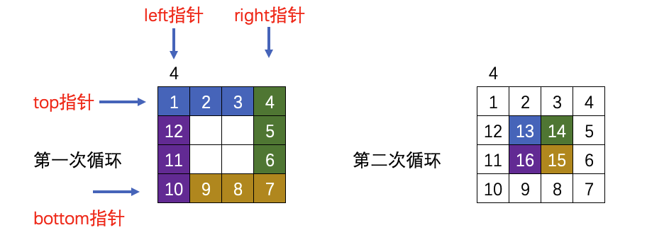

# 代码随想录算法训练营第二天| 977.有序数组的平方、209.长度最小的子数组、59.螺旋矩阵II。

## 977. 有序数组的平方

>   题目链接：[leetcode链接](https://leetcode.cn/problems/squares-of-a-sorted-array/)
>
>   文章讲解：[代码随想录(programmercarl.com)](https://programmercarl.com/0977.有序数组的平方.html)
>
>   视频讲解：[双指针法经典题目 | LeetCode：977.有序数组的平方](https://www.bilibili.com/video/BV1QB4y1D7ep )
>
>   状态：AC

### 思路

首先想到的是暴力算法，将每个元素计算平方，之后再将数组进行排序，此时的时间复杂度为`O(nlog n)`。但是并不满足题目中要求的`O(n)`，因为有一个条件我们还没有用上：**非递减顺序数组**。看了题解之后才清楚更好的方法：**双指针算法**。

由于是非递减的数组，而且会有负数，那么在平方之后，得到的新数组的最后一位一定会在原数组的起始或者末尾位置。那么使用双指针算法相向遍历即可，得到最大的值放入到新数组的末尾。

### 代码

``` go
func sortedSquares(nums []int) []int {
	n := len(nums)
	result := make([]int, n)
	left := 0
	right := len(nums) - 1
	for i := right; i >= 0; i-- {  // i为result的索引
		if nums[left]*nums[left] < nums[right]*nums[right] {  // right侧更大
			result[i] = nums[right] * nums[right]
			right--
		} else {  // left侧更大
			result[i] = nums[left] * nums[left]
			left++
		}
	}
	return result
}
```

## 209.长度最小的子数组

>   题目链接：[leetcode链接](https://leetcode.cn/problems/minimum-size-subarray-sum/)
>
>   文章讲解：[代码随想录(programmercarl.com)](https://programmercarl.com/0209.%E9%95%BF%E5%BA%A6%E6%9C%80%E5%B0%8F%E7%9A%84%E5%AD%90%E6%95%B0%E7%BB%84.html)
>
>   视频讲解：[拿下滑动窗口！ | LeetCode 209 长度最小的子数组](https://www.bilibili.com/video/BV1tZ4y1q7XE)
>
>   状态：AC

### 思路

此题需要找最短连续的一子数组，能想到的是 **滑动窗口** 算法。

1.   设最短子数组长度`minLength`为无穷大，题目规定长度最大为100000，`minLength=100001`即可。
2.   右侧不断向前，直至这一子数组的和大于 `target`
3.   子序列和大于target之后，左侧也不断向前，直至子数组和小于 `target`，记录下此刻的序列长度，并与 `minLength` 进行比较。
4.   循环条件：当右侧到头，并且此时的子数组的和小于`target`
5.   退出循环后，如果`minLength`依旧等于100001，说明不存在满足要求的子数组，则返回`0`

### 代码

``` go
func minSubArrayLen(target int, nums []int) int {
	left := 0
	right := 0
	sum := 0
	minLength := 100001
	length := len(nums)
	for left <= right && right <= length {
		if sum < target {
			if right < length {
				sum += nums[right]
				right++
			} else {
				break
			}
		} else {
			if minLength > right-left {
				minLength = right - left
			}
			sum -= nums[left]
			left++
		}
	}
	if minLength == 100001 {
		return 0
	}
	return minLength
}
```

## 59.螺旋矩阵II

> 题目链接：[leetcode链接](https://leetcode.cn/problems/spiral-matrix-ii/)
>
> 文章讲解：[代码随想录(programmercarl.com)](https://programmercarl.com/0059.螺旋矩阵II.html)
>
> 视频讲解：[一入循环深似海 | LeetCode：59.螺旋矩阵II](https://www.bilibili.com/video/BV1SL4y1N7mV/)
>
> 状态：AC

### 思路



1.   循环次数是`n/2`

2.   每次循环时候按照<font color="#4664b9">蓝色</font>、<font color="#4f7633">绿色</font>、<font color="#b0871e">黄色</font>、<font color="#622a93">紫色</font>的顺序填数字， 数字保持自增，保存结果的数组为`results`

3.   各个颜色的范围，注意是从大到小还是从小到大：

     <font color="#4664b9">蓝色的范围：results\[top\][left ~ right - 1]</font>
     <font color="#4f7633">绿色的范围：results\[top ~ bottom - 1\][right]</font>

     <font color="#b0871e">黄色的范围：results\[bottom\][right ~ left + 1]</font>

     <font color="#622a93">紫色的范围：results[bottom ~ top + 1]\[left\]</font>

4.   每一轮过后，`top++`、`bottom--`、`left++`、`right--`

5.   额外的，如果n为基数，最中心的数字是在循环条件之外的，需要额外加上。

### 代码

``` go
func generateMatrix(n int) [][]int {
	top := 0
	bottom := n - 1
	left := 0
	right := n - 1
	result := make([][]int, n)
	for i := 0; i < n; i++ {
		result[i] = make([]int, n)
	}
	num := 1
	for i := 0; i < n/2; i++ {
		for j := left; j < right; j++ {
			result[top][j] = num
			num++
		}

		for j := top; j < bottom; j++ {
			result[j][right] = num
			num++
		}

		for j := right; j > left; j-- {
			result[bottom][j] = num
			num++
		}
		for j := bottom; j > top; j-- {
			result[j][left] = num
			num++
		}
		top++
		left++
		right--
		bottom--
	}
	if n%2 == 1 {
		result[n/2][n/2] = num
	}
	return result
}
```

## 小结

-   帮助了群里一些录友解决了些问题，能看出来他们也比较萌新，想起了自己最开始大一学的时候，但是自己并没有坚持下去，很可惜。

-   Go语言在初始化数组时候还不是很熟练，写的时候一直在思考int类型二维数组怎么初始化，但是用切片写起来还是简单一些吧

    ``` go
    result := make([][]int, n)
    for i := 0; i < n; i++ {
        result[i] = make([]int, n)
    }
    ```

    

-   今天还有点别的事情，先写这么多，扩展题先不写了
-   打卡第二天！
