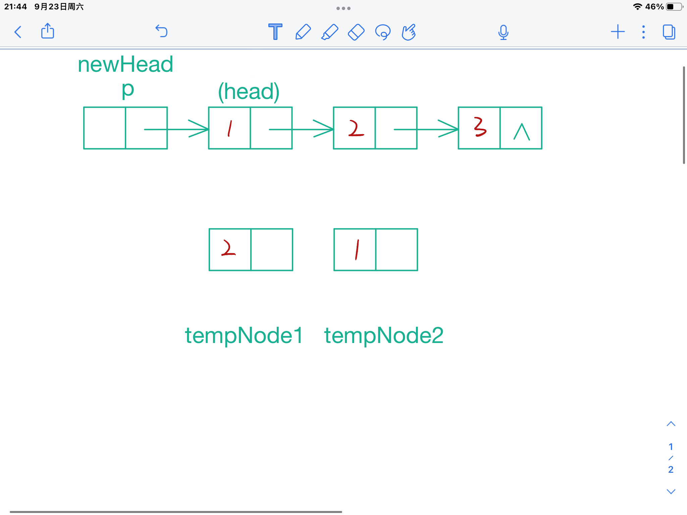
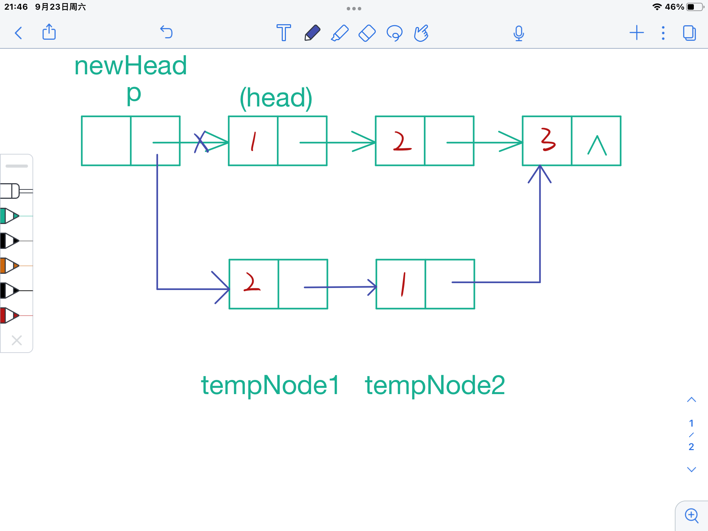
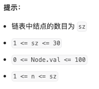
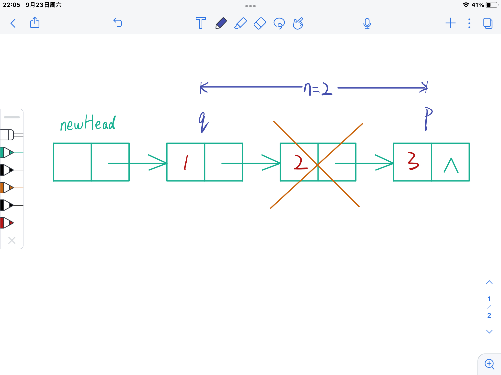
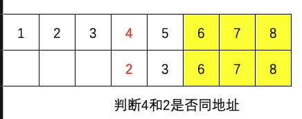
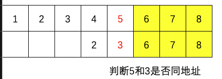
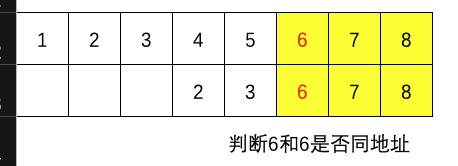
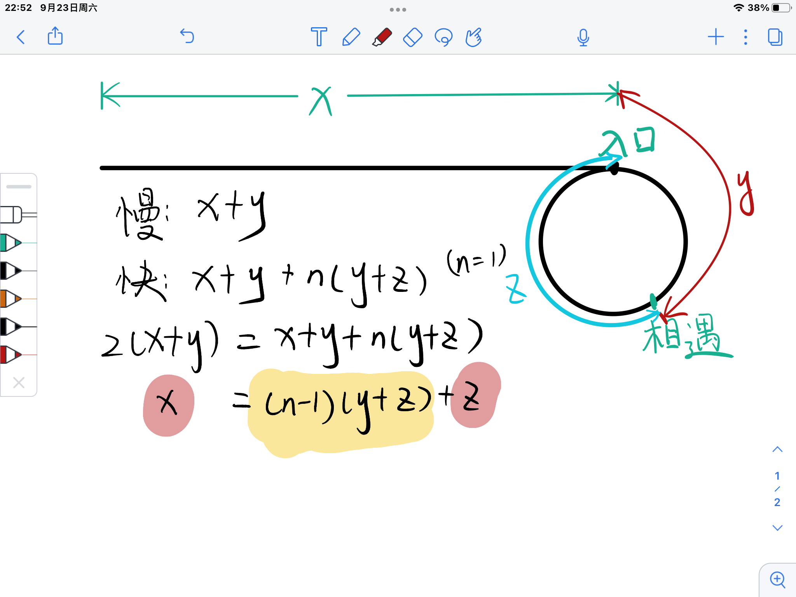

# 代码随想录算法训练营第四天| 24.两两交换链表中的节点、19.删除链表的倒数第N个节点、面试题02.07.链表相交、142.环形链表II。

## 24.两两交换链表中的节点

>   题目链接：[力扣题目链接](https://leetcode.cn/problems/swap-nodes-in-pairs/)
>
>   文章讲解：[代码随想录(programmercarl.com)](https://programmercarl.com/0024.两两交换链表中的节点.html)
>
>   视频讲解：[帮你把链表细节学清楚！ | LeetCode：24. 两两交换链表中的节点](https://www.bilibili.com/video/BV1YT411g7br)
>
>   状态：AC

### 思路

1.   定义新的头结点，定义指针`p = newHead`，定义两个新的结点`tempNode1.Val = 2`，`tempNode2.Val = 1`（这里的值`1`和`2`是为了简化描述）



2.   使用新的结点重新进行连接，并且`p`前进到下一个位置（注意连接顺序，防止断链）
     -   `tempNode2.Next = p.Next.Next.Next`
     -   `tempNode1.Next = tempNode2`
     -   `p.Next = tempNode1`
     -   `p = p.Next.Next`



### 代码

``` go
func swapPairs(head *ListNode) *ListNode {
	newHead := &ListNode{
		Val:  0,
		Next: head,
	}
	p := newHead
	for p.Next != nil && p.Next.Next != nil {
		tempNode1 := &ListNode{
			Val:  p.Next.Next.Val,
			Next: nil,
		}
		tempNode2 := &ListNode{
			Val:  p.Next.Val,
			Next: p.Next.Next.Next,
		}
		tempNode1.Next = tempNode2
		p.Next = tempNode1
		p = p.Next.Next
	}
	return newHead.Next
}
```


## 19.删除链表的倒数第N个节点

>   题目链接：[力扣题目链接](https://leetcode.cn/problems/remove-nth-node-from-end-of-list/)
>
>   文章讲解：[代码随想录(programmercarl.com)](https://programmercarl.com/0019.%E5%88%A0%E9%99%A4%E9%93%BE%E8%A1%A8%E7%9A%84%E5%80%92%E6%95%B0%E7%AC%ACN%E4%B8%AA%E8%8A%82%E7%82%B9.html#%E6%80%9D%E8%B7%AF)
>
>   视频讲解：[链表遍历学清楚！ | LeetCode：19.删除链表倒数第N个节点](https://www.bilibili.com/video/BV1vW4y1U7Gf)
>
>   状态：AC

### 思路

定义两个指针`p`和`q`，指针`p`先出发，指针`q`保持与`p`距离为`n`之后再出发，这样`q.Next`则是待删除的元素。

>   会不会出现`n`大于链表长度的情况（例如链表长度为5，删除倒数第8个元素）：不会，leetcode题解中给出。
>
>   



### 代码

``` go
func removeNthFromEnd(head *ListNode, n int) *ListNode {
	if head == nil {
		return head
	}
	newHead := &ListNode{
		Val:  0,
		Next: head,
	}
	p := newHead
	for i := 0; i <= n; i++ {
		p = p.Next
	}
	q := newHead
	for p != nil {
		p = p.Next
		q = q.Next
	}
	if q.Next.Next != nil {
		q.Next = q.Next.Next
	} else {
		q.Next = nil
	}

	return newHead.Next
}
```

## 面试题02.07.链表相交

>   题目链接：[力扣题目链接](https://leetcode.cn/problems/intersection-of-two-linked-lists-lcci/)
>
>   文章讲解：[代码随想录(programmercarl.com)](https://programmercarl.com/%E9%9D%A2%E8%AF%95%E9%A2%9802.07.%E9%93%BE%E8%A1%A8%E7%9B%B8%E4%BA%A4.html)
>
>   状态：AC

### 思路

假设是两个一维数组（只是为了方便逻辑上描述），查看是否相交，那么需要“尾部对齐”。假设长的链表开始的索引为0，我们需要从短的数组的开始。大意如下图







走到末尾都没发现有相同地址的节点则不存在相交的情况。

-   尾部对齐操作：遍历两个链表（一组指针`p = newHeadA.Next`和`q = newHeadB.Next`），求各自的长度。
-   重新定义一组指针（`p1 = newHeadA.Next`和`q1 = newHeadB.Next`），让其中更长的链表的指针移动到和短的同步位置<font color="#bdbdbd">（这里可能是Go语言的特性？C语言不需要此操作，不重新定义指针p和q回不到起始位置）</font>
-   同时向前移动，判断是否地址相同

### 代码

``` go
func getIntersectionNode(headA, headB *ListNode) *ListNode {
    // 定义两个新的头，指向传参的头
    newHeadA := &ListNode {
        Val: 0,
        Next: headA,
    }
    newHeadB := &ListNode {
        Val: 0,
        Next: headB,
    }
    // 求两个链表各自的长度
    p := newHeadA.Next
    lenA := 0
    q := newHeadB.Next
    lenB := 0
    for p != nil {
        p = p.Next
        lenA++
    }
    for q != nil {
        q = q.Next
        lenB++
    }
    
    // 定义两个新的指针，进行“对齐”操作
    p1 := newHeadA.Next
    q1 := newHeadB.Next
    if lenA < lenB {
        for i := 0; i < lenB - lenA; i++ {
            q1 = q1.Next
        }
    } else {
        for i := 0; i < lenA - lenB; i++ {
            p1 = p1.Next
        }
    }
    // 对齐后向前查找，找到了返回结点，否则为nil
    for p1 != nil && q1 != nil {
        if p1 == q1 {
            return p1
        } else {
            p1 = p1.Next
            q1 = q1.Next
        }
    }
    return nil
}
```

## 142. 环形链表II

>   题目链接：[力扣题目链接](https://leetcode.cn/problems/linked-list-cycle-ii/)
>
>   文章讲解：[代码随想录(programmercarl.com)](https://programmercarl.com/0142.%E7%8E%AF%E5%BD%A2%E9%93%BE%E8%A1%A8II.html)
>
>   视频讲解：[把环形链表讲清楚！| LeetCode:142.环形链表II](https://www.bilibili.com/video/BV1if4y1d7ob)
>
>   状态：想不出思路后看了卡哥的讲解恍然大悟，AC！

### 思路

<s><font color="#FF0000">最开始没有审题，当成了这道题是在问是否存在环，后来发现这只是第一问</font></s>

这道题需要返回的是：如果链表有环，那么返回最后一个结点链接到了哪个结点上。

1.   首先要找到，链表是否有环，这里使用的是快慢指针的算法，快指针速度为2，慢指针速度为1。若快指针走到了终点说明没有环；如果两个指针相遇说明有环。

     >   因为相对速度差1，所以二者必相遇

2.   找到入口：（卡哥视频讲的很好，如果有疑问一定**看完视频**再提问）



为什么一圈必定会追上：假设他们同时进入入口（整个链表就是个环），慢指针走一圈后，快指针走两圈。如果快指针先进入，那么追上慢指针必定走不到一圈。

最后推出来x=z，意味着此时的快指针降速（速度变为1），同时新定义的指针从头开始运动，两者必定在入口处相遇

### 代码

``` go
func detectCycle(head *ListNode) *ListNode {
    fast := head
    slow := head
    p := head
    // 这层for寻找环
    for fast != nil {
        slow = slow.Next
        fast = fast.Next
        if fast != nil {
            fast = fast.Next
            if slow == fast {  // 两指针相遇说明有环
            for p != fast {  // 这层for执行的是公式中x=z的一步
                p = p.Next
                fast = fast.Next
            }
            return p
            }
        } else {
            break
        }        
    }
    return nil
}
```

## 小结

-   今天重新写了下链表的实现（主要是vscode没有装调试leetcode插件），部分题都是自己在GoLand中自己写函数构造的链表，最后单独写了个文件保存这部分代码（主要就是新建链表和打印链表），新建链表是通过一个数组传要初始化的值。当然了，今天的也只有两道题可以用，后两道直接在leetcode的网页上写了，看起来挺复杂的还担心不好debug，理清思路之后写起来很快，也不会出错。

    ``` go
    package InitLinkList
    
    import "fmt"
    
    type ListNode struct {
    	Val  int
    	Next *ListNode
    }
    
    func InsertElem(head *ListNode, nums []int) *ListNode {
    	newHead := &ListNode{
    		Val:  0,
    		Next: head,
    	}
    	p := newHead
    	for _, v := range nums {
    		p.Next = &ListNode{
    			Val:  v,
    			Next: nil,
    		}
    		p = p.Next
    	}
    	return newHead.Next
    }
    
    func PrintList(head *ListNode) {
    	p := head
    	for p != nil {
    		fmt.Printf("%d\t", p.Val)
    		p = p.Next
    	}
    	fmt.Println()
    }
    
    ```

-   Go有些语法还不是很了解，今天发现了跨文件调用需要将`变量名`和`函数名`首字母大写，也叫作导出。从一些语法来看Go现在给我的感觉他就不想Java那种强面向对象编程。这点还挺好的（对我个人而言），很灵活，调用的时候也不需要实例化（也没这一种说法）。

-   后三道题（最后一道题指的求是否存在环的过程）考研复习408的时候已经见过，只不过这次的身份发生了变化，面对这道题状态也不同。考研复习时候遇到手撕代码的题首先想到的是如何拿分，没思路就暴力算法。有额外时间再考虑优化。如果再试卷上我可能会使用空间复杂度更大的算法，空间换时间。但是现在在求职中，要好好的理解每一道题，每一种优化的思路，题干加以限制：`空间复杂度为O(1)`。真的需要认真思考，链表相交没有想出来，看了卡哥的讲解理解了。
-   现在的刷题状态是这样的：多给自己思考的时间争取想到最优的解法。无论是否解出来再去看看卡哥的讲解和代码，看看别人写的和自己写的差距在哪。我的代码现在经常出现这种逻辑，对于个别情况需要单独判断，而别人的则不需要，因为自己在边界情况考虑的欠妥。明天周日休息一天。但是事情还是挺多的。

<font color="#3914a5">第一周打卡结束！4天结束！</font>
