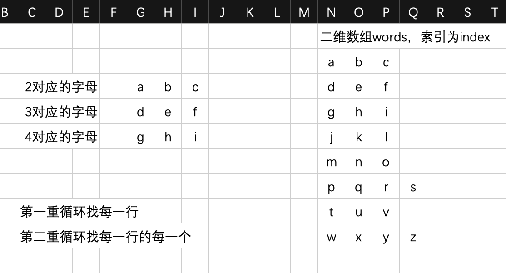

# 代码随想录算法训练营第二十五天  216.组合总和III、17.电话号码的字母组合

## 216.组合总和III

>   题目链接：[力扣题目链接](https://leetcode.cn/problems/combination-sum-iii/)
>
>   文章讲解：[代码随想录(https://programmercarl.com)](https://programmercarl.com/0216.%E7%BB%84%E5%90%88%E6%80%BB%E5%92%8CIII.html)
>
>   视频讲解：[和组合问题有啥区别？回溯算法如何剪枝？| LeetCode：216.组合总和III](https://www.bilibili.com/video/BV1wg411873x)
>
>   状态：AC

### 思路

定义`result`存放总结果，`path`存放单次结果。递归层数由`k`决定

1.   递归函数构造：
     -   无返回值类型
     -   需要传参`k`确定递归次数
     -   传参`n`用于比较和
     -   传参`index`确定当前递归索引
     -   传参`sum`为当前和

2.   递归结束条件：当`path`长度等于`k`说明打到了需求长度，并且`sum == n`的时候，说明为想要的答案，将`path`添加到`result`当中。并且`return`
3.   单次递归和剪枝：从`index`开始，到9结束。如果`sum + i > n`则`return`。每层先添加到`path`，再向下`index+1`

### 代码

``` go
func combinationSum3(k int, n int) [][]int {
	var result [][]int
	var path []int
	var backTracking func(k, n, index, sum int)
	backTracking = func(k, n, index, sum int) {
		if len(path) == k {
			if sum == n {
				temp := make([]int, k)
				copy(temp, path)
				result = append(result, temp)
			}
			return
		}
		for i := index; i <= 9; i++ {
			if sum+i > n {
				return
			}
			path = append(path, i)
			sum += i
			backTracking(k, n, i+1, sum)
			sum -= path[len(path)-1]
			path = path[:len(path)-1]
		}
	}
	backTracking(k, n, 1, 0)
	return result
}
```

## 17. 电话号码的字母组合

>   题目链接：[力扣题目链接](https://leetcode.cn/problems/letter-combinations-of-a-phone-number/)
>
>   文章讲解：[代码随想录(https://programmercarl.com)](https://programmercarl.com/0017.%E7%94%B5%E8%AF%9D%E5%8F%B7%E7%A0%81%E7%9A%84%E5%AD%97%E6%AF%8D%E7%BB%84%E5%90%88.html)
>
>   视频讲解：[还得用回溯算法！| LeetCode：17.电话号码的字母组合](https://www.bilibili.com/video/BV1yV4y1V7Ug)
>
>   状态：AC

### 思路

首先先保存各个数字对应了哪些字母，这里使用了字符类型，例如2对应了`'a', 'b', 'c'`，使用二维数组保存。假设输入字符串是`"234"`



1.   递归函数的构造：无返回值类型；每次要传参应该遍历哪一个`index`（`words`哪一行）。判断第几行使用`words[int(digits[i] - '0')]`
2.   递归终止条件：`path`的长度和字符串`digits`长度相等，并且不等于0
3.   单层递归逻辑：两重循环内，每次`index+1`

### 代码

``` go
func letterCombinations(digits string) []string {
	var result []string
	var path string
	words := [][]string{
		{"a", "b", "c"},
		{"d", "e", "f"},
		{"g", "h", "i"},
		{"j", "k", "l"},
		{"m", "n", "o"},
		{"p", "q", "r", "s"},
		{"t", "u", "v"},
		{"w", "x", "y", "z"},
	}
	var backTracking func(index int)
	backTracking = func(index int) {
		if len(path) == len(digits) && len(path) != 0 {
			result = append(result, path)
			return
		}
		for i1 := index; i1 < len(digits); i1++ {
			for i2 := 0; i2 < len(words[int(digits[i1]-50)]); i2++ {
				path += words[int(digits[i1]-50)][i2]
				backTracking(i1 + 1)
				path = path[:len(path)-1]
			}
		}
	}
	backTracking(0)
	return result
}
```

