# 【debug】记一次失败的爬虫经历


今天我的室友需要在一个网站上批量下载一些数据，但是他并不会代码，我尝试帮他处理一下

URL:`http://dc2.cistrome.org/#/`

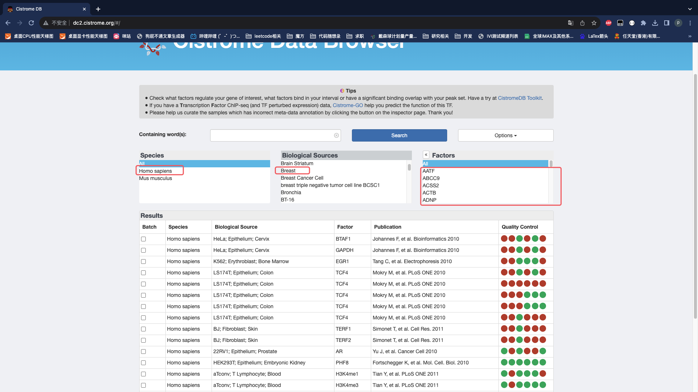

网站上需要点击这些选项，`Factors`需要每个点击，可能有些因素并没有数据。

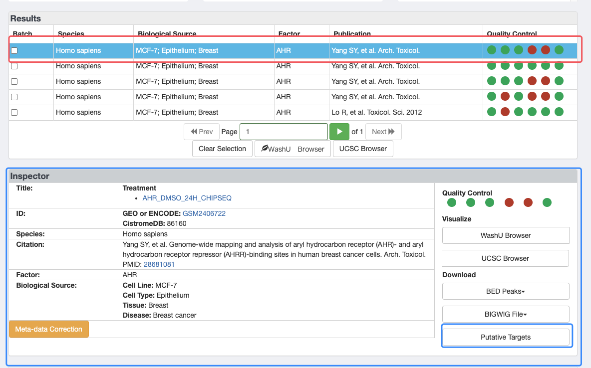

先选中第一行，然后才会出现下方的`Inspector`部分，再点击`Putative Targets`进入下载页面

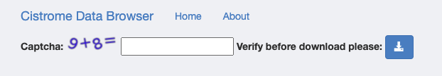

下载页面输入验证码点击下载即可。

## 1. 分析、抓包

抓包使用了Fiddler这个软件。设置好URL进行筛选

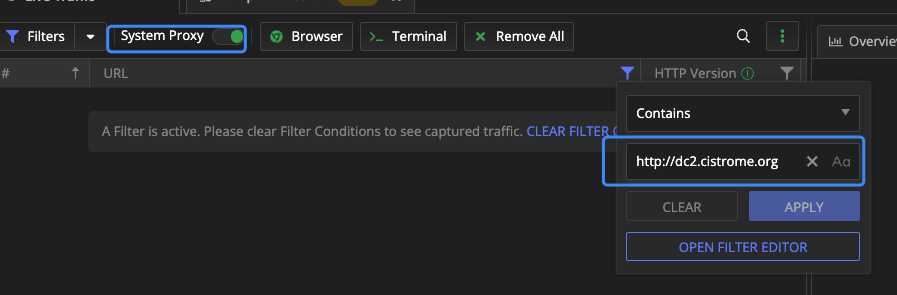

先正常的操作一遍，让Fiddler记录这个过程。

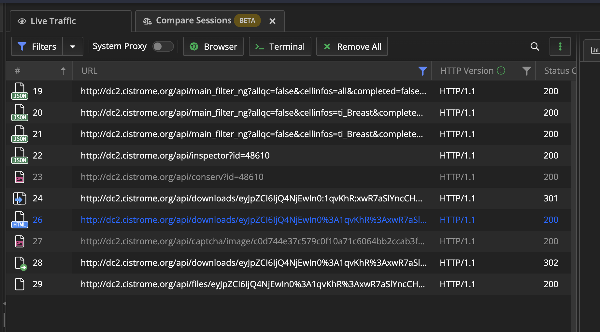

依次查看每一行：

-   19\~21：选择第一张图的一些条件，一共要选三次，出现了三条数据，分析其中参数很简单。需要查找factors的列表
-   22：加载第二张图的Inspector部分，需要查找id
-   23：在第二张图最下面还有一部分，我没有截出来，这里是获取到一张图片
-   24：向URL请求，此处的URL里面都是冒号，返回的是301，重定向将冒号替换为`%3A`的URL编码
-   26：重定向，返回的是验证码的那个页面
-   27：请求验证码的图片
-   28：提交验证码
-   29：下载链接（返回txt文件）

## 2. 获取每个部分的关键数据

### 导入相关的包

``` python
import json
import time

import requests
from bs4 import BeautifulSoup
```

### 获取每个factors

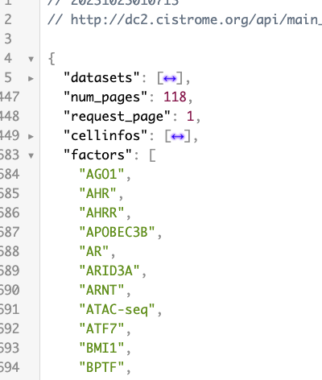

根据上面分析，使用第20行的URL即可得到所有的factors，然后替换其中的`factors=all`，将`all`替换为每一个`factors`即可。

``` python
url1 = "http://dc2.cistrome.org/api/main_filter_ng?allqc=false&cellinfos=ti_Breast&completed=false&curated=false&factors=all&keyword=&page=1&peakqc=false&run=false&species=Homo+sapiens"  # 21行URL

headers = {
    "Accept": "text/html,application/xhtml+xml,application/xml;q=0.9,image/avif,image/webp,image/apng,*/*;q=0.8,application/signed-exchange;v=b3;q=0.7",
    "Accept-Encoding": "gzip, deflate",
    "Origin": "http://dc2.cistrome.org",
    "Accept-Language": "zh-Hans-CN,zh-Hans;q=0.8,en-US;q=0.5,en;q=0.3",
    "Host": "dc2.cistrome.org",
    "User-Agent": "Mozilla/4.0 (compatible; MSIE 7.0; Windows NT 10.0; WOW64; Trident/7.0; .NET4.0C; .NET4.0E; Tablet PC 2.0; wbx 1.0.0; wbxapp 1.0.0; Zoom 3.6.0)",
}

session = requests.session()

response = session.get(url, headers=headers)
json_list = response.json()["factors"]
```


## 3. 获取inspector中的id值

为了方便书写，就以第一个factors作为演示


继续刚刚请求，将新的`factors`替换，查看response的结果

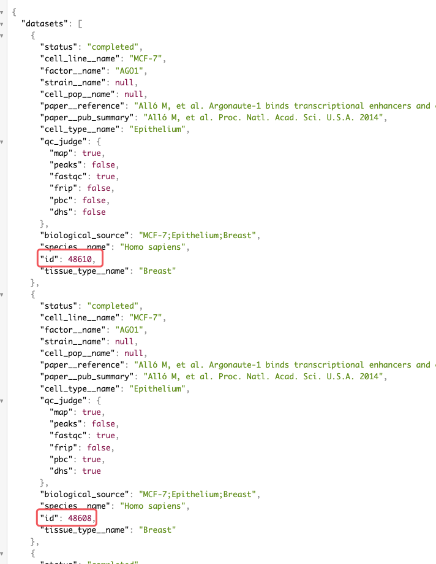

有可能Inspector中会出现多栏，经过查阅后去第1个id就好

``` python
url2 = f"http://dc2.cistrome.org/api/main_filter_ng?allqc=false&cellinfos=ti_Breast&completed=false&curated=false&factors=AHO1&keyword=&page=1&peakqc=false&run=false&species=Homo+sapiens"
response = session.get(url2, headers=headers)
id = response.json()["datasets"][0]["id"]
```

## 4. 跳转至验证码页面

根据Fiddler中的URL显示：`http://dc2.cistrome.org/api/downloads/eyJpZCI6IjQ4NjEwIn0%3A1qvKhR%3AxwR7aSlYncCHoao44VSfL3o22igp`

需要查看最后面一串字符是什么或从哪里来。我们查看22行的请求


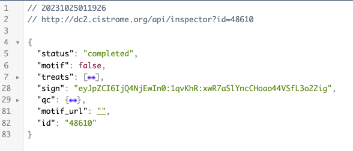

进入22行的请求发现就是`sign`这一项，并且将冒号替换为`%3A`即可。

``` python
download_url = f"http://dc2.cistrome.org/api/inspector?id={id}"
response_url = session.get(download_url, headers=headers)
sign = response_url.json()["sign"]
sign = sign.replace(":", "%3A")
```

## 5. 输入验证码

这一步之前，发送了两个请求，一个是获取HTML，一个是获取验证码。分析27行的数据，能发现最后与刚刚的`sign`值完全不同，查看27行最后一串是什么。

分析获取到的HTML，能看到如下内容

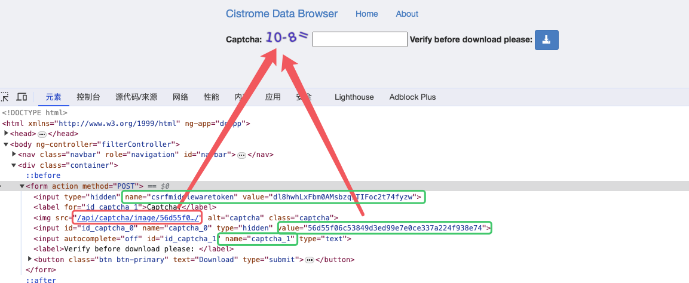

红色是为27行的URL最后的部分，绿色则是要提交的表单，将验证码下载到本地手动数据数据再提交上去。

``` python
soup = BeautifulSoup(response.content, "html.parser")
img_tag = soup.find("img")["src"]
img_id = img_tag.split("/")[-2]
img_url = "http://dc2.cistrome.org" + img_tag
image = session.get(img_url, headers=headers)
with open("test.png", "wb") as f:
    f.write(image.content)
    captcha = int(input("输入test.png的验证码"))
    data = {
        "csrfmiddlewaretoken": session.cookies["csrftoken"],
        "captcha_0": img_id,
        "captcha_1": captcha
    }
```

## 6. 问题出现

分析28行请求


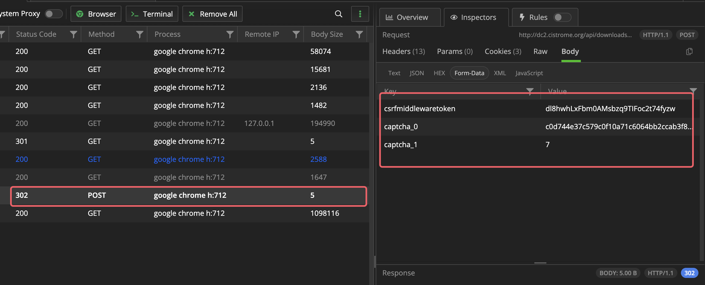

看起来只需要POST以下三个数据就好，之后再`get`29行操作，但是始终拿不到正确的数据

``` python
response = session.post(url=download_url, headers=headers, data=data)
download = session.get(f"http://dc2.cistrome.org/api/files/{sign}/", headers=headers)
with open("test.txt", "w") as file:
    file.write(download.text)
```

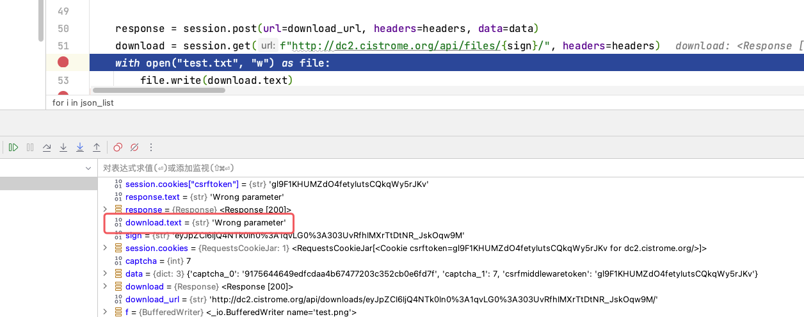

无论如何都是错误的参数，看了好多次都没有找到哪里请求有问题。

尝试改了`session.post(data)`参数，改成`json`也不对。改了`data`中的`captcha_1`的类型也不对。传输字符串的形式也不对`session.post(data=f"csrfmiddlewaretoken={session.cookies['csrftoken']}&captcha_0={img_id}&captcha_1={captcha}")`。

但是我在网页先进行输入验证码操作，拿到可以下载的“权限”之后，再去fiddler中模拟29行get请求却可以正常下载。想了好久也没找到什么好的办法。

## 7. 验证码其他的失败的想法

1.   最开始认为验证码如果人为输入会比较慢，应该让AI去识别，识别到字符串之后使用python中的`eval()`语句获得到结果。后来测试两个发现识别的非常不准。因为运算符不是常规角度，有可能会被识别为字母。最后放弃了这个方法。
2.   `captcha_0`和`captcha_1`这两个参数一个是验证码的`id`，应该为后台数据库存储的名字，一个是计算结果。尝试了始终使用一组正确的不断的请求骗过服务器验证。还是因为卡在了上一步始终为参数错误，再过了一会就显示`Time Out!`。我觉得如果参数正确可以尝试一下这个方法。
3.   尝试SQL注入，使用语句`' or 1=1 --`还是失败。
