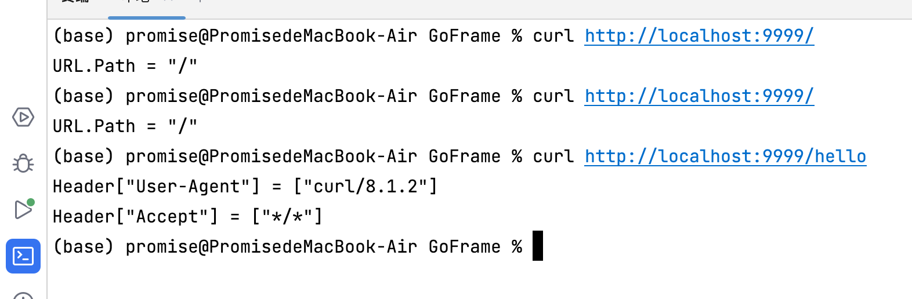

# 【Study】Go语言动手写Web框架-Gee第一天

项目来源: [7天用Go动手写/从零实现系列](https://github.com/geektutu/7days-golang)


## 第一天

### 1. net/http的简易demo

#### 代码和一些说明

``` go
package main

import (
	"fmt"
	"log"
	"net/http"
)

func main() {
	http.HandleFunc("/", indexHandler)
	http.HandleFunc("/hello", helloHandler)
	log.Fatal(http.ListenAndServe(":9999", nil))

}

func indexHandler(w http.ResponseWriter, req *http.Request) {
	fmt.Fprintf(w, "URL.Path = %q\n", req.URL.Path)
}

func helloHandler(w http.ResponseWriter, req *http.Request) {
	for k, v := range req.Header {
		fmt.Fprintf(w, "Header[%q] = %q\n", k, v)
	}
}

```

使用Go语言内置的`net/http`库, 简单写个demo

> 第10、11行：设置两个路由，分别是`/`和`/hello`，并且分别绑定了两个函数（第16、20行）`indexHandler`和`helloHandler`
>
> 处理`indexHandler`，返回的是URL；处理`helloHandler`，返回的是请求头内的信息
>
> 第12行：设置端口为9999，表示在9999端口进行监听。第二个参数为处理所有http请求实例，`nil`代表使用标准库中的实例处理。
>
> `http.ListenAndServe`底层源码：
>
> ```go
> // ListenAndServe listens on the TCP network address addr and then calls
> // Serve with handler to handle requests on incoming connections.
> // Accepted connections are configured to enable TCP keep-alives.
> //
> // The handler is typically nil, in which case the DefaultServeMux is used.
> //
> // ListenAndServe always returns a non-nil error.
> 
> func ListenAndServe(addr string, handler Handler) error {
> 	server := &Server{Addr: addr, Handler: handler}
> 	return server.ListenAndServe()
> }
> ```
>
> `Handler`底层源码：
>
> ```go
> // A Handler responds to an HTTP request.
> //
> // ServeHTTP should write reply headers and data to the ResponseWriter
> // and then return. Returning signals that the request is finished; it
> // is not valid to use the ResponseWriter or read from the
> // Request.Body after or concurrently with the completion of the
> // ServeHTTP call.
> //
> // Depending on the HTTP client software, HTTP protocol version, and
> // any intermediaries between the client and the Go server, it may not
> // be possible to read from the Request.Body after writing to the
> // ResponseWriter. Cautious handlers should read the Request.Body
> // first, and then reply.
> //
> // Except for reading the body, handlers should not modify the
> // provided Request.
> //
> // If ServeHTTP panics, the server (the caller of ServeHTTP) assumes
> // that the effect of the panic was isolated to the active request.
> // It recovers the panic, logs a stack trace to the server error log,
> // and either closes the network connection or sends an HTTP/2
> // RST_STREAM, depending on the HTTP protocol. To abort a handler so
> // the client sees an interrupted response but the server doesn't log
> // an error, panic with the value ErrAbortHandler.
> type Handler interface {
>     ServeHTTP(ResponseWriter, *Request)
> }
> ```
>
> `http.ListenAndServe()`的第二个参数类型可以看到是一个接口，需要实现`ServeHTTP`方法，也就是说所有HTTP请求都交给它来处理（第二节实现）
>
> `log.Fatal()`: 进入源码我们可以看到这样的注释`Fatal is equivalent to Print() followed by a call to os.Exit(1).`
>
> 可以得知，当程序报错之后打印日志并会立即退出，defer函数也不会执行，而不同于`panic()`
>
> `panic()`: 
>
> 1. 函数立刻停止执行 (注意是函数本身，不是应用程序停止)
> 2. defer函数被执行
> 3. 返回给调用者(caller)
> 4. 调用者函数假装也收到了一个panic函数，从而
>     4.1 立即停止执行当前函数
>     4.2 它defer函数被执行
>     4.3 返回给它的调用者(caller)
> 5. ...(递归重复上述步骤，直到最上层函数)
>     应用程序停止。

#### 一些运行结果


当然也可以使用curl工具


### 2. 实现http.Handler接口

需要构造一个对象，并且实现`ServeHTTP`方法

``` go
type Engine struct {}


func (engine *Engine) ServeHTTP(w http.ResponseWriter, req *http.Request) {
	switch req.URL.Path {
	case "/":
		fmt.Fprintf(w, "URL.Path = %q\n", req.URL.Path)
	case "/hello":
		for k, v := range req.Header {
			fmt.Fprintf(w, "header[%q] = %q\n", k, v)
		}
	default:
		fmt.Fprintf(w, "404 NOT FOUND: %s\n", req.URL)
	}
}

func main() {
    engine := new(Engine)
    log.Fatal(http.ListenAndServe(":9999", engine))
}
```


>   定义`Engine`对象，并且实现其中的函数`ServeHTTP(http.ResponseWriter, *http.Request)`，对URL处理只有`/`个`/hello`，处理的逻辑同上。函数中的两个参数分别为：针对第二个参数请求的响应，请求的信息。

### 3. 重新组织代码结构，实现核心功能，准备被调用

使用`New()`创建 gee 的实例，使用 `GET()`方法添加路由，最后使用`Run()`启动Web服务。

```
gee/
  |--gee.go
  |--go.mod
main.go
go.mod
```

``` go
// go.mod
module example

go 1.21

require (
	gee v0.0.0
)

replace (
	gee => ./gee
)
```

``` go
// gee.go
package gee

import (
	"fmt"
	"net/http"
)

type HandlerFunc func(http.ResponseWriter, *http.Request)

type Engine struct {
	router map[string]HandlerFunc
}

func New() *Engine {
	return &Engine{router: make(map[string]HandlerFunc)}
}

func (engine *Engine) addRoute(method string, pattern string, handler HandlerFunc) {
	key := method + "-" + pattern
	engine.router[key] = handler
}

func (engine *Engine) GET(pattern string, handler HandlerFunc) {
	engine.addRoute("GET", pattern, handler)
}

func (engine *Engine) POST(pattern string, handler HandlerFunc) {
	engine.addRoute("POST", pattern, handler)
}

func (engine *Engine) Run(addr string) (err error) {
	return http.ListenAndServe(addr, engine)
}

func (engine *Engine) ServeHTTP(w http.ResponseWriter, req *http.Request) {
	key := req.Method + "-" + req.URL.Path
	if handler, ok := engine.router[key]; ok {
		handler(w, req)
	} else {
		_, err := fmt.Fprintf(w, "404 NOT FOUND: %s\n", req.URL)
		if err != nil {
			return
		}
	}
}

```

``` go
// main.go
package main

import (
	"fmt"
	"gee"
	"net/http"
)

func main() {
	r := gee.New()
	r.GET("/", func(writer http.ResponseWriter, request *http.Request) {
		_, err := fmt.Fprintf(writer, "URL.Path = %q\n", request.URL.Path)
		if err != nil {
			return
		}
	})

	r.GET("/hello", func(writer http.ResponseWriter, request *http.Request) {
		for k, v := range request.Header {
			_, err := fmt.Fprintf(writer, "Header[%q] = %q\n", k, v)
			if err != nil {
				return
			}
		}
	})

	err := r.Run(":9999")
	if err != nil {
		return
	}
}

```

#### 代码和一些说明

1.   执行`main()`函数，首先进行实例化了`gee`，`main.go`中的12行开始执行，调用`GET()`方法时，会到`gee.go`中`addRoute()`添加路由和映射

     >   例如：r.GET("/", handler)，则会在映射表中添加{"GET-/": handler}

2.   `main.go`中，两个路由`/`和`/hello`添加完毕开始执行`r.Run()`，运行服务。

3.   `Run()`中的`ListenAndServe(addr, handler)`函数，又会去执行`handler`中的接口，也就是`ServeHTTP()`，由于我们在`gee.go`文件中已经实现了该方法，会进行调用。

4.   `gee.go`文件中，实现了实例化的过程`New()`函数

#### 一些运行结果


