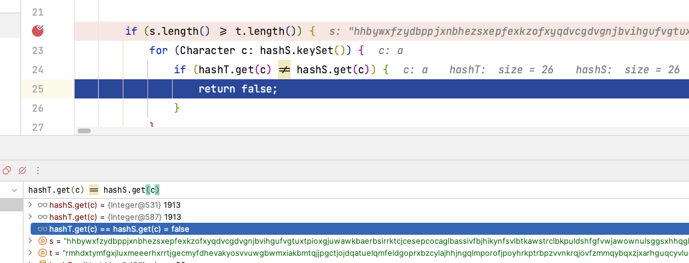
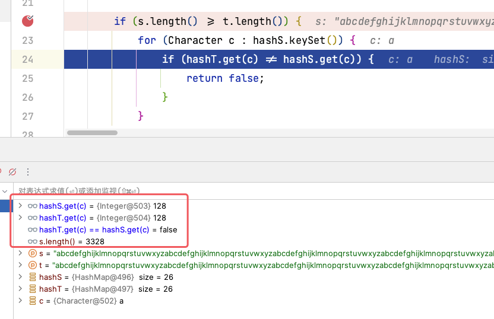

# 【debug】Java中的map比较

题目链接：[242. 有效的字母异位词](https://leetcode.cn/problems/valid-anagram/)

事情起因：（由于自己对Java了解不深、有表达错误的请指出，感谢！）


群友发了一张代码截图，觉得自己写的代码并没有错，但是不能通过测试用例。

他的算法我简单说一下，有点麻烦，但算法不是这篇博客的重点。

1.   两个Map：`hashS`、`hashT`分别用于存放字符串`s`和`t`中字母出现的频率(19行之前)；
2.   遍历长的字符串对应的Map，假设是`hashS`，判断`hashS`与`hashT`相同的字母频率是否一样，如果不一样则`return false`

当时我是在外面，看到了这段代码，理解了他的想法之后好像真的没什么问题。


### 复现Bug与初步解决

回来之后代码放到idea里面跑了一下，发现这个测试用例长度为50000位，而且每个字母出现的频率是一样的


打上断点继续向下走，看看是哪一步出现了问题。




没想到第一次循环就出错了，`hashT.get(c)`与`hashS.get(c)`的值都是1913，但是地址不一样，一个是`{Integer@531}`，一个是`{Integer@587}`。看来这里的`!=`判断的是地址而不是值，使用`equal()`方法即可，如下：


### 深层探索

事情并没有真正的解决，既然群友能通过一些测试用例，说明了一些情况使用`!=`是可以用的，那几个测试用例都是用了很短的字符串，我也看下是什么情况，`s="anagram"`，`t="nagaram"`，这是个正确的用例，debug的结果是这样


这可就是玄学了呀，短的数据不会出现问题，而长的会出现。

#### 猜想一：与Map的大小有关

因为长的测试用例有26个键值对（每个字母均出现），而短的只出现了5个字母。我设置测试用例`s = t = "abcdefghijklmnopqrstuvwxyz"`（以下简称字母表），让每个字母都出现一次。


还是正常的，<font color="#ff0000">猜想错误</font>

#### 猜想二：与测试用例的长度有关

接着我就多复制些字母表，出错误的是在50000的长度，我把字母表长度先放到3000多，

``` java
// 扩增字符串代码代码
String s = "abcdefghijklmnopqrstuvwxyz";
String t = "abcdefghijklmnopqrstuvwxyz";
for (int i = 0; i < 7; i++) {
    s += s;
    t += t;
}
```





还是有错误，继续缩短长度，将扩增代码循环6次，减少一次再看看


这次竟然又不出错了，玄学！妥妥的玄学！

我换了种思路，这次不用字母表了，只是用一个变量看看会不会触发这个BUG，如果依然触发，每次长度增加1，那么很快就会得到到底在多长的时候会出现。25行打上断点，被执行前一定会卡住。


最后做一次验证，是不是Map中，只要有val超过128就会发生地址改变的情况。这次的测试用例使用随机字母

``` java
String s = "";
String t = "";
Random random = new Random();
while (true) {
    int temp = random.nextInt(26) + 97;
    s += (char)temp;
    t += (char)temp;
    System.out.println(isAnagram(s, t));
}
```


很好！当字母w出现了超过128次时候地址发生了变化。128这个数字相信大家一定很敏感，那么这个范围很可能是[-128, 127]。那么则需要看看底层源码是怎么说的，去看看`Map.java`，搜索`127`，并没有发现相关说明。


`{Integer@***}`这里面经常变得数字就是星号部分，那么去`Ieteger.java`里面看看有什么发现。


### 结论

结合这两段我悟了，果然有这么个范围，在初始化值的时候，[-128, 127]这个范围的数是在缓存里面，所以当`Map`中的`value`小于128时候读取的是缓存中的数，所以他们地址是一样的，也就是`hashS.get(c)==hashT.get(c)`的原因。当超过这个范围，则会在新的地方存放一个值，尽管`hashS.get(c)`和`hashT.get(c)`均为128，但是使用`==`或`!=`判断的时候，判断的是**地址**，得到`hashS.get(c)!=hashT.get(c)`。

#### 所以一定要写equal()方法进行判断

#### 所以一定要写equal()方法进行判断

#### 所以一定要写equal()方法进行判断

`hashS.get(c).equal(hashT.get(c))`，这样判断的才是值而不是地址


