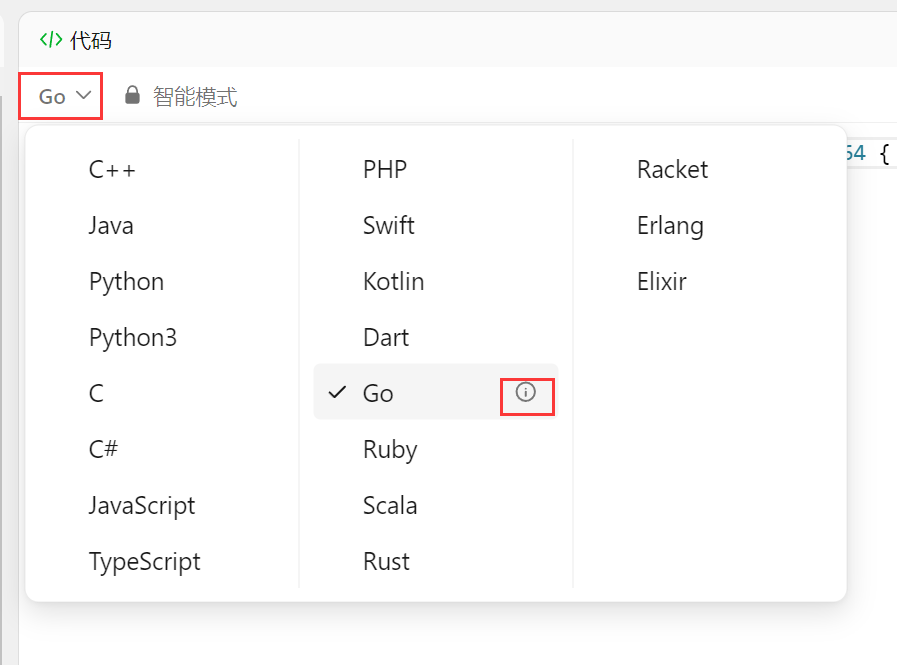
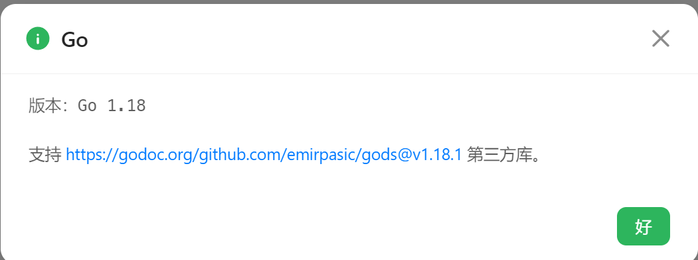

# 【study】Leetcode中Go语言第三方包

在刷Leetcode时，发现Go并不像其他语言有原生的栈、队列等等结构。虽然很多操作都可以用**切片**或**数组**代替，但还是想知道如果自己想使用这些数据结构应该怎么办。





[支持的库的连接](https://github.com/emirpasic/gods/tree/v1.18.1)


包含的数据结构如下


- Containers
  - Lists
    - ArrayList
    - SinglyLinkedList
    - DoublyLinkedList
  - Sets
    - HashSet
    - TreeSet
    - LinkedHashSet
  - Stacks
    - LinkedListStack
    - ArrayStack
  - Maps
    - HashMap
    - TreeMap
    - LinkedHashMap
    - HashBidiMap
    - TreeBidiMap
  - Trees
    - RedBlackTree
    - AVLTree
    - BTree
    - BinaryHeap
  - Queues
    - LinkedListQueue
    - ArrayQueue
    - CircularBuffer
    - PriorityQueue
- Functions
    - Comparator
    - Iterator
      - IteratorWithIndex
      - IteratorWithKey
      - ReverseIteratorWithIndex
      - ReverseIteratorWithKey
    - Enumerable
      - EnumerableWithIndex
      - EnumerableWithKey
    - Serialization
      - JSONSerializer
      - JSONDeserializer
    - Sort
    - Container
- Appendix

所有数据结构都依赖`Container`接口，调用起来也很方便

### 以栈举例

``` go
import "github.com/emirpasic/gods/stacks/arraystack"

func main() {
    stack = arraystack.New()  // 初始化一个栈
    stack.Push(1)  // 入栈
    value, _ := stack.Peek()  // 查看站定元素
    value, _ := stack.Pop()  // 出栈
    size := stack.Size()  // 栈的大小
    isEmpty := stack.Empty()  // 是否为空栈
    stack.Clear()  // 清空栈
}
```

更多操作可以看github中的`README.md`文件或者看源码
