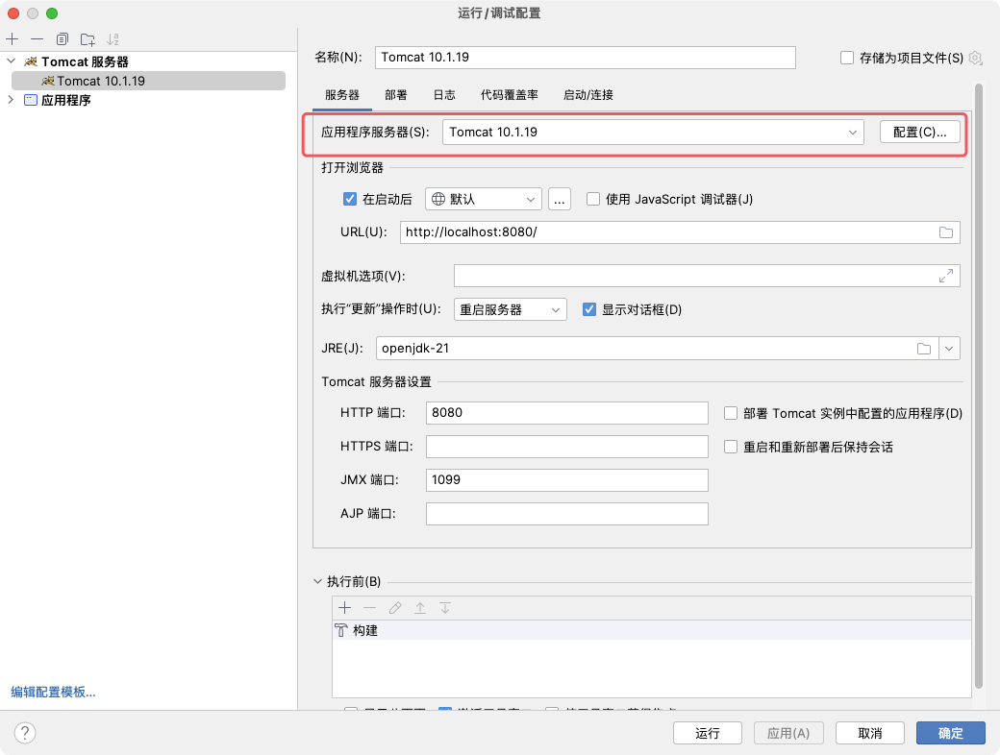

# Spring MVC学习 Part01


**SSM=Spring + Spring MVC + MyBatis**


SSM技术栈如下


表述层

SSM框架构建起单体项目的技术栈需求！其中Spring MVC负责表述层（控制层）实现简化。

Spring MVC的作用主要覆盖式表述层，例如：

-   请求映射
-   数据输入
-   视图界面
-   请求分发
-   表单回显
-   会话控制
-   过滤拦截
-   异步交互
-   文件上传
-   文件下载
-   数据校验
-   类型转换
-   等等等


## 1. Spring MVC处理流程


1.   用户发送请求至前端控制器 DispatcherServlet。
2.   DispatcherServlet 收到请求调用 HandlerMapping 处理器映射器。
3.    处理器映射器根据请求 url 找到具体的处理器，生成处理器对象及处理器拦截器（如果有则生成）一并返回给 DispatcherServlet。
4.    DispatcherServlet 通过 HandlerAdapter 处理器适配器调用处理器。
5.    HandlerAdapter 执行处理器（handler，也叫后端控制器）。
6.    Controller 执行完成返回 ModelAndView。
7.    HandlerAdapter 将 handler 执行结果 ModelAndView 返回给 DispatcherServlet
8.   DispatcherServlet 将 ModelAndView 传给 ViewReslover 视图解析器。
9.   ViewReslover 解析后返回具体 View 对象。
10.   DispatcherServlet 对 View 进行渲染视图（即将模型数据填充至视图中
11.   DispatcherServlet 响应用户。


### Spring MVC涉及组件理解：

1.   DispatcherServlet：Spring MVC提供，需要使用`web.xml`配置使其生效，它是整个流处理的核心，所有请求都经过它的处理的分发。
2.   HandlerMapping：Spring MVC提供，需要进行IoC配置使其加入IoC容器方可生效。它内部缓存handler（Controller方法）和handler访问路径数据，被DispatcherServlet调用，用于查找路径对应的handler
3.   HandlerAdapter：Spring MVC提供，需要进行IoC配置使其加入IoC容器方可生效。它可以处理请求参数和处理响应数据。每次DispatcherServlet都是通过handlerAdapter间接调用handler，它是handler和DispatcherServlet之间的适配器
4.   Handler：处理器，是Controller类内部方法的简称，由自己定义，用来接收参数，向后调用业务，最终返回响应结果

5.   ViewResovler：Spring MVC提供，需要进行IoC配置使其加入IoC容器方可生效。视图解析器主要作用简化模板视图页面查找。**前后端分离项目，后端只返回JSON数据**。视图解析器组件不是必须的。


## 2. 新建Spring MVC项目

在父工程的`pom.xml`文件导入相关依赖

``` xml
<?xml version="1.0" encoding="UTF-8"?>
<project xmlns="http://maven.apache.org/POM/4.0.0"
         xmlns:xsi="http://www.w3.org/2001/XMLSchema-instance"
         xsi:schemaLocation="http://maven.apache.org/POM/4.0.0 http://maven.apache.org/xsd/maven-4.0.0.xsd">
    <modelVersion>4.0.0</modelVersion>

    <groupId>org.example</groupId>
    <artifactId>SpringMVCStudy</artifactId>
    <version>1.0-SNAPSHOT</version>
    <packaging>pom</packaging>
    <modules>
        <module>spring-mvc-part01</module>
    </modules>

    <properties>
        <spring.version>6.1.4</spring.version>
        <servlet.api>10.0.0</servlet.api>
        <maven.compiler.source>21</maven.compiler.source>
        <maven.compiler.target>21</maven.compiler.target>
        <project.build.sourceEncoding>UTF-8</project.build.sourceEncoding>
    </properties>

    <dependencies>
        <dependency>
            <groupId>org.springframework</groupId>
            <artifactId>spring-context</artifactId>
            <version>${spring.version}</version>
        </dependency>
        <dependency>
            <groupId>jakarta.platform</groupId>
            <artifactId>jakarta.jakartaee-web-api</artifactId>
            <version>${servlet.api}</version>
            <scope>provided</scope>
        </dependency>
        <dependency>
            <groupId>org.springframework</groupId>
            <artifactId>spring-webmvc</artifactId>
            <version>${spring.version}</version>
        </dependency>
    </dependencies>

</project>
```


子模块名`spring-mvc-part01`，并且将改模块更改为web项目，在“文件--->项目--->项目结构”添加`web`相关


添加工件


新建Controller，`controller.HelloController`

```java
package org.example.controller;

import org.springframework.stereotype.Controller;
import org.springframework.web.bind.annotation.RequestMapping;
import org.springframework.web.bind.annotation.ResponseBody;

/**
 * Author: Promise
 * Date: 2024-03-01 18:03
 * Description:
 */

@Controller
public class HelloController {

    // handler: springmvc/hello  return "hello spring mvc!"
    // 对外访问的地址, 到handlerMapping注册的注解
    @RequestMapping("springmvc/hello")  // 对外访问的地址
    @ResponseBody  // 直接返回字符串给前端, 不要查找视图解析器
    public String hello() {
        System.out.println("HelloController.hello");
        return "Hello Spring MVC!";
    }
}
```


新建配置类，将Controller配置到IoC容器中，`config.MVCConfig.java`

```java
package org.example.config;


import org.springframework.context.annotation.Bean;
import org.springframework.context.annotation.ComponentScan;
import org.springframework.context.annotation.Configuration;
import org.springframework.web.servlet.mvc.method.annotation.RequestMappingHandlerAdapter;
import org.springframework.web.servlet.mvc.method.annotation.RequestMappingHandlerMapping;

/**
 * Author: Promise
 * Date: 2024-03-01 18:07
 * Description:
 *  1. Controller配置到IoC容器
 *  2. HandlerMapping handlerAdapter加入到IoC容器
 */

@Configuration  // 配置类注解
@ComponentScan("org.example.controller")  // 扫描指定包
public class MVCConfig {
    @Bean
    public RequestMappingHandlerMapping handlerMapping() {
        return new RequestMappingHandlerMapping();
    }

    @Bean
    public RequestMappingHandlerAdapter handlerAdapter() {
        return new RequestMappingHandlerAdapter();
    }
}

```


配置Spring MVC

```java
package org.example.config;

import org.springframework.web.servlet.support.AbstractAnnotationConfigDispatcherServletInitializer;

/**
 * Author: Promise
 * Date: 2024-03-01 18:26
 * Description:
 * Spring MVC提供的接口, 是替代web.xml的方案, 更方便实现完全注解方式ssm处理
 * Spring MVC框架会自动检查当前实现类, 会自动加载getRootConfigClasses() / getServletConfigClasses().
 * getServletMappings 返回的地址 设置DispatcherServlet对应处理的地址
 */

public class SpringMVCInit extends AbstractAnnotationConfigDispatcherServletInitializer {
    /**
     * 指定service / mapper 层的配置类
     */
    @Override
    protected Class<?>[] getRootConfigClasses() {
        return null;
    }

    /**
     * 指定Spring MVC 的配置类
     */
    @Override
    protected Class<?>[] getServletConfigClasses() {
        return new Class[]{MVCConfig.class};  // IoC 配置类
    }

    /**
     * 设置DispatcherServlet处理路径
     * 一般情况下为 / 代表处理所有请求
     */
    @Override
    protected String[] getServletMappings() {
        return new String[]{"/"};
    }
}

// 该类等效了以下内容
// <web-app>
//
//  <listener>
//     <listener-class>org.springframework.web.context.ContextLoaderListener</listener-class>
//  </listener>
//
//
//  <servlet>
//     <servlet-name>app1</servlet-name>
//     <servlet-class>org.springframework.web.servlet.DispatcherServlet</servlet-class>
//     <init-param>
//        <param-name>contextConfigLocation</param-name>
//        <param-value>/WEB-INF/web.xml</param-value>
//     </init-param>
//     <load-on-startup>1</load-on-startup>
//  </servlet>
//
//  <servlet-mapping>
//     <servlet-name>app1</servlet-name>
//     <url-pattern>/</url-pattern>
//  </servlet-mapping>
//
//</web-app>
```


## 3. 搭建Tomcat（macOS下）

[apache-tomcat-10.1.19.zip](https://dlcdn.apache.org/tomcat/tomcat-10/v10.1.19/bin/apache-tomcat-10.1.19.zip)

下载tomcat压缩包，进行解压。进入到idea中，将红框内的路径修改为解压后的路径。



在“部署”栏目中添加之前新建的“工件”，并且上下文更改为`/`


到解压路径下，修改`*.sh`文件的启动权限

``` shell
chmod u+x *.sh
```

启动tomcat

``` shell
./startup.sh
```

关闭tomcat

``` sh
./shutdown.sh
```


此时已经可以使用idea来启动Tomcat服务器


运行，输入URL`http://localhost:8080/springmvc/hello`


## 4. Spring MVC接收数据

### 4.1 访问路径

`@RequestMapping`注解的作用是将请求的URL地址和处理请求的方式（handler方法）关联起来，建立映射的关系

>   1.   不同于WebServlet必须要使用`/`开头，但是在SpringMVC中不一定必须要用`/`开头
>
>   2.   支持模糊地址。`*`：任意一层字符串     `**`：任意层任意字符串。
>
>        `/user/*`  --->  /`user/a`可以进入，`/user/a/b`不可以进入
>
>        `/user/**`    ---> `/user/a/a/a/a/a`
>
>   3.   请求方式的指定：使用属性`method`，若不符合请求方式，会出现<font color="red">405</font>异常


```java
package org.example.requestmapping;

import org.springframework.stereotype.Controller;
import org.springframework.web.bind.annotation.RequestMapping;
import org.springframework.web.bind.annotation.RequestMethod;

/**
 * Author: Promise
 * Date: 2024-03-03 14:16
 * Description:
 * 类上和方法上添加@RequestsMapping区别
 *      类上是提取通用方法的地址(非必须)
 *      方法上是具体的handler地址(必须)
 *      如下方代码, 如果想访问/user路径, 那么直接写@RequestMapping不加参数即可
 */

@Controller
@RequestMapping("/user")
public class UserController {
    @RequestMapping(value = "/login", method = {RequestMethod.GET, RequestMethod.POST})  // 作用注册地址, 将handler注册到handlerMapping上
    public String login() {
        return null;
    }

    @RequestMapping(value = "/register", method = RequestMethod.POST)
    public String register() {
        return null;
    }

    @RequestMapping
    public String index() {
        return null;
    }
}

```

`@GetMapping`和`@PostMapping`注解

均继承自`@RequestMapping`，但是他们只能用于注解方法

`@RequestMapping(value = "/register", method = RequestMethod.POST)`等价于`@PostRequest("register")`

`GET   POST    PUT   DELETE`同理


### @RequestMapping注解

-   `value = "***"`：路径
-   `method = RequestMethod.***`：请求方法


## 5. Spring MVC接收数据

param格式：`key1=value1&key2=value2`

JSON格式：`{"key1": "value1", "key2": "value2"}`

param格式是ASCII码，JSON为`UTF-8`。类型方面，param仅支持字符串类型，而JSON可以更复杂

新建模块`spring-mvc-part02`，并且按照之前的方法重新配置web项目，部署Tomcat时，“应用程序上下文”更改为`/part02`


此处使用三种接收参数方式：

-   直接接收
-   注解指定：指定任意请求参数名，要求必须传递
-   特殊值

新建Controller，`param.ParamController`


### 5.1 直接接收


```java
package org.example.param;

import org.springframework.stereotype.Controller;
import org.springframework.web.bind.annotation.*;

/**
 * Author: Promise
 * Date: 2024-03-03 15:19
 * Description:
 */

@Controller
@RequestMapping("/param")
public class ParamController {
    @GetMapping("/data")
    @ResponseBody
    public String data(String name, int age) {
        System.out.println("name = " + name + ", age = " + age);
        return "name = " + name + ", age = " + age;
    }
}
```


新建配置类`config.MVCConfig`

``` java
package org.example.config;

import org.springframework.context.annotation.Bean;
import org.springframework.context.annotation.ComponentScan;
import org.springframework.context.annotation.Configuration;
import org.springframework.web.servlet.mvc.method.annotation.RequestMappingHandlerAdapter;
import org.springframework.web.servlet.mvc.method.annotation.RequestMappingHandlerMapping;

/**
 * Author: Promise
 * Date: 2024-03-03 15:20
 * Description:
 */

@Configuration
@ComponentScan("org.example")
public class MVCConfig {
    @Bean
    public RequestMappingHandlerMapping handlerMapping() {
        return new RequestMappingHandlerMapping();
    }

    @Bean
    public RequestMappingHandlerAdapter handlerAdapter() {
        return new RequestMappingHandlerAdapter();
    }
}

```


Spring MVC初始化

```java
package org.example.config;

import org.springframework.web.servlet.support.AbstractAnnotationConfigDispatcherServletInitializer;

/**
 * Author: Promise
 * Date: 2024-03-03 15:21
 * Description:
 */

public class SpringMVCInit extends AbstractAnnotationConfigDispatcherServletInitializer {
    @Override
    protected Class<?>[] getRootConfigClasses() {
        return new Class[0];
    }

    @Override
    protected Class<?>[] getServletConfigClasses() {
        return new Class[]{MVCConfig.class};
    }

    @Override
    protected String[] getServletMappings() {
        return new String[]{"/"};
    }
}

```

启动服务器，在浏览器输入相应URL

`http://localhost:8080/part02/param/data?name=root&age=18`


### 5.2 注解指定


**@RequestParam参数**

只加在形参列表，指定请求参数名，或者是否为必须传递，或者非必须传递设置默认值


*用法如下*


`String func(@RequestParam(value = ""), required = true)`


1.   `value = "***"`：前端传过来的参数名
2.   `required = true/false`：是否为必须传递项，默认为必须（若不传递会报<font color="red">400</font>异常）
3.   `defaultValue = "1"`：默认值为1


在`param.ParamController.java`继续添加方法

``` java
// 2. 注解指定
// URL:  /param/data1?account=root&page=1
// 其中account参数为必须传递, page是非必须传递(但是需要有一个默认值)
@GetMapping("/data1")
@ResponseBody
public String data1(@RequestParam(value = "account") String username,
                    @RequestParam(required = false, defaultValue = "1") int page) {
    System.out.println("account(username) = " + username + ", page = " + page);
    return "account(username) = " + username + ", page = " + page;
}
```


### 5.3 特殊值

继续在`ParamController`添加方法

```java
// 3. 特殊值
// 一名多值   key=1&key=2  直接使用集合值即可
// URL:   /param/data2?hobbies=唱&hobbies=跳&hobbies=rap&hobbies=篮球
@GetMapping("/data2")
@ResponseBody
public String data2(@RequestParam List<String> hobbies) {
    System.out.println("hobbies = " + hobbies);
    return hobbies.toString();
}
```

>   注意：此处的参数必须要添加@RequestParam，将hobbies对应的一个字符才能直接赋值给集合，报错类型异常。加了此注解之后才可add相应字符串


<font color="red">下图为不加@RequestParam注解报错的情况</font>


<font color="green">添加注解之后</font>


控制台的输出


现在解决编码的问题

需要将类注解的`@RequestMapping`中增加属性即可。

`@RequestMapping(value = "/param", produces = "text/plain;charset=UTF-8")`


### 5.4 使用实体对象接收值（*）


创建实体类`pojo.User`

```java
package org.example.pojo;

import org.springframework.stereotype.Component;

/**
 * Author: Promise
 * Date: 2024-03-03 19:59
 * Description:
 */

public class User {
    private String name;
    private int age;

    public String getName() {
        return name;
    }

    public void setName(String name) {
        this.name = name;
    }

    public int getAge() {
        return age;
    }

    public void setAge(int age) {
        this.age = age;
    }
    
    
    @Override
    public String toString() {
        return "User{" +
                "name='" + name + '\'' +
                ", age=" + age +
                '}';
    }
}
```


添加方法

```java
// 4. 实体类
// 用实体类接收值
// URL:   /param/data3?name=zhangsan&age=18
@GetMapping("/data3")
@ResponseBody
public String data3(User user) {  // 属性名等同于前端传的属性
    System.out.println(user);
    return user.toString();
}
```


若传输过来的属性对应不到实体对象，也不会进行赋值。


### 5.5 路径传参

新建Controller，`path.Controller`

```java
package org.example.path;

import org.springframework.stereotype.Controller;
import org.springframework.web.bind.annotation.GetMapping;
import org.springframework.web.bind.annotation.RequestMapping;
import org.springframework.web.bind.annotation.RequestParam;
import org.springframework.web.bind.annotation.ResponseBody;

/**
 * Author: Promise
 * Date: 2024-03-03 20:11
 * Description:
 */

@Controller
@RequestMapping("path")
public class PathController {
    
    // URL:  path/账号/密码
    // 动态路径设计
    @GetMapping("{account}/{password}")  // 使用大括号
    @ResponseBody
    public String login() {
        
    }
}
```

**@GetMapping("{account}/{password}")**

等价于`@GetMapping("*/*")`，但是使用星号并不能获取到参数。

若按照如下形式写，代表接收param类型的值

``` java
@GetMapping("{account}/{password}")  // 使用大括号
@ResponseBody
public String login(String account, String password) {

}
```

需要使用注解`@PathVariable`在形参前面，其他属性与`@RequestParam`中相同，可以设置不同的名字和是否必须项等。


``` java
package org.example.path;

import org.springframework.stereotype.Controller;
import org.springframework.web.bind.annotation.*;

/**
 * Author: Promise
 * Date: 2024-03-03 20:11
 * Description:
 */

@Controller
@RequestMapping(value = "/path", produces = "text/plain;charset=UTF-8")
public class PathController {

    // URL:  path/账号/密码
    // 动态路径设计
    @ResponseBody
    @GetMapping(value = "/{account}/{password}")  // 使用大括号
    public String login(@PathVariable("account") String account,
                        @PathVariable("password") String password) {
        System.out.println("account = " + account + ", password = " + password);
        return "account = " + account + ", password = " + password;
    }
}

```


### 5.6 JSON接收

新建Controller，`json.JSONController`

```java
package org.example.json;

import org.example.pojo.Person;
import org.springframework.stereotype.Controller;
import org.springframework.web.bind.annotation.PostMapping;
import org.springframework.web.bind.annotation.RequestBody;
import org.springframework.web.bind.annotation.RequestMapping;
import org.springframework.web.bind.annotation.ResponseBody;

/**
 * Author: Promise
 * Date: 2024-03-03 20:51
 * Description:
 */

@Controller
@RequestMapping("json")
@ResponseBody
public class JSONController {
    // data 通过请求体使用post方法

    @PostMapping("data")
    public String data(@RequestBody Person person) {
        System.out.println("person = " + person);
        return person.toString();
    }
}
```

默认实体类是param类型的，但是想接收JSON格式，需要加入注解`@RequestBody`


使用Python进行模拟POST请求

``` python
import requests

url = "http://localhost:8080/part02/json/data"
person = {
    "name": "John Doe",
    "age": 30,
    "gender": "male"
}

response = requests.post(url, data=person)
print(response)

```


模拟POST请求之后会得到以下报错，<font color="red">415</font>状态码


**415类型错误原因???**

>   因为JSON是前端的格式，而不是Java的格式。Java原生的Web API只支持路径参数和param参数。
>
>   如果需要项目支持JSON格式需要以下操作：
>
>   -   导入JSON处理相关依赖
>
>       ``` xml
>       <dependency>
>           <groupId>com.fasterxml.jackson.core</groupId>
>           <artifactId>jackson-databind</artifactId>
>           <version>2.15.0</version>
>       </dependency>
>       ```
>
>       
>
>   -   handlerAdapter配置JSON转换器
>
>       在`config.MVCConfig.java`中添加类注解`@EnableWebMVC`，给handlerAdapter配置JSON转换器
>
>   
>
>   但是经过一天的Debug还没找到问题的所在，即使python代码我更改为如下的形式
>
>   ``` python
>   import requests
>   import json
>   
>   url = "http://localhost:8080/part02/json/data"
>   person = {
>       "name": "John Doe",
>       "age": 30,
>       "gender": "male"
>   }
>   
>   
>   header = {
>       "Content-Type": "application/json"
>   }
>   
>   response = requests.post(url, data=json.dumps(person), headers=header)
>   print(response.text)
>   
>   ```
>
>   java代码更改为以下（主要是`@PostMapping`注解添加了属性）
>
>   ``` java
>   @PostMapping(value = "data", consumes = MediaType.APPLICATION_JSON_UTF8_VALUE)
>   public String data(@RequestBody Person person) {
>       System.out.println("person = " + person);
>       return person.toString();
>   }
>   ```
>
>   consumes属性是指定接收的字符串格式，这里为`application/json;charset=utf-8`
>
>   报的错误为
>
>   <font color="#6c0000">org.springframework.web.servlet.handler.AbstractHandlerExceptionResolver.logException Resolved [org.springframework.web.HttpMediaTypeNotSupportedException: Content-Type 'application/json;charset=UTF-8' is not supported]</font>
>
>   


#### @EnableWebMvc注解

效果等同于在XML配置中，可以使用`<mvc:annotation-driven>`元素


### 5.7 接收cookie

**@CookieValue**

新建Controller，`cookie.CookieController`

```java
package org.example.cookie;

import jakarta.servlet.http.Cookie;
import jakarta.servlet.http.HttpServletResponse;
import org.springframework.stereotype.Controller;
import org.springframework.web.bind.annotation.CookieValue;
import org.springframework.web.bind.annotation.GetMapping;
import org.springframework.web.bind.annotation.RequestMapping;
import org.springframework.web.bind.annotation.ResponseBody;

/**
 * Author: Promise
 * Date: 2024-03-04 21:36
 * Description:
 */

@Controller
@RequestMapping("cookie")
@ResponseBody
public class CookieController {
    @GetMapping("data")
    public String data(@CookieValue(value = "cookieName")String value) {
        System.out.printf("value = " + value);
        return value;
    }

    @GetMapping("save")
    public String save(HttpServletResponse response) {
        Cookie cookie = new Cookie("cookieName", "root");
        response.addCookie(cookie);
        return "ok";
    }
}
```

先通过`/cookie/save`添加一个cookie，再访问`/cookie/data`返回这个cookie的值


### 5.8获取请求头

**@RequestHeader**

>   `@Request***`可以查到通过request请求的各种参数

新建Controller，`header.HeaderController`

```java
package org.example.header;

import org.springframework.stereotype.Controller;
import org.springframework.web.bind.annotation.GetMapping;
import org.springframework.web.bind.annotation.RequestHeader;
import org.springframework.web.bind.annotation.RequestMapping;
import org.springframework.web.bind.annotation.ResponseBody;

/**
 * Author: Promise
 * Date: 2024-03-04 21:42
 * Description:
 */

@Controller
@RequestMapping("header")
@ResponseBody
public class headerController {
    @GetMapping("getHeader")
    public String getHeader(@RequestHeader("Host") String host) {
        System.out.println("host = " + host);
        return host;
    }
}
```


