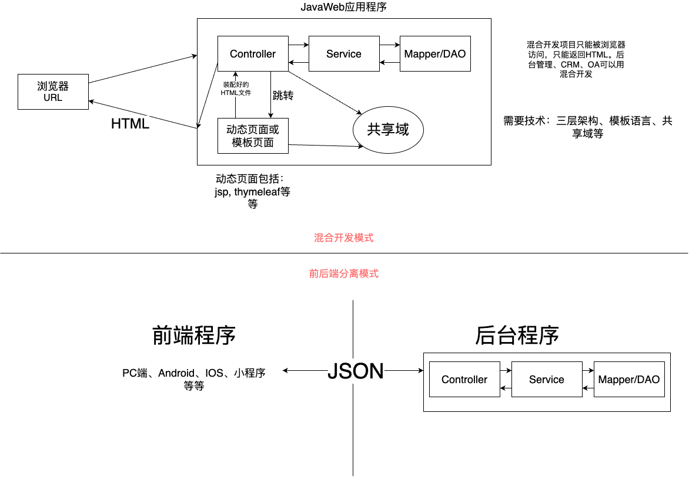

# Part03 Spring MVC响应数据


由于上一部分构建代码时构建了`part02`，为了统一名称这里写为part03


新建模块`spring-mvc-response`

## 开发模式简介



### 1. 混合模式开发

使用JSP返回动态页面。

构建web项目，web目录在`spring-mvc-response.src.main下`

`web`目录中，在`WEB-INF`文件夹下新建视图`views/index.jsp`。

``` jsp
<%--
  Created by IntelliJ IDEA.
  User: promise
  Date: 2024/3/5
  Time: 16:07
  To change this template use File | Settings | File Templates.
--%>
<%@ page contentType="text/html;charset=UTF-8" language="java" %>
<html>
<head>
    <title>Title</title>
</head>
<body>
    <span style="color: red;">${data}</span>
</body>
</html>

```


SpringMVC的配置

新建配置类`config.MVCConfig`

```java
package org.example.config;

import org.springframework.context.annotation.ComponentScan;
import org.springframework.context.annotation.Configuration;
import org.springframework.web.servlet.config.annotation.EnableWebMvc;
import org.springframework.web.servlet.config.annotation.ViewResolverRegistry;
import org.springframework.web.servlet.config.annotation.WebMvcConfigurer;

/**
 * Author: Promise
 * Date: 2024-03-05 16:09
 * Description:
 */
@Configuration
@ComponentScan("org.example")
@EnableWebMvc
public class MVCConfig implements WebMvcConfigurer {
    // 配置视图解析器, 指定前后缀

    @Override
    public void configureViewResolvers(ViewResolverRegistry registry) {
        registry.jsp("/WEB-INF/views/", "jsp");

        // 使用handler 直接返回index即可
    }
}
```

视图需要通过视图解析器进行返回，在这里配置视图解析器，实现`WebMvcConfigurer`接口中的一个方法，配置前后缀，这样可以直接使用该文件夹下的文件，无需额外指定路径等。不需要再使用`@Bean`配置


配置MVC初始化类`SpringMVCInit.java`

```java
package org.example.config;

import org.springframework.web.servlet.support.AbstractAnnotationConfigDispatcherServletInitializer;

/**
 * Author: Promise
 * Date: 2024-03-05 16:20
 * Description:
 */

public class SpringMVCInit extends AbstractAnnotationConfigDispatcherServletInitializer {
    @Override
    protected Class<?>[] getRootConfigClasses() {
        return new Class[0];
    }

    @Override
    protected Class<?>[] getServletConfigClasses() {
        return new Class[]{MVCConfig.class};
    }

    @Override
    protected String[] getServletMappings() {
        return new String[]{"/"};  // 拦截地址
    }
}
```
