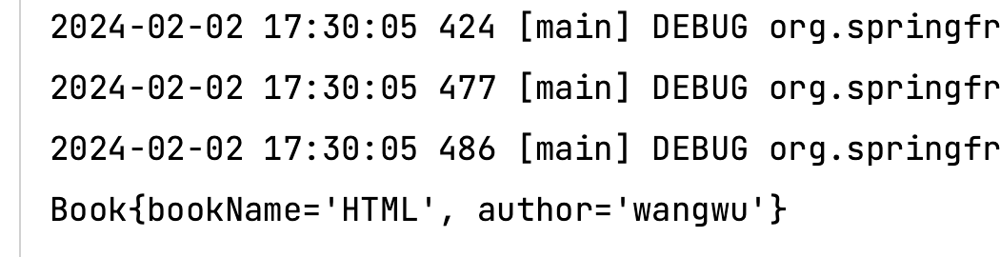

# Spring学习day02


## 控制反转  IoC

Spring中通过IoC容器来管理所有Java对象的实例化和初始化，控制对象与对象之间的依赖关系。我们将由IoC容器管理的Java对象成为Spring Bean，与Java使用关键字`new`创建的Java对象没有任何区别。

IoC容器是Spring框架中最重要的核心组件之一，它贯穿了Spring从诞生到成长的整个过程。


-   控制反转是一种思想
-   控制反转是为了降低程序耦合度，提高程序扩展能力
-   控制反转，反转的是什么？
    -   将对象的创建权力交出去，交给第三方容器负责
    -   将对象和对象之间关系的维护权交出去，交给第三方容器负责
-   控制反转这种思想如何实现
    -   DI（Dependency injection）：依赖注入

## 依赖注入介绍

**指Spring创建对象过程中，将的对象依赖属性通过配置进行注入**

依赖注入常见的实现方式包括两种：

-   set注入
-   构造注入

Bean管理：Bean对象的创建，以及Bean对象中属性的赋值（或者叫做Bean对象之间关系的维护）


## 基于XML管理bean

新建子模块`spring6-iocxml`

### 获取bean的三种方式

#### 方式一：根据id获取


#### 方式二：根据类型获取

<font color="red">当根据类型获取bean时，要求IoC容器中制定类型的bean有且只能有一个</font>

若IoC容器中一共配置了两个，例如：

``` xml
<!--beans.xml中-->
<bean class="org.example.spring6.iocxml.User" id="user"/>
<bean class="org.example.spring6.iocxml.User" id="user2"/>
```

``` java
User user2 = context.getBean(User.class);
System.out.println("根据类型获取bean: " + user2);
```


<font color="red">错误信息如下</font>

``` 
org.springframework.beans.factory.NoUniqueBeanDefinitionException: No qualifying bean of type 'org.example.spring6.iocxml.User' available: expected single matching bean but found 2: user,user2

```


如果一个接口有多个实现类，这些实现类都配置了bean，根据接口类型可以获取bean吗

>   不可以，因为bean不唯一
>
>   ``` xml
>   <!--一个接口实现类的获取过程-->
>   <bean id="userDao" class="org.example.spring6.iocxml.bean.UserDaoImpl"/>
>   <bean id="personDao" class="org.example.spring6.iocxml.bean.PersonDaoImpl" />
>   ```
>
>   ``` java
>   // java新建PersonDaoImpl，依赖UserDao接口
>   package org.example.spring6.iocxml.bean;
>   
>   /**
>    * Author: Wang Xinran
>    * Date: 2024-02-02 17:05
>    * Description:
>    */
>   
>   public class PersonDaoImpl implements UserDao{
>       @Override
>       public void run() {
>           System.out.println("Person......");
>       }
>   }
>   
>   ```
>
>   ``` java
>   // 编写测试用例
>   @Test
>   public void testUserDao() {
>       ApplicationContext context = new ClassPathXmlApplicationContext("beans.xml");
>       // 根据类型获取接口对应的bean
>       UserDao userDao = context.getBean(UserDao.class);
>       System.out.println(userDao);
>       userDao.run();
>   }
>   ```
>
>   
>
>   <font color="red">错误信息</font>
>
>   ``` 
>   org.springframework.beans.factory.NoUniqueBeanDefinitionException: No qualifying bean of type 'org.example.spring6.iocxml.bean.UserDao' available: expected single matching bean but found 2: userDao,personDao
>   
>   ```


#### 方式三：根据id和类型获取

``` java
@Test
public void testUser() {
    ApplicationContext context = new ClassPathXmlApplicationContext("beans.xml");

    // 1. 根据id获取bean
    User user1 = (User) context.getBean("user");
    System.out.println("根据id获取bean: " + user1);

    // 2. 根据类型获取bean
    User user2 = context.getBean(User.class);
    System.out.println("根据类型获取bean: " + user2);

    // 3. 根据id和类型获取bean
    User user3 = context.getBean("user", User.class);
    System.out.println("根据id和类型获取bean: " + user3);
}
```

## 依赖注入

### 依赖注入之setter注入

1.   创建类，定义属性，生成属性的set方法
2.   在spring配置文件中配置

新建Book类，并且实现getter，setter，有参和无参构造函数

``` java
// org/example/spring6/iocxml/di/Book.java
package org.example.spring6.iocxml.di;

/**
 * Author: Wang Xinran
 * Date: 2024-02-02 17:14
 * Description:
 */

public class Book {
    private String bookName;
    private String author;

    public Book() {

    }
    public Book(String bookName, String author) {
        this.bookName = bookName;
        this.author = author;
    }

    public String getBookName() {
        return bookName;
    }

    public void setBookName(String bookName) {
        this.bookName = bookName;
    }

    public String getAuthor() {
        return author;
    }

    public void setAuthor(String author) {
        this.author = author;
    }

    @Override
    public String toString() {
        return "Book{" +
                "bookName='" + bookName + '\'' +
                ", author='" + author + '\'' +
                '}';
    }
}

```

新建配置文件（为区分刚刚的配置文件）`bean-di.xml`

``` xml
<?xml version="1.0" encoding="UTF-8"?>
<beans xmlns="http://www.springframework.org/schema/beans"
       xmlns:xsi="http://www.w3.org/2001/XMLSchema-instance"
       xsi:schemaLocation="http://www.springframework.org/schema/beans http://www.springframework.org/schema/beans/spring-beans.xsd">
    <!--bean通过set方法注入-->
    <!--具体过程，通过标签中的name属性，对应到setter中的setBookName()函数-->
    <bean class="org.example.spring6.iocxml.di.Book" id="book">
        <property name="bookName" value="HTML"/>  <!--属性名-->
        <property name="author" value="wangwu"/>  <!--属性值-->
    </bean>
</beans>
```

在测试类进行测试

``` java
@Test
public void testSetter() {
    ApplicationContext context = new ClassPathXmlApplicationContext("bean-di.xml");
    Book book = context.getBean("book", Book.class);
    System.out.println(book);
}
```




### 依赖注入之构造器注入

1.   创建类，定义属性，生成有参数的构造方法
2.   在spring配置文件配置

**Book类同上，但是构造函数做简单修改**

``` java
public Book() {
    System.out.println("无参构造已经被执行");
}
public Book(String bookName, String author) {
    this.bookName = bookName;
    this.author = author;
    System.out.println("有参构造已经被执行");
}
```


``` xml
<!--bean通过set方法注入-->
<bean class="org.example.spring6.iocxml.di.Book" id="book">
    <property name="bookName" value="HTML"/>
    <property name="author" value="wangwu"/>
</bean>

<!--bean通过构造器注入-->
<bean class="org.example.spring6.iocxml.di.Book" id="bookConstructor">
    <constructor-arg name="bookName" value="PHP"/>
    <constructor-arg name="author" value="AAAAA"/>
</bean>
```


测试类

``` java
@Test
public void testConstructor() {
    ApplicationContext context = new ClassPathXmlApplicationContext("bean-di.xml");
    Book book = context.getBean("bookConstructor", Book.class);
    System.out.println(book);
}
```


执行结果


>   \- 为什么有一句<font color="red">无参构造已经被执行</font>？
>
>   \- 因为xml文件中“通过set方法注入”里面的内容也被执行，这里运行的是无参构造函数


### 特殊值处理

-   字面量赋值

    常规写法

-   null值

    若为空值，需要使用额外的标签

    ``` xml
    <property name="bookName">
    	<null/>
    </property>
    ```

    

-   xml实体

    插入的值为xml格式

    -   解决方法1：转义

        ``` xml
        <property name="bookName" value="&lt; &gt;">
        </property>
        ```

        

-   CDATA节（区），可以表示特殊符号

    -   解决方法2：

    ``` xml
    <property name="bookName">
        <value><![CDATA[a < b]]></value>
    </property>
    
    ```

    

    

### 特殊类型属性注入

#### 外部引入bean

新建两个类，部门和员工（一对多关系），

``` java
// org/example/spring6/iocxml/ditest/Department.java
public class Department {
    private String dName;

    public String getdName() {
        return dName;
    }

    public void setdName(String dName) {
        this.dName = dName;
    }

    public Department() {

    }

    public Department(String dName) {
        this.dName = dName;
    }

    public void info() {
        System.out.println("部门名称: " + dName);
    }
}
```


``` java
// org/example/spring6/iocxml/ditest/Employee.java
public class Employee {
    private String eName;

    private Integer age;

    // 员工输入某个部门
    private Department department;


    public String geteName() {
        return eName;
    }

    public void seteName(String eName) {
        this.eName = eName;
    }

    public Integer getAge() {
        return age;
    }

    public void setAge(Integer age) {
        this.age = age;
    }

    public Department getDepartment() {
        return department;
    }

    public void setDepartment(Department department) {
        this.department = department;
    }

    public Employee() {

    }

    public Employee(String eName, Integer age, Department department) {
        this.eName = eName;
        this.age = age;
        this.department = department;
    }

    public void work() {
        System.out.println(eName + "员工在工作, 工龄为: " + age);
        department.info();
    }
}

```


``` xml
<?xml version="1.0" encoding="UTF-8"?>
<beans xmlns="http://www.springframework.org/schema/beans"
       xmlns:xsi="http://www.w3.org/2001/XMLSchema-instance"
       xsi:schemaLocation="http://www.springframework.org/schema/beans http://www.springframework.org/schema/beans/spring-beans.xsd">

    <!--
        第一种方式: 引入外部的bean
        1. 创建两个类对象: Department, Employee
        2. 在Employee的bean标签里面, 使用property引入Department, Employee的bean
    -->
    <bean class="org.example.spring6.iocxml.ditest.Department" id="department">
        <property name="dName" value="安保部"/>
    </bean>

    <bean class="org.example.spring6.iocxml.ditest.Employee" id="employee">
        <!--普通属性注入-->
        <property name="eName" value="lucy"/>
        <property name="age" value="50"/>
        <!--对象类型注入-->
        <property name="department" ref="department"/>  <!--将部门对象引入  使用ref-->

    </bean>
</beans>
```


新建测试用例

``` java
@Test
public void testEmployee() {
    ApplicationContext context = new ClassPathXmlApplicationContext("bean-di-test.xml");
    // 员工对象
    Employee employee = context.getBean("employee", Employee.class);
    employee.work();
}
```


输出结果


#### 内部引入bean

``` xml
<bean class="org.example.spring6.iocxml.ditest.Employee" id="employee2">
        <!--内部bean注入-->
        <property name="eName" value="mary"/>
        <property name="age" value="30"/>
        <property name="department">
            <bean class="org.example.spring6.iocxml.ditest.Department">
                <property name="dName" value="财务部"/>
            </bean>
        </property>
</bean>
```

