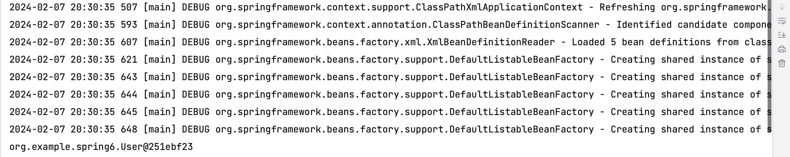
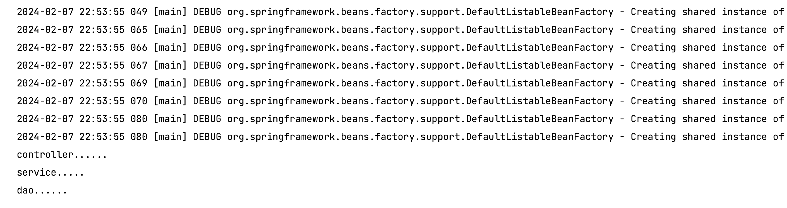
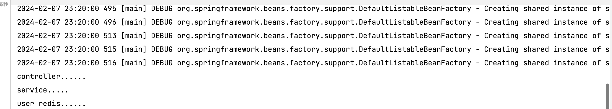

# 【study】Spring学习part03

新建模块`spring6-ioc-annotation`

## 基于注解管理bean（★）

Spring通过注解实现自动装配的步骤如下：

1.   引入依赖
2.   开启组件扫描
3.   使用注解定义bean
4.   依赖注入


最基本的写法：

新建类User

``` java
package org.example.spring6;

import org.springframework.stereotype.Component;

@Component
public class User {

}

```

配置bean文件，`bean.xml`，添加相关约束

`xmlns:context="http://www.springframework.org/schema/context"`

``` xml
xsi:schemaLocation="http://www.springframework.org/schema/beans
       http://www.springframework.org/schema/beans/spring-beans.xsd
       http://www.springframework.org/schema/context
       http://www.springframework.org/schema/context/spring-context.xsd"
```


``` xml
<?xml version="1.0" encoding="UTF-8"?>
<beans xmlns="http://www.springframework.org/schema/beans"
       xmlns:xsi="http://www.w3.org/2001/XMLSchema-instance"
       xmlns:context="http://www.springframework.org/schema/context"
       xsi:schemaLocation="http://www.springframework.org/schema/beans
       http://www.springframework.org/schema/beans/spring-beans.xsd
       http://www.springframework.org/schema/context
       http://www.springframework.org/schema/context/spring-context.xsd">

    <!--开启组件扫描-->
    <context:component-scan base-package="org.example.spring6"/>

</beans>
```

### 使用注解定义bean

Spring提供了一下多个注解，这些注解可以直接标注在Java类上，将它们定义成Spring bean

| 注解        | 说明                                                         |
| ----------- | ------------------------------------------------------------ |
| @Component  | 该注解用于描述Spring中的bean，他是一个泛化的概念，仅仅表示容器中的一个组件（bean），并且可以作用在应用的任何层次，例如Service层，Dao层等。使用时只需将该注解标注在相应类上即可。 |
| @Repository | 该注解用于将数据访问层（Dao层）的类标识为Spring中的bean，其功能与@Component相同。 |
| @Service    | 该注解通常作用在业务层（Service层），用于将业务层的类标识为Spring中的bean，其功能与@Component相同 |
| @Controller | 该注解通常作用在控制层（如Spring MVC的Controller），用于将控制层的类标识为Spring中的bean，其功能与@Component相同 |

编写测试类

``` java
@Test
public void testUser() {
    ApplicationContext context = new ClassPathXmlApplicationContext("bean.xml");
    User user = context.getBean("user", User.class);
    System.out.println(user);
}
```




### @Autowired注入

单独使用`@Autowired`注解是根据类型装配，默认是`byType`

``` xml
<!--bean.xml-->
<?xml version="1.0" encoding="UTF-8"?>
<beans xmlns="http://www.springframework.org/schema/beans"
       xmlns:xsi="http://www.w3.org/2001/XMLSchema-instance"
       xmlns:context="http://www.springframework.org/schema/context"
       xsi:schemaLocation="http://www.springframework.org/schema/beans
       http://www.springframework.org/schema/beans/spring-beans.xsd
       http://www.springframework.org/schema/context
       http://www.springframework.org/schema/context/spring-context.xsd">

    <!--开启组件扫描-->
    <context:component-scan base-package="org.example.spring6"/>

</beans>
```


构建一个小demo，项目结构如下

`org/example/autowired/`路径下

```
📁 autowired/
├─📁 dao/
│ ├─📁 impl/
│ │ └─📄 UserDaoImpl.java
│ └─📄 UserDao.java
├─📁 controller/
│ └─📄 UserController.java
└─📁 service/
  ├─📁 impl/
  │ └─📄 UserServiceImpl.java
  └─📄 UserSerivce.java

```

Controller使用`@Controller`注解

Dao的接口实现使用`@Repository`注解

Service的接口实现使用`@Service`注解

`UserController`、`UserServiceImpl`、`UserDaoImpl`分别实现`add()`方法，接口省略不写。


#### 1. 属性注入

在`UserController`中注入`service`，这里不再需要`setter()`进行注入，使用`@Autowired注解`，下面同理。即注解写到属性上。

``` java
@Controller
public class UserController {
    // 注入service
    // 第一种方式：属性注入
    @Autowired  // 根据类型找到对应对象, 完成注入
    private UserService userService;
    
    public void add() {
    	System.out.println("controller......");
        userService.add();
    }

}
```


在`UserServiceImpl`中注入`dao`

``` java
@Service
public class UserServiceImpl implements UserService {
    // 注入dao
    // 第一种方式: 属性注入
    @Autowired
    private UserDao userDao;
    
    public void add() {
        System.out.println("service......");
        userDao.add();
    }
}
```


编写测试类

``` java
@Test
public void testAutowired() {
    ApplicationContext context = new ClassPathXmlApplicationContext("bean.xml");
    UserController controller = context.getBean(UserController.class);
    controller.add();
}
```





#### 2. set注入

写出其`setter()`，在前方加入注解`@Autowired`，之后同理

``` java
package org.example.autowired.controller;

import org.example.autowired.service.UserService;
import org.springframework.beans.factory.annotation.Autowired;
import org.springframework.stereotype.Controller;


@Controller
public class UserController {

    // 第二种方式: set注入
    // 生成setter()
    private UserService userService;

    @Autowired
    public void setUserService(UserService userService) {
        this.userService = userService;
    }

    public void add() {
        System.out.println("controller......");
        userService.add();
    }
}

```

#### 3. 构造方法注入

在构造函数前加入注解`@Autowired`，其他同理

```  java
package org.example.autowired.controller;

import org.example.autowired.service.UserService;
import org.springframework.beans.factory.annotation.Autowired;
import org.springframework.stereotype.Controller;


@Controller
public class UserController {

    // 第三种方式: 构造方法注入
    // 生成构造函数
    private UserService userService;

    @Autowired
    public UserController(UserService userService) {
    	this.userService = userService;
    }

    public void add() {
        System.out.println("controller......");
        userService.add();
    }
}


```

#### 4. 形参注入

形参也可以使用`@Autowired`进行注解


#### 5. 只有一个构造函数，无需使用注解

<font color="red">当构造函数只有一个时，Autowired注解可以省略</font>


#### 6. @Autowired注解和@Qualifier注解联合

新建一个`UserRedisDaoImpl`类实现`UserDao`接口

``` java
@Repository
public class UserRedisDaoImpl implements UserDao {
    @Override
    public void add() {
        System.out.println("user redis......");
    }
}

```

此时执行测试代码会报错

``` 
org.springframework.beans.factory.UnsatisfiedDependencyException: Error creating bean with name 'userController': Unsatisfied dependency expressed through method 'setUserService' parameter 0: Error creating bean with name 'userServiceImpl': Unsatisfied dependency expressed through field 'userDao': No qualifying bean of type 'org.example.autowired.dao.UserDao' available: expected single matching bean but found 2: userDaoImpl,userRedisDaoImpl

```

因为`UserDao`在注入的时候发现了两个对象，`userDaoImpl,userRedisDaoImpl`，此时不能根据类型注入，需要进行名称注入

``` java
@Service
public class UserServiceImpl implements UserService {
    // 注入dao
    // 第一种方式: 属性注入
    @Autowired
    @Qualifier (value = "userRedisDaoImpl")
    private UserDao userDao;

    @Override
    public void add() {
        System.out.println("service.....");
        userDao.add();
    }
}

```





### @Resource注入

与`@Autowired`注解区别

| @Resource                                                    | @Autowired                                                   |
| ------------------------------------------------------------ | ------------------------------------------------------------ |
| 是JDK扩展包中，属于JDK的一部分。所以该注解是标准注解，更具有通用性。 | Spring框架中自己的注解                                       |
| 默认根据名称装配byName，未指定name时，使用属性名作为name。通过name找不到则会自动启动通过类型byType装配 | 默认根据类型装配byType，如果想根据名称装配，需要配合`@Qualifier`注解一起使用 |
| 用在属性上、setter方法上                                     | 用在属性上、setter方法上、构造方法上、构造方法参数上         |


需要使用依赖（JDK高于11或低于8需要引入依赖）

``` xml
<dependency>
    <groupId>jakarta.annotation</groupId>
    <artifactId>jakarta.annotation-api</artifactId>
    <version>2.1.1</version>
</dependency>
```

 

### 全注解开发

不再使用spring配置文件，写一个配置类代替配置文件

新建配置类

``` java
@Configuration  // 配置类
@ComponentScan("org.example")  // 开启组件扫描
// 该注解等价于在bean.xml文件中 <context:component-scan base-package="org.example"/>
public class SpringConfig {

}
```


新建测试用例

``` java
@Test
public void testUserControllerAnno() {
    // 加载配置类
    ApplicationContext context = new AnnotationConfigApplicationContext(SpringConfig.class);
    UserController controller = context.getBean(UserController.class);
    controller.add();
}
```

