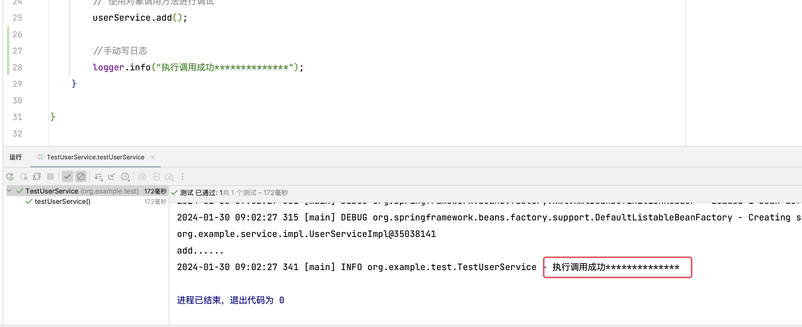

# 【study】Spring学习part01

- 传统JavaWeb开发的困惑
- IoC、DI和AOP思想提出
- Spring框架诞生

## 传统JavaWeb开发的困惑以及解决方案

``` java
// 用户账户信息修改业务方法
public void updateUserInfo(User user) {
    try {
        // 开启事务
        DaoUtils.openTransaction();
        // 获得UserDao执行插入User数据到数据库操作
        UserDao userDao = new UserDaoImpl();
        userDao.updateUserInfo(user);
        // 修改成功后, 向用户行为日志表中插入一条数据, 内容: 修改时间等信息
        UserLog userLog = new UserLogImpl();
        UserLog.recodeUserUpdate(user);
        // 提交事务
        DaoUtils.commit();
    } catch(Exception e) {
        // 回滚事务
        DaoUtils.rollback();
        // 向异常日志表中插入数据
        ExceptionLog exceptionLog = new ExceptionLogImpl();
        exceptionLog.recodeException(this, e);
    }
}
```

``` java
// 用户注册业务方法
public void regist(User user) {
    try {
        // 开启事务
        DaoUtils.openTransaction();
        // 获得UserDao执行插入User数据到数据库操作
        UserDao userDao = new UserDaoImpl();
        userDao.addUser(user);
        // 修改成功后, 向用户行为日志表中插入一条数据, 内容: 时间, 用户, 注册行为
        UserLog userLog = new UserLogImpl();
        UserLog.recodeUserRegist(user);
        // 注册成功后, 向用户邮箱发送一封激活邮件
        CommonUtils.sendEmail(user);
        // 提交事务
        DaoUtils.commit();
    } catch(Exception e) {
        // 回滚事务
        DaoUtils.rollback();
        // 向异常日志表中插入数据
        ExceptionLog exceptionLog = new ExceptionLogImpl();
        exceptionLog.recodeException(this, e);
    }
}
```

代码是两个业务层的代码, 主业务均为第7\~8行

现在存在一些问题: 以`updateUserInfo()`方法举例

``` java
UserDao userDao = new UserDaoImpl();
UserLog userLog = new UserLogImpl();
ExceptionLog exceptionLog = new ExceptionLogImpl();
```

这里面耦合度很高:

- 层与层之间紧密耦合在了一起, 接口与具体实现紧密耦合在一起

    > 解决思路: 程序代码中不要动手new对象，第三方根据要求为程序提供需要的Bean对象

- 通用的事务功能耦合在业务代码中，通用的日志功能耦合在业务代码中

    > 程序代码中不要动手new对象，第三方根据要求为程序提供需要的Bean对象的代理对象

### IoC思想

Inversion of Control，控制反转，强调的是原来在程序中创建Bean的权利反转给第三方

### DI思想

Dependency Injection，依赖注入，强调的Bean之间关系，这种关系第三方负责去设置

### AOP思想

Aspect Oriented Programming，面向切面编程，功能的横向抽取，主要的实现方式是Proxy

## 基于XML管理Bean

IDE中新建Java项目，并且新建子模块`day01`, 父模块中的`pom.xml`引入一些依赖

==jdk版本: 21.0.2==

``` xml
<dependencies>
    <dependency>
        <groupId>org.springframework</groupId>
        <artifactId>spring-context</artifactId>
        <version>6.1.2</version>
    </dependency>

    <dependency>
        <groupId>org.junit.jupiter</groupId>
        <artifactId>junit-jupiter-api</artifactId>
        <version>5.8.2</version>
    </dependency>
</dependencies>
```

建立一些简单的文件

在`day01.src.main.java.org.example`文件夹下

``` java
// service.UserService.Java
package org.example.service;

public interface UserService {
    void add();
}

```

``` java
// service.impl.UserSerivceImpl
package org.example.service.impl;

import org.example.service.UserService;

public class UserServiceImpl implements UserService {
	public void add() {
        System.out.println("add......");
    }
}

```

`day01/src/main/resources/`文件夹内添加xml配置文件, 文件名没有要求，这里叫做`beans.xml`

``` xml
<?xml version="1.0" encoding="UTF-8"?>
<beans xmlns="http://www.springframework.org/schema/beans"
       xmlns:xsi="http://www.w3.org/2001/XMLSchema-instance"
       xsi:schemaLocation="http://www.springframework.org/schema/beans http://www.springframework.org/schema/beans/spring-beans.xsd">
    <bean class="org.example.service.impl.UserServiceImpl" id="userService">

    </bean>
</beans>
```

`bean`标签中，class指定要创建对象的类，id是唯一标识


``` java
// test.TestUserService
public class TestUserService {
    @Test
    public void testUserService() {
        // 加载Spring配置文件, 对象创建
        ApplicationContext context = new ClassPathXmlApplicationContext("beans.xml");

        // 获取创建的对象
        // context.getBean("userService")的返回值为Object类型, 需要强制类型转换
        UserService userService = (UserService) context.getBean("userService");
        System.out.println(userService);

        // 使用对象调用方法进行调试
        userService.add();
    }

}

```


创建的对象会执行其构造函数。

创建好的对象会被放入到`Map<String, BeanDefinition> beanDefinitionMap`

key是唯一标识符，`beans.xml`中的id

value是类的定义（描述）信息


## Log4j2日志框架

### 日志信息优先级（由低到高）

-   TRACE：追踪，是最低的日志级别，相当于追踪程序的执行
-   DEBUG：调试一般在开发中，都将其设置为最低的日志级别
-   INFO：信息，输出重要的信息，使用较多
-   WARN：警告，输出警告的信息
-   ERROR：错误，输出错误信息
-   FATAL：严重错误

 ### 引入log4j2依赖

``` xml
<dependency>
    <groupId>org.apache.logging.log4j</groupId>
    <artifactId>log4j-core</artifactId>
    <version>2.20.0</version>
</dependency>
<dependency>
    <groupId>org.apache.logging.log4j</groupId>
    <artifactId>log4j-slf4j2-impl</artifactId>
    <version>2.20.0</version>
</dependency>
```

配置log4j2，在`day01.src.main.resources`下新建`log4j2.xml`

``` xml
<!--日志信息配置-->
<?xml version="1.0" encoding="UTF-8" ?>
<configuration>
    <loggers>
        <root level="DEBUG">
            <appender-ref ref="spring6log" />
            <appender-ref ref="RollingFile"/>
            <appender-ref ref="log"/>
        </root>
    </loggers>
    <appenders>
        <!--输入日志信息到控制台-->
        <console name="spring6log" target="SYSTEM_OUT">
            <!--控制日志输出的格式-->
            <PatternLayout pattern="%d{yyyy-MM-dd HH:mm:ss SSS} [%t] %-3level %logger{1024} - %msg%n"/>
        </console>

        <!--文件会打印输出所有信息，这个log每次运行程序会自动清空，由append属性决定，适合临时测试调用-->
        <File name="log" fileName="/Users/promise/Promise Code/Java/FinalWork/SpringStudy/day01/test.log" append="false">
            <PatternLayout pattern="%d{HH:mm:ss.SSS} %-5level %class{36} %L %M - %msg%xEx%n" />
        </File>

        <!--
        这个会打印所有的信息
        每次大小超过size，则这size大小的日志会自动存入按年份-月份建立的文件夹下面进行压缩，作为存档
        -->
        <RollingFile name="RollingFile" fileName="/Users/promise/Promise Code/Java/FinalWork/SpringStudy/day01/app.log"
                     filePattern="log/$${date:yyyy-MM}/app-%d{MM-dd-yyyy}-%i.log.gz">
            <PatternLayout pattern="%d{yyyy-MM-dd 'at' HH:mm:ss z} %-5level %class{36} %L %M - %msg%xEx%n"/>
            <SizeBasedTriggeringPolicy size="50MB"/>
            <!--DefaultRolloverStrategy 属性不设置，则默认为最多同一文件夹下7个文件，这里设置了20-->
            <DefaultRolloverStrategy max="20"/>
        </RollingFile>
    </appenders>
</configuration>
```

### 使用logger

在`org/example/test/TestUserService.java`文件，自定义logger

``` java
package org.example.test;


import org.example.service.UserService;
import org.junit.jupiter.api.Test;
import org.slf4j.Logger;
import org.slf4j.LoggerFactory;
import org.springframework.context.ApplicationContext;
import org.springframework.context.support.ClassPathXmlApplicationContext;

public class TestUserService {
    // 创建Logger对象
    private Logger logger = LoggerFactory.getLogger(TestUserService.class);
    @Test
    public void testUserService() {
        // 加载Spring配置文件, 对象创建
        ApplicationContext context = new ClassPathXmlApplicationContext("beans.xml");

        // 获取创建的对象
        // context.getBean("userService")的返回值为Object类型, 需要强制类型转换
        UserService userService = (UserService) context.getBean("userService");
        System.out.println(userService);

        // 使用对象调用方法进行调试
        userService.add();

        //手动写日志
        logger.info("执行调用成功**************");
    }

}

```



