# Spring学习part02


## 控制反转  IoC

Spring中通过IoC容器来管理所有Java对象的实例化和初始化，控制对象与对象之间的依赖关系。我们将由IoC容器管理的Java对象成为Spring Bean，与Java使用关键字`new`创建的Java对象没有任何区别。

IoC容器是Spring框架中最重要的核心组件之一，它贯穿了Spring从诞生到成长的整个过程。

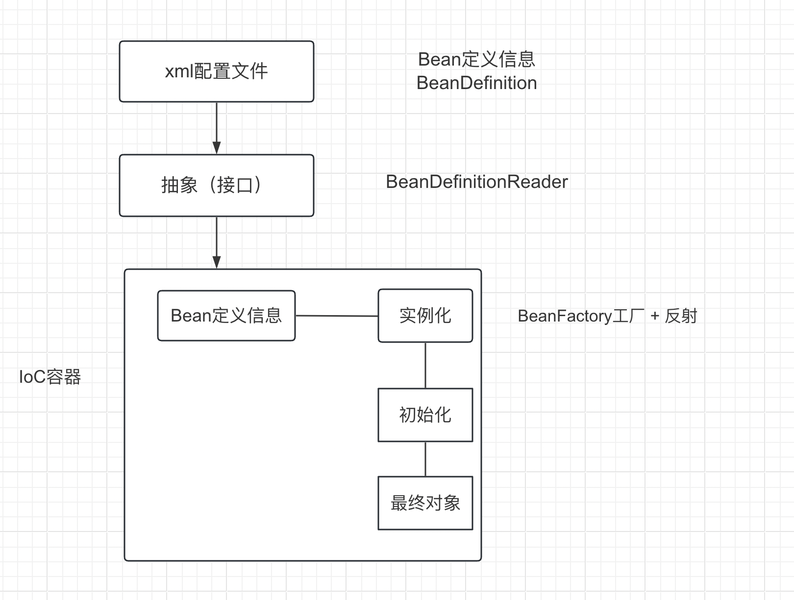


-   控制反转是一种思想
-   控制反转是为了降低程序耦合度，提高程序扩展能力
-   控制反转，反转的是什么？
    -   将对象的创建权力交出去，交给第三方容器负责
    -   将对象和对象之间关系的维护权交出去，交给第三方容器负责
-   控制反转这种思想如何实现
    -   DI（Dependency injection）：依赖注入

## 依赖注入介绍

**指Spring创建对象过程中，将的对象依赖属性通过配置进行注入**

依赖注入常见的实现方式包括两种：

-   set注入
-   构造注入

Bean管理：Bean对象的创建，以及Bean对象中属性的赋值（或者叫做Bean对象之间关系的维护）


## 基于XML管理bean

新建子模块`spring6-iocxml`

### 获取bean的三种方式

#### 方式一：根据id获取


#### 方式二：根据类型获取

<font color="red">当根据类型获取bean时，要求IoC容器中制定类型的bean有且只能有一个</font>

若IoC容器中一共配置了两个，例如：

``` xml
<!--beans.xml中-->
<bean class="org.example.spring6.iocxml.User" id="user"/>
<bean class="org.example.spring6.iocxml.User" id="user2"/>
```

``` java
User user2 = context.getBean(User.class);
System.out.println("根据类型获取bean: " + user2);
```


<font color="red">错误信息如下</font>

``` 
org.springframework.beans.factory.NoUniqueBeanDefinitionException: No qualifying bean of type 'org.example.spring6.iocxml.User' available: expected single matching bean but found 2: user,user2

```


如果一个接口有多个实现类，这些实现类都配置了bean，根据接口类型可以获取bean吗

>   不可以，因为bean不唯一
>
>   ``` xml
>   <!--一个接口实现类的获取过程-->
>   <bean id="userDao" class="org.example.spring6.iocxml.bean.UserDaoImpl"/>
>   <bean id="personDao" class="org.example.spring6.iocxml.bean.PersonDaoImpl" />
>   ```
>
>   ``` java
>   // java新建PersonDaoImpl，依赖UserDao接口
>   package org.example.spring6.iocxml.bean;
>   
>   /**
>    * 
>    * Date: 2024-02-02 17:05
>    * Description:
>    */
>   
>   public class PersonDaoImpl implements UserDao{
>       @Override
>       public void run() {
>           System.out.println("Person......");
>       }
>   }
>   
>   ```
>
>   ``` java
>   // 编写测试用例
>   @Test
>   public void testUserDao() {
>       ApplicationContext context = new ClassPathXmlApplicationContext("beans.xml");
>       // 根据类型获取接口对应的bean
>       UserDao userDao = context.getBean(UserDao.class);
>       System.out.println(userDao);
>       userDao.run();
>   }
>   ```
>
>   
>
>   <font color="red">错误信息</font>
>
>   ``` 
>   org.springframework.beans.factory.NoUniqueBeanDefinitionException: No qualifying bean of type 'org.example.spring6.iocxml.bean.UserDao' available: expected single matching bean but found 2: userDao,personDao
>   
>   ```


#### 方式三：根据id和类型获取

``` java
@Test
public void testUser() {
    ApplicationContext context = new ClassPathXmlApplicationContext("beans.xml");

    // 1. 根据id获取bean
    User user1 = (User) context.getBean("user");
    System.out.println("根据id获取bean: " + user1);

    // 2. 根据类型获取bean
    User user2 = context.getBean(User.class);
    System.out.println("根据类型获取bean: " + user2);

    // 3. 根据id和类型获取bean
    User user3 = context.getBean("user", User.class);
    System.out.println("根据id和类型获取bean: " + user3);
}
```

### 依赖注入

#### 依赖注入之setter注入

1.   创建类，定义属性，生成属性的set方法
2.   在spring配置文件中配置

新建Book类，并且实现getter，setter，有参和无参构造函数

``` java
// org/example/spring6/iocxml/di/Book.java
package org.example.spring6.iocxml.di;

/**
 * 
 * Date: 2024-02-02 17:14
 * Description:
 */

public class Book {
    private String bookName;
    private String author;

    public Book() {

    }
    public Book(String bookName, String author) {
        this.bookName = bookName;
        this.author = author;
    }

    public String getBookName() {
        return bookName;
    }

    public void setBookName(String bookName) {
        this.bookName = bookName;
    }

    public String getAuthor() {
        return author;
    }

    public void setAuthor(String author) {
        this.author = author;
    }

    @Override
    public String toString() {
        return "Book{" +
                "bookName='" + bookName + '\'' +
                ", author='" + author + '\'' +
                '}';
    }
}

```

新建配置文件（为区分刚刚的配置文件）`bean-di.xml`

``` xml
<?xml version="1.0" encoding="UTF-8"?>
<beans xmlns="http://www.springframework.org/schema/beans"
       xmlns:xsi="http://www.w3.org/2001/XMLSchema-instance"
       xsi:schemaLocation="http://www.springframework.org/schema/beans http://www.springframework.org/schema/beans/spring-beans.xsd">
    <!--bean通过set方法注入-->
    <!--具体过程，通过标签中的name属性，对应到setter中的setBookName()函数-->
    <bean class="org.example.spring6.iocxml.di.Book" id="book">
        <property name="bookName" value="HTML"/>  <!--属性名-->
        <property name="author" value="wangwu"/>  <!--属性值-->
    </bean>
</beans>
```

在测试类进行测试

``` java
@Test
public void testSetter() {
    ApplicationContext context = new ClassPathXmlApplicationContext("bean-di.xml");
    Book book = context.getBean("book", Book.class);
    System.out.println(book);
}
```

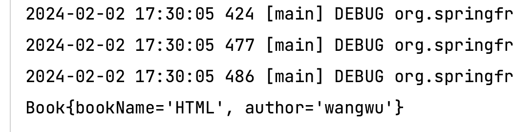


#### 依赖注入之构造器注入

1.   创建类，定义属性，生成有参数的构造方法
2.   在spring配置文件配置

**Book类同上，但是构造函数做简单修改**

``` java
public Book() {
    System.out.println("无参构造已经被执行");
}
public Book(String bookName, String author) {
    this.bookName = bookName;
    this.author = author;
    System.out.println("有参构造已经被执行");
}
```


``` xml
<!--bean通过set方法注入-->
<bean class="org.example.spring6.iocxml.di.Book" id="book">
    <property name="bookName" value="HTML"/>
    <property name="author" value="wangwu"/>
</bean>

<!--bean通过构造器注入-->
<bean class="org.example.spring6.iocxml.di.Book" id="bookConstructor">
    <constructor-arg name="bookName" value="PHP"/>
    <constructor-arg name="author" value="AAAAA"/>
</bean>
```


测试类

``` java
@Test
public void testConstructor() {
    ApplicationContext context = new ClassPathXmlApplicationContext("bean-di.xml");
    Book book = context.getBean("bookConstructor", Book.class);
    System.out.println(book);
}
```


执行结果

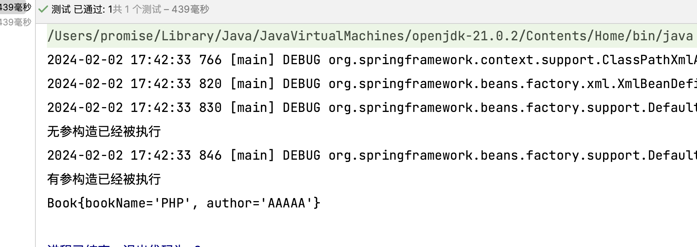

>   \- 为什么有一句<font color="red">无参构造已经被执行</font>？
>
>   \- 因为xml文件中“通过set方法注入”里面的内容也被执行，这里运行的是无参构造函数


#### 特殊值处理

-   字面量赋值

    常规写法

-   null值

    若为空值，需要使用额外的标签

    ``` xml
    <property name="bookName">
    	<null/>
    </property>
    ```

    

-   xml实体

    插入的值为xml格式

    -   解决方法1：转义

        ``` xml
        <property name="bookName" value="&lt; &gt;">
        </property>
        ```

        

-   CDATA节（区），可以表示特殊符号

    -   解决方法2：

    ``` xml
    <property name="bookName">
        <value><![CDATA[a < b]]></value>
    </property>
    
    ```

    

    

#### 特殊类型属性注入

##### 外部引入bean

新建两个类，部门和员工（一对多关系），

``` java
// org/example/spring6/iocxml/ditest/Department.java
public class Department {
    private String dName;

    public String getdName() {
        return dName;
    }

    public void setdName(String dName) {
        this.dName = dName;
    }

    public Department() {

    }

    public Department(String dName) {
        this.dName = dName;
    }

    public void info() {
        System.out.println("部门名称: " + dName);
    }
}
```


``` java
// org/example/spring6/iocxml/ditest/Employee.java
public class Employee {
    private String eName;

    private Integer age;

    // 员工输入某个部门
    private Department department;


    public String geteName() {
        return eName;
    }

    public void seteName(String eName) {
        this.eName = eName;
    }

    public Integer getAge() {
        return age;
    }

    public void setAge(Integer age) {
        this.age = age;
    }

    public Department getDepartment() {
        return department;
    }

    public void setDepartment(Department department) {
        this.department = department;
    }

    public Employee() {

    }

    public Employee(String eName, Integer age, Department department) {
        this.eName = eName;
        this.age = age;
        this.department = department;
    }

    public void work() {
        System.out.println(eName + "员工在工作, 工龄为: " + age);
        department.info();
    }
}

```


``` xml
<?xml version="1.0" encoding="UTF-8"?>
<beans xmlns="http://www.springframework.org/schema/beans"
       xmlns:xsi="http://www.w3.org/2001/XMLSchema-instance"
       xsi:schemaLocation="http://www.springframework.org/schema/beans http://www.springframework.org/schema/beans/spring-beans.xsd">

    <!--
        第一种方式: 引入外部的bean
        1. 创建两个类对象: Department, Employee
        2. 在Employee的bean标签里面, 使用property引入Department, Employee的bean
    -->
    <bean class="org.example.spring6.iocxml.ditest.Department" id="department">
        <property name="dName" value="安保部"/>
    </bean>

    <bean class="org.example.spring6.iocxml.ditest.Employee" id="employee">
        <!--普通属性注入-->
        <property name="eName" value="lucy"/>
        <property name="age" value="50"/>
        <!--对象类型注入-->
        <property name="department" ref="department"/>  <!--将部门对象引入  使用ref-->

    </bean>
</beans>
```


新建测试用例

``` java
@Test
public void testEmployee() {
    ApplicationContext context = new ClassPathXmlApplicationContext("bean-di-test.xml");
    // 员工对象
    Employee employee = context.getBean("employee", Employee.class);
    employee.work();
}
```


输出结果

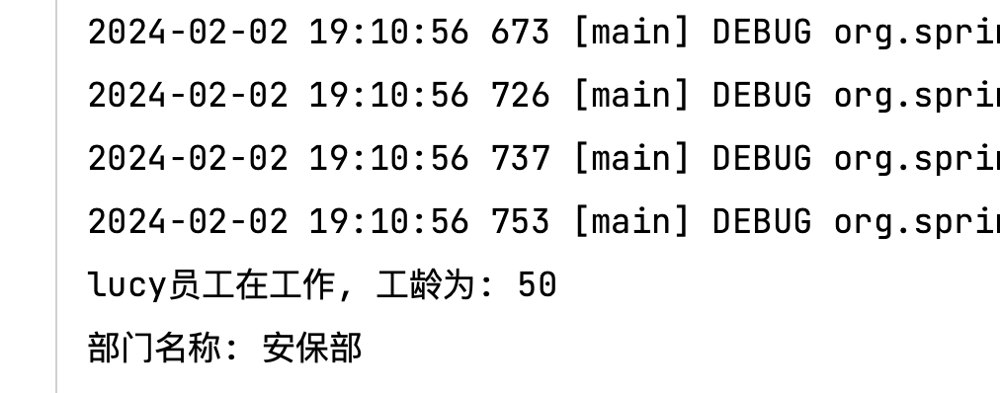


##### 内部引入bean

``` xml
<bean class="org.example.spring6.iocxml.ditest.Employee" id="employee2">
        <!--内部bean注入-->
        <property name="eName" value="mary"/>
        <property name="age" value="30"/>
        <property name="department">
            <bean class="org.example.spring6.iocxml.ditest.Department">
                <property name="dName" value="财务部"/>
            </bean>
        </property>
</bean>
```


##### 级联引入bean

``` xml
<!--
        第二种方式: 级联赋值bean
        1. 创建两个类对象: Department, Employee
        2. 在Employee的bean标签里面, 使用property引入Department, Employee的bean
    -->
<bean id="employee3" class="org.example.spring6.iocxml.ditest.Employee">
    <property name="eName" value="tom"/>
    <property name="age" value="30"/>

    <!--级联赋值-->
    <property name="department" ref="department3"/>  <!--这里不能写value-->
    <property name="department.dName" value="测试部"/>
</bean>
<bean id="department3" class="org.example.spring6.iocxml.ditest.Department">
    <property name="dName" value="技术研发部"/>
</bean>
```


#### 为数组类型属性赋值

员工类添加爱好，并生成getter(), setter()

``` java
private String[] hobbies;

public String[] getHobbies() {
    return hobbies;
}

public void setHobbies(String[] hobbies) {
    this.hobbies = hobbies;
}
```

构造bean，新建`bean-di-array.xml`

``` xml
<?xml version="1.0" encoding="UTF-8"?>
<beans xmlns="http://www.springframework.org/schema/beans"
       xmlns:xsi="http://www.w3.org/2001/XMLSchema-instance"
       xsi:schemaLocation="http://www.springframework.org/schema/beans http://www.springframework.org/schema/beans/spring-beans.xsd">
    <bean class="org.example.spring6.iocxml.ditest.Department" id="department">
        <property name="dName" value="技术部" />
    </bean>

    <bean class="org.example.spring6.iocxml.ditest.Employee" id="employee">
        <!--注入普通的属性值-->
        <property name="eName" value="Lucy" />
        <property name="age" value="20" />
        <!--注入对象类型的属性值-->
        <property name="department" ref="department"/>
        <!--注入数组类型的属性值-->
        <property name="hobbies">
            <array>
                <value>唱</value>
                <value>跳</value>
                <value>rap</value>
                <value>篮球</value>
            </array>
        </property>

    </bean>
</beans>
```

>   如果为数组类型，在`property`标签中还有`array`标签写入，再使用`value`标签添加值。

编写测试类

``` java
@Test
public void testArray() {
    ApplicationContext context = new ClassPathXmlApplicationContext("bean-di-array.xml");
    Employee employee = context.getBean("employee", Employee.class);
    employee.work();
}
```

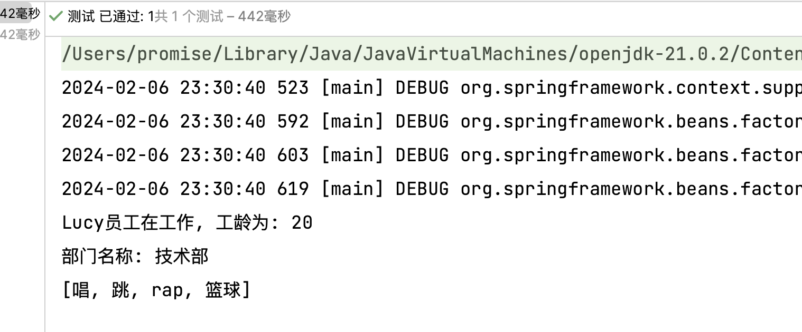


#### 为集合类型属性注入

##### list集合类型

部门新增属性，员工列表，并生成getter(), setter()

``` java
private List<Employee> employeeList;

public List<Employee> getEmployeeList() {
    return employeeList;
}

public void setEmployeeList(List<Employee> employeeList) {
    this.employeeList = employeeList;
}

public void info() {
    System.out.println("部门名称: " + dName);
    for (Employee emp : employeeList) {
        System.out.println(emp.geteName());
    }
}
```

配置bean，`bean-di-list.xml`

``` xml
<?xml version="1.0" encoding="UTF-8"?>
<beans xmlns="http://www.springframework.org/schema/beans"
       xmlns:xsi="http://www.w3.org/2001/XMLSchema-instance"
       xsi:schemaLocation="http://www.springframework.org/schema/beans http://www.springframework.org/schema/beans/spring-beans.xsd">
    <bean class="org.example.spring6.iocxml.ditest.Employee" id="employee1">
        <property name="eName" value="Lucy"/>
        <property name="age" value="20"/>
    </bean>

    <bean class="org.example.spring6.iocxml.ditest.Employee" id="employee2">
        <property name="eName" value="Mary"/>
        <property name="age" value="30"/>
    </bean>

    <bean class="org.example.spring6.iocxml.ditest.Department" id="department">
        <property name="dName" value="技术研发部"/>
        <property name="employeeList">
            <list>  <!--list中引入其他的bean-->
                <ref bean="employee1"/>
                <ref bean="employee2"/>
            </list>
        </property>
    </bean>
</beans>
```

编写测试类

``` java
@Test
public void testList() {
    ApplicationContext context = new ClassPathXmlApplicationContext("bean-di-list.xml");
    Department department = context.getBean("department", Department.class);
    department.info();
}
```

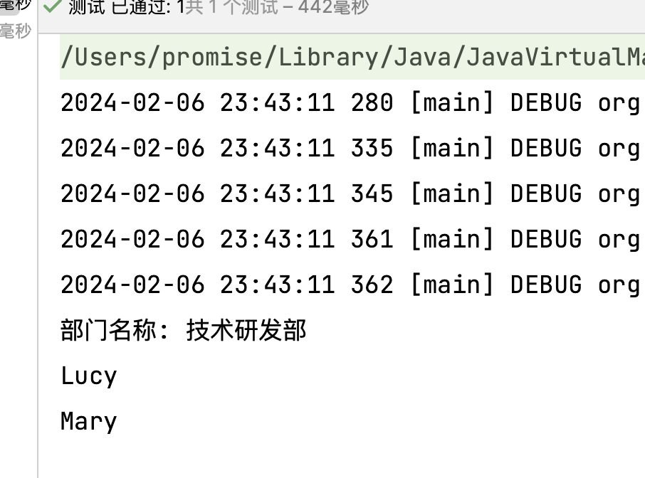


##### map集合类型

新建学生类

``` java
package org.example.spring6.iocxml.dimap;

import java.util.Map;

/**
 * 
 * Date: 2024-02-07 00:05
 * Description:
 */

public class Student {
    private String studentId;
    private String studentName;

    private Map<String, Teacher> teacherMap;

    public String getStudentId() {
        return studentId;
    }

    public void setStudentId(String studentId) {
        this.studentId = studentId;
    }

    public String getStudentName() {
        return studentName;
    }

    public void setStudentName(String studentName) {
        this.studentName = studentName;
    }

    public Map<String, Teacher> getTeacherMap() {
        return teacherMap;
    }

    public void setTeacherMap(Map<String, Teacher> teacherMap) {
        this.teacherMap = teacherMap;
    }

    public void run() {
        System.out.println("学生编号: " + studentId + "学生名: " + studentName);
        System.out.println(teacherMap);
    }

    @Override
    public String toString() {
        return "Student{" +
                "studentId='" + studentId + '\'' +
                ", studentName='" + studentName + '\'' +
                ", teacherMap=" + teacherMap +
                '}';
    }
}

```


新建教师类

``` java
package org.example.spring6.iocxml.dimap;

/**
 * 
 * Date: 2024-02-07 00:05
 * Description:
 */

public class Teacher {
    private String teacherId;
    private String teacherName;

    public String getTeacherId() {
        return teacherId;
    }

    public void setTeacherId(String teacherId) {
        this.teacherId = teacherId;
    }

    public String getTeacherName() {
        return teacherName;
    }

    public void setTeacherName(String teacherName) {
        this.teacherName = teacherName;
    }

    @Override
    public String toString() {
        return "Teacher{" +
                "teacherId='" + teacherId + '\'' +
                ", teacherName='" + teacherName + '\'' +
                '}';
    }
}

```


配置bean，`bean-di-map.xml`

``` xml
<?xml version="1.0" encoding="UTF-8"?>
<beans xmlns="http://www.springframework.org/schema/beans"
       xmlns:xsi="http://www.w3.org/2001/XMLSchema-instance"
       xsi:schemaLocation="http://www.springframework.org/schema/beans http://www.springframework.org/schema/beans/spring-beans.xsd">
    <!--
        1. 创建两个对象
        2. 注入普通类型属性
        3. 在学生bean中注入map集合类型属性
    -->
    <bean class="org.example.spring6.iocxml.dimap.Student" id="student">
        <property name="studentId" value="20000"/>
        <property name="studentName" value="张三"/>
        <property name="teacherMap">
            <map>
                <entry key="100010" value-ref="teacher1"/>
                <entry key="100011" value-ref="teacher2"/>
                <entry key="100012" value-ref="teacher3"/>
            </map>
        </property>
    </bean>

    <bean class="org.example.spring6.iocxml.dimap.Teacher" id="teacher1">
        <property name="teacherId" value="100"/>  <!--讲师id-->
        <property name="teacherName" value="蔡老师"/>
    </bean>
    <bean class="org.example.spring6.iocxml.dimap.Teacher" id="teacher2">
        <property name="teacherId" value="101"/>  <!--讲师id-->
        <property name="teacherName" value="徐老师"/>
    </bean>
    <bean class="org.example.spring6.iocxml.dimap.Teacher" id="teacher3">
        <property name="teacherId" value="102"/>  <!--讲师id-->
        <property name="teacherName" value="kun老师"/>
    </bean>
</beans>
```


编写测试类

``` java
@Test
public void testMap() {
    ApplicationContext context = new ClassPathXmlApplicationContext("bean-di-map.xml");
    Student student = context.getBean("student", Student.class);
    student.run();
}
```

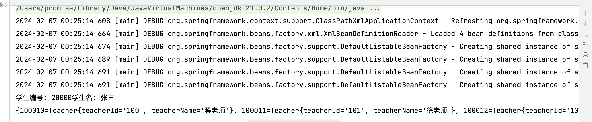


#### 引用集合类型的bean

新增课程类Lesson

``` java
package org.example.spring6.iocxml.dimap;

/**
 * 
 * Date: 2024-02-07 00:29
 * Description:
 */

public class Lesson {
    private String lessonName;

    public String getLessonName() {
        return lessonName;
    }

    public void setLessonName(String lessonName) {
        this.lessonName = lessonName;
    }

    @Override
    public String toString() {
        return "Lesson{" +
                "lessonName='" + lessonName + '\'' +
                '}';
    }
}

```


新增学生属性：lessonList，表示学生选了哪些课程，并生成getter(), setter()

``` java
private List<Lesson> lessonList;

public List<Lesson> getLessonList() {
    return lessonList;
}

public void setLessonList(List<Lesson> lessonList) {
    this.lessonList = lessonList;
}
```


配置bean，`bean-di-ref.xml`

需要引入新的约束

`xmlns:util="http://www.springframework.org/schema/util"`

`xsi:schemaLocation`中添加

-   `http://www.springframework.org/schema/util`
-   `http://www.springframework.org/schema/util/spring-util.xsd`

``` xml
<?xml version="1.0" encoding="UTF-8"?>
<beans xmlns="http://www.springframework.org/schema/beans"
       xmlns:xsi="http://www.w3.org/2001/XMLSchema-instance"
       xmlns:util="http://www.springframework.org/schema/util"
       xsi:schemaLocation="http://www.springframework.org/schema/beans
       http://www.springframework.org/schema/beans/spring-beans.xsd
       http://www.springframework.org/schema/util
       http://www.springframework.org/schema/util/spring-util.xsd">
    <!--1. 创建三个对象-->
    <!--2. 注入普通类型属性-->
    <bean class="org.example.spring6.iocxml.dimap.Student" id="student">
        <property name="studentId" value="10000"/>
        <property name="studentName" value="张三"/>
        <property name="lessonList" ref="lessonList"/>
        <property name="teacherMap" ref="teacherMap"/>
    </bean>

    <bean class="org.example.spring6.iocxml.dimap.Teacher" id="teacher1">
        <property name="teacherName" value="蔡老师"/>
        <property name="teacherId" value="100"/>
    </bean>

    <bean class="org.example.spring6.iocxml.dimap.Teacher" id="teacher2">
        <property name="teacherName" value="徐老师"/>
        <property name="teacherId" value="101"/>
    </bean>

    <bean class="org.example.spring6.iocxml.dimap.Lesson" id="lesson1">
        <property name="lessonName" value="数据结构"/>
    </bean>
    <bean class="org.example.spring6.iocxml.dimap.Lesson" id="lesson2">
        <property name="lessonName" value="计算机组成原理"/>
    </bean>
    <bean class="org.example.spring6.iocxml.dimap.Lesson" id="lesson3">
        <property name="lessonName" value="操作系统"/>
    </bean>
    <bean class="org.example.spring6.iocxml.dimap.Lesson" id="lesson4">
        <property name="lessonName" value="计算机网络"/>
    </bean>

    <!--3. 使用util: 类型  定义-->
    <util:list id="lessonList">
        <ref bean="lesson1"/>
        <ref bean="lesson2"/>
        <ref bean="lesson3"/>
        <ref bean="lesson4"/>
    </util:list>

    <util:map id="teacherMap">
        <entry key="10010" value-ref="teacher1"/>
        <entry key="10011" value-ref="teacher2"/>
    </util:map>
    <!--4. 在学生bean引入util: 类型定义bean, 完成list, map类型属性注入-->
</beans>
```


输出结果

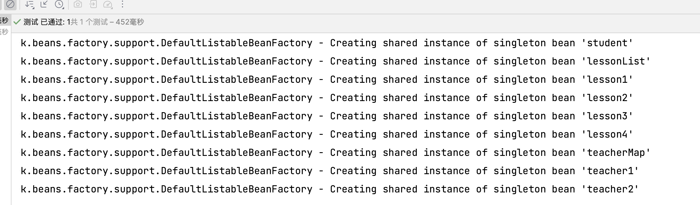


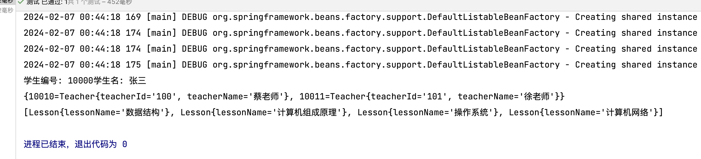


#### p命名空间注入

`bean-di-ref.xml`中简单修改，添加如下约束以及标签

`xmlns:p="http://www.springframework.org/schema/p"`

``` xml
<bean class="org.example.spring6.iocxml.dimap.Student" id="studentP" p:studentId="1000" p:studentName="Mary"
      p:lessonList-ref="lessonList" p:teacherMap-ref="teacherMap">

</bean>
```

编写测试用例

``` java
@Test
public void testPLabel() {
    ApplicationContext context = new ClassPathXmlApplicationContext("bean-di-ref.xml");
    Student student = context.getBean("studentP", Student.class);
    student.run();
}
```

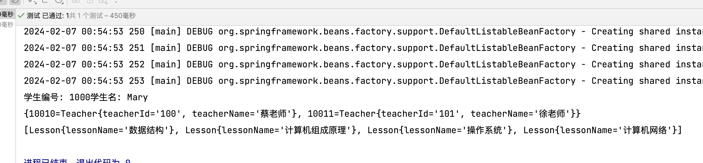

 

#### 引入外部属性文件

导入连接MySQL相关依赖在`pom.xml`中

``` xml
<!--MySQL驱动-->
<dependency>
    <groupId>mysql</groupId>
    <artifactId>mysql-connector-java</artifactId>
    <version>8.0.30</version>
</dependency>
<dependency>
    <groupId>com.alibaba</groupId>
    <artifactId>druid</artifactId>
    <version>1.0.31</version>
</dependency>
```


连接MySQL操作，写入配置文件`jdbc.properties`，配置MySQL相关

``` properties
jdbc.user=root
jdbc.password=11111111
jdbc.url=jdbc:mysql://localhost:3306/ssm?serverTimezone=UTC
jdbc.driver=com.mysql.cj.jdbc.Driver
```


然后配置配置bean，`bean-jdbc.xml`

``` xml
<?xml version="1.0" encoding="UTF-8"?>
<beans xmlns="http://www.springframework.org/schema/beans"
       xmlns:xsi="http://www.w3.org/2001/XMLSchema-instance"
       xmlns:context="http://www.springframework.org/schema/context"
       xsi:schemaLocation="http://www.springframework.org/schema/beans
       http://www.springframework.org/schema/beans/spring-beans.xsd
       http://www.springframework.org/schema/context
       http://www.springframework.org/schema/context/spring-context.xsd">
    <!--引入外部属性文件-->
    <context:property-placeholder location="classpath:jdbc.properties"/>

    <!--完成数据库信息注入-->
    <bean id="druidDataSource" class="com.alibaba.druid.pool.DruidDataSource">
        <property name="url" value="${jdbc.url}"/>
        <property name="username" value="${jdbc.user}"/>
        <property name="password" value="${jdbc.password}"/>
        <property name="driverClassName" value="${jdbc.driver}"/>
    </bean>
</beans>
```

这里的属性值会读取到`jdbc.properties`文件中的值


编写测试用例

``` java
@Test
public void testJdbc2() {
    ApplicationContext context = new ClassPathXmlApplicationContext("bean-jdbc.xml");
    DruidDataSource druidDataSource = context.getBean(DruidDataSource.class);
    System.out.println(druidDataSource.getUrl());
}
```

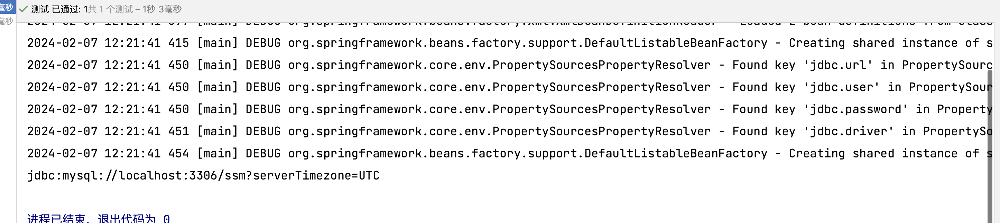


### bean的作用域

在Spring中，可以通过配置bean标签的`scope`属性来执行bean的作用范围，各取值含义如下表：

| 取值              | 含义                                    | 创建对象的时机  |
| ----------------- | --------------------------------------- | --------------- |
| singleton（默认） | 在IoC容器中，这个bean的对象始终为单实例 | IoC容器初始化时 |
| prototype         | 这个bean在IoC容器中有多个实例           | 获取bean时      |

新建Order类

``` java
package org.example.spring6.iocxml.scope;

/**
 * 
 * Date: 2024-02-07 12:32
 * Description:
 */

public class Orders {

}

```

配置bean，`bean-scope.xml`

``` xml
<?xml version="1.0" encoding="UTF-8"?>
<beans xmlns="http://www.springframework.org/schema/beans"
       xmlns:xsi="http://www.w3.org/2001/XMLSchema-instance"
       xsi:schemaLocation="http://www.springframework.org/schema/beans http://www.springframework.org/schema/beans/spring-beans.xsd">
    <!--通过scope属性配置单实例  多实例-->
    <bean class="org.example.spring6.iocxml.scope.Orders" id="orders" scope="singleton">

    </bean>
</beans>
```

其中`bean`标签中的`scope`属性默认为`singleton`


新建测试类

``` java
@Test
public void testOrders() {
    ApplicationContext context = new ClassPathXmlApplicationContext("bean-scope.xml");
    Orders orders = context.getBean("orders", Orders.class);
    System.out.println(orders);
    Orders orders1 = context.getBean("orders", Orders.class);
    System.out.println(orders1);
}
```

这里新建两个对象，都取自同一个bean，输出对象的地址，查看是否相同

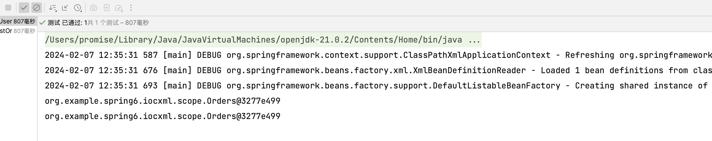

可以看到两个实例的地址是相同的


测试多实例，将`bean`标签中的`scope`属性改为`prototype`

``` xml
<?xml version="1.0" encoding="UTF-8"?>
<beans xmlns="http://www.springframework.org/schema/beans"
       xmlns:xsi="http://www.w3.org/2001/XMLSchema-instance"
       xsi:schemaLocation="http://www.springframework.org/schema/beans http://www.springframework.org/schema/beans/spring-beans.xsd">
    <!--通过scope属性配置单实例  多实例-->
    <bean class="org.example.spring6.iocxml.scope.Orders" id="orders" scope="prototype">

    </bean>
</beans>
```

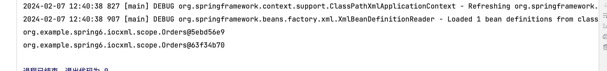


### bean的生命周期


1.   bean对象的创建（调用无参构造）
2.   给bean对象设置相关属性
3.   bean后置处理器（初始化之前）
4.   bean对象初始化（调用制定初始化方法）
5.   bean后置处理器（初始化之后）
6.   bean对象创建完成，可以使用
7.   bean对象销毁（配置制定销毁方法）
8.   关闭IoC容器

新建User类

``` java
package org.example.spring6.iocxml.life;

/**
 * 
 * Date: 2024-02-07 12:47
 * Description:
 */

public class User {
    private String name;

    public User() {
        System.out.println("第一步: 这是无参构造函数, 创建bean对象");
    }

    public String getName() {
        return name;
    }

    public void setName(String name) {
        this.name = name;
        System.out.println("第二步: 给bean对象设置属性值");
    }

    // 初始化的方法
    public void initMethod() {
        System.out.println("第四步: bean对象初始化, 调用指定方法进行初始化");
    }

    // 销毁的方法
    public void destroyMethod() {
        System.out.println("第七步: bean对象销毁, 调用制定方法进行销毁");
    }


}

```

用于实现bean的初始化和销毁方法，`initMethod()`和`destroyMethod()`

构造bean，`bean-life.xml`

``` xml
<?xml version="1.0" encoding="UTF-8"?>
<beans xmlns="http://www.springframework.org/schema/beans"
       xmlns:xsi="http://www.w3.org/2001/XMLSchema-instance"
       xsi:schemaLocation="http://www.springframework.org/schema/beans http://www.springframework.org/schema/beans/spring-beans.xsd">
    <bean class="org.example.spring6.iocxml.life.User" id="user" init-method="initMethod"
          destroy-method="destroyMethod">
        <property name="name" value="Lucy" />
    </bean>
</beans>
```

在`bean`标签中添加两个属性`init-method`和`destroy-method`，属性值为两个函数名

编写测试类

``` java
@Test
public void testLife() {
    ClassPathXmlApplicationContext context = new ClassPathXmlApplicationContext("bean-life.xml");
    org.example.spring6.iocxml.life.User user = context.getBean("user", org.example.spring6.iocxml.life.User.class);
    System.out.println(user);
    System.out.println("第六步: bean对象创建完成");
    context.close();  // 对象销毁  只有实现类才有这个函数, ApplicationContext并没有这个方法
}
```

为了区分其他包里面的`User`类，这里写了包的全路径


这里并没有给出第三步与第五步，现在写入后置处理器

新建类`MyBeanPost`依赖于接口`BeanPostProcessor`

``` java
package org.example.spring6.iocxml.life;

import org.springframework.beans.BeansException;
import org.springframework.beans.factory.config.BeanPostProcessor;

/**
 * 
 * Date: 2024-02-07 13:00
 * Description:
 */

public class MyBeanPost implements BeanPostProcessor {
    @Override
    public Object postProcessBeforeInitialization(Object bean, String beanName) throws BeansException {
        System.out.println("第三步: 后置处理器, 在初始化之前执行");
        System.out.println(beanName + "::" + bean);
        return bean;
    }

    @Override
    public Object postProcessAfterInitialization(Object bean, String beanName) throws BeansException {
        System.out.println("第五步: 后置处理器, 在初始化之后执行");
        System.out.println(beanName + "::" + bean);
        return bean;
    }

}

```

在`bean-life.xml`中新增后置处理器的配置

``` xml
<!--bean的后置处理器要放入IoC容器才能生效-->
<bean class="org.example.spring6.iocxml.life.MyBeanPost" id="myBeanPost">

</bean>
```

测试类运行结果

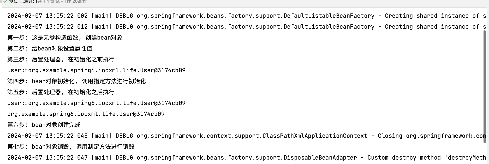


### FactoryBean工厂bean

新建User1类，无任何属性

``` java
package org.example.spring6.iocxml.factoryBean;

/**
 * 
 * Date: 2024-02-07 16:19
 * Description:
 */

public class User1 {

}

```

配置bean，`bean-factorybean.xml`

``` xml
<?xml version="1.0" encoding="UTF-8"?>
<beans xmlns="http://www.springframework.org/schema/beans"
       xmlns:xsi="http://www.w3.org/2001/XMLSchema-instance"
       xsi:schemaLocation="http://www.springframework.org/schema/beans http://www.springframework.org/schema/beans/spring-beans.xsd">
    <bean class="org.example.spring6.iocxml.factoryBean.MyFactoryBean" id="user1">

    </bean>
</beans>
```

实现FactoryBean接口

``` java
package org.example.spring6.iocxml.factoryBean;

import org.springframework.beans.factory.FactoryBean;

/**
 * 
 * Date: 2024-02-07 16:18
 * Description:
 */

public class MyFactoryBean implements FactoryBean<User1> {

    @Override
    public User1 getObject() throws Exception {
        return new User1();
    }

    @Override
    public Class<?> getObjectType() {
        return User1.class;
    }
}

```

新建测试类

``` java
@Test
public void testFactoryBean() {
    ApplicationContext context = new ClassPathXmlApplicationContext("bean-factorybean.xml");
    User1 user1 = context.getBean("user1", User1.class);
    System.out.println(user1);
}
```

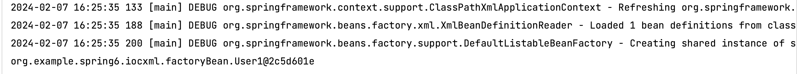

### 基于XML的自动装配

根据制定的策略，在IoC容器中匹配某一个bean，自动为指定的bean中所依赖的类类型或接口类型属性值复制

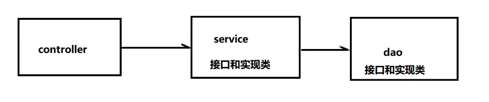

若不使用Spring的写法

**DAO层**

``` java
package org.example.spring6.iocxml.auto.dao;

public interface UserDao {
    public void addUserDao();
}

```

``` java
package org.example.spring6.iocxml.auto.dao.impl;

import org.example.spring6.iocxml.auto.dao.UserDao;

/**
 * 
 * Date: 2024-02-07 16:33
 * Description:
 */

public class UserDaoImpl implements UserDao {
    @Override
    public void addUserDao() {
        System.out.println("执行了UserDao方法");
    }
}

```


**Service层**

``` java
package org.example.spring6.iocxml.auto.service;

public interface UserService {
    public void addUserService();
}

```

``` java
package org.example.spring6.iocxml.auto.service.impl;

import org.example.spring6.iocxml.auto.dao.UserDao;
import org.example.spring6.iocxml.auto.dao.impl.UserDaoImpl;
import org.example.spring6.iocxml.auto.service.UserService;

/**
 * 
 * Date: 2024-02-07 16:32
 * Description:
 */

public class UserServiceImpl implements UserService {

    @Override
    public void addUserService() {
        System.out.println("UserService()方法执行");
        UserDao userDao = new UserDaoImpl();
        userDao.addUserDao();
    }
}

```


**Controller层**

``` java
package org.example.spring6.iocxml.auto.controller;

import org.example.spring6.iocxml.auto.service.UserService;
import org.example.spring6.iocxml.auto.service.impl.UserServiceImpl;

/**
 * 
 * Date: 2024-02-07 16:31
 * Description:
 */

public class UserController {
    public void addUser() {
        System.out.println("controller方法执行");
        UserService userService = new UserServiceImpl();
        userService.addUserService();
    }
}

```


**新建简单测试类**

``` java
@Test
public void testController() {
    UserController controller = new UserController();
    controller.addUser();
}
```

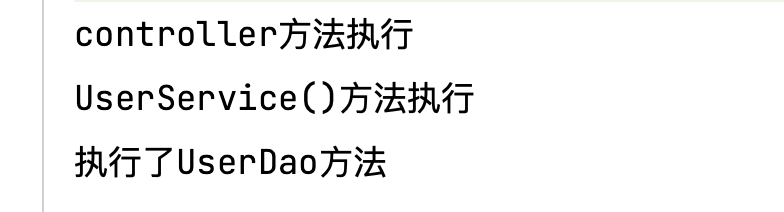


#### 配置bean，完成自动装配

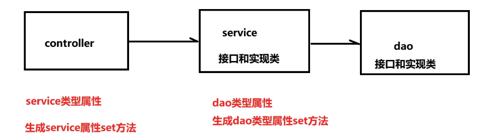


**Controller层**

``` java
package org.example.spring6.iocxml.auto.controller;

import org.example.spring6.iocxml.auto.service.UserService;
import org.example.spring6.iocxml.auto.service.impl.UserServiceImpl;

/**
 * 
 * Date: 2024-02-07 16:31
 * Description:
 */

public class UserController {

    private UserService userService;

    public UserService getUserService() {
        return userService;
    }

    public void setUserService(UserService userService) {
        this.userService = userService;
    }

    public void addUser() {
        System.out.println("controller方法执行");
        // 调用service方法
        userService.addUserService();
    }
}

```


**Service层**

``` java
package org.example.spring6.iocxml.auto.service.impl;

import org.example.spring6.iocxml.auto.dao.UserDao;
import org.example.spring6.iocxml.auto.dao.impl.UserDaoImpl;
import org.example.spring6.iocxml.auto.service.UserService;

/**
 * 
 * Date: 2024-02-07 16:32
 * Description:
 */

public class UserServiceImpl implements UserService {

    private UserDao userDao;

    public UserDao getUserDao() {
        return userDao;
    }

    public void setUserDao(UserDao userDao) {
        this.userDao = userDao;
    }

    @Override
    public void addUserService() {
        System.out.println("UserService()方法执行");
        userDao.addUserDao();
    }
}

```


配置bean，`bean-auto.xml`

```xml
<?xml version="1.0" encoding="UTF-8"?>
<beans xmlns="http://www.springframework.org/schema/beans"
       xmlns:xsi="http://www.w3.org/2001/XMLSchema-instance"
       xsi:schemaLocation="http://www.springframework.org/schema/beans http://www.springframework.org/schema/beans/spring-beans.xsd">
    <bean class="org.example.spring6.iocxml.auto.controller.UserController" id="userController" autowire="byType">

    </bean>

    <bean class="org.example.spring6.iocxml.auto.service.impl.UserServiceImpl" id="userService" autowire="byType">

    </bean>

    <bean class="org.example.spring6.iocxml.auto.dao.impl.UserDaoImpl" id="userDao">

    </bean>
</beans>
```

其中`autowire`属性是自动装填属性，属性值`byType`是根据类型自动装配，根据类型装配会自动匹配相应的类型，而根据名称匹配需要保证待匹配bean的名称与声明时相同。 


新建测试类

``` java
@Test
public void testAuto() {
    ApplicationContext context = new ClassPathXmlApplicationContext("bean-auto.xml");
    UserController userController = context.getBean("userController", UserController.class);
    userController.addUser();
}
```

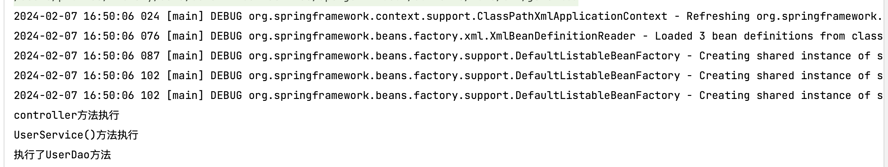

>   `byType`：根据类型匹配IoC容器中的某个兼容类型的bean，为属性自动赋值
>
>   若在IoC中，没有任何一个兼容类型的bean能够为属性赋值，则该属性不装配，即默认值为null
>
>   若在IoC中，有多个兼容类型的bean能够为属性赋值，则抛出异常NoUniqueBeanDefinitionException

