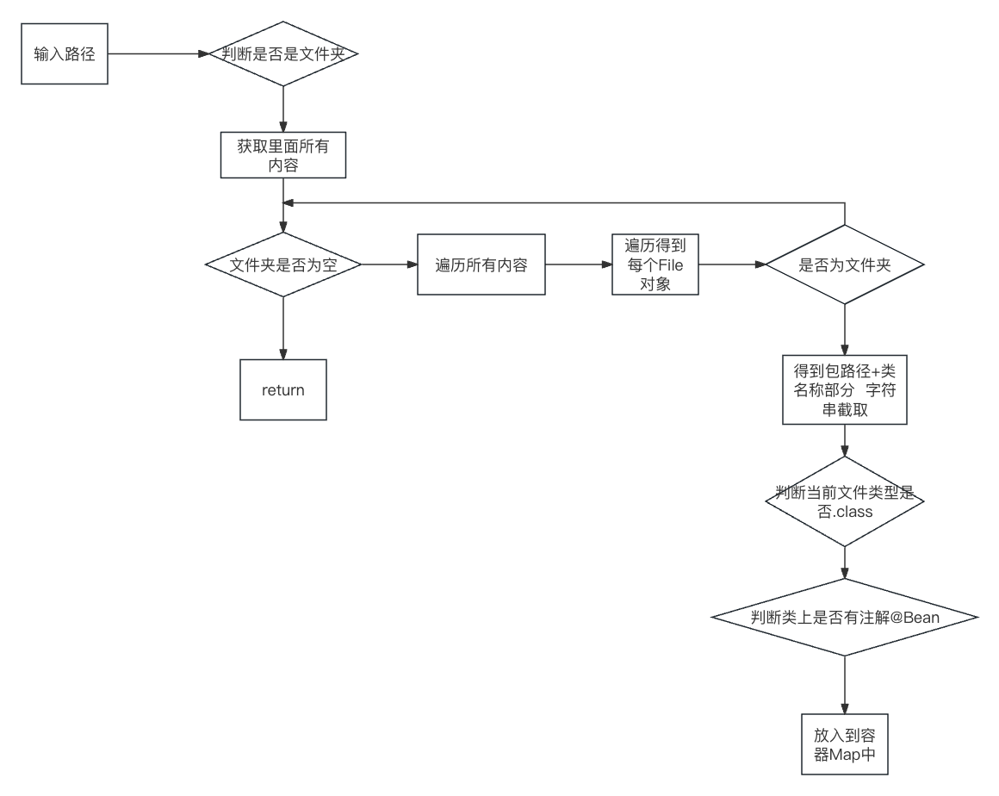

# 【study】Spring学习part04


## 反射

通过Class文件获取到对象相关的内容，并使用

``` java
import org.example.reflect.Car;
import org.junit.jupiter.api.Test;

import java.lang.reflect.Constructor;
import java.lang.reflect.Field;
import java.lang.reflect.Method;

/**
 *
 * Date: 2024-02-08 00:02
 * Description:
 */

public class TestCar {
    // 1. 获取class对象多种方式
    @Test
    public void testCarClass1() throws Exception {
        // 1. 类名.class
        Class clazz1 = Car.class;

        // 2. 对象.getClass()
        Class clazz2 = new Car().getClass();

        // 3. Class.forName("类的全路径")
        Class clazz3 = Class.forName("org.example.reflect.Car");

        System.out.println(clazz1);
        System.out.println(clazz2);
        System.out.println(clazz3);

        Car car1 = (Car) clazz3.getDeclaredConstructor().newInstance();
        System.out.println(car1);
    }

    // 2. 获取构造方法
    @Test
    public void testCarClass2() throws Exception {
        Class<Car> clazz = Car.class;
        // 获取所有public构造方法
        Constructor<?>[] constructors = clazz.getConstructors();
        // 获取private构造方法
        // clazz.getDeclaredConstructors();
        for (Constructor<?> c : constructors) {
            System.out.println("方法名称: " + c.getName() + "\t参数个数:" + c.getParameterCount());
        }

        // 指定有参构造创建对象
        // 构造public
        Constructor<Car> constructor1 = clazz.getConstructor(String.class, int.class, String.class);
        Car car = constructor1.newInstance("问界", 10, "黑色");
        System.out.println(car);

        // 构造private
        Constructor<Car> declaredConstructor = clazz.getDeclaredConstructor(String.class);
        declaredConstructor.setAccessible(true);  // 设置允许私有访问
        Car car1 = declaredConstructor.newInstance("智界");
        System.out.println(car1);
    }

    // 3. 获取属性
    @Test
    public void testCarClass3() throws Exception {
        Class<Car> carClass = Car.class;
        // 获取所有public属性
        Field[] fields = carClass.getFields();
        System.out.println("public属性有");
        for (Field field : fields) {
            System.out.println(field);
        }

        // 获取所有public + private属性
        System.out.println("private属性有");
        Field[] declaredFields = carClass.getDeclaredFields();
        for (Field f : declaredFields) {
            System.out.println(f);
        }


        Class clazz = Car.class;
        Car car = (Car) clazz.getDeclaredConstructor().newInstance();
        for (Field f : declaredFields) {
            if (f.getName().equals("name")) {
                // 设置允许访问
                f.setAccessible(true);
                f.set(car, "问界M9");
            }
            System.out.println(f.getName());
            System.out.println(car);
        }
    }

    // 4. 获取方法
    @Test
    public void testCarClass4() throws Exception {
        Car car = new Car("问界M7", 3, "蓝色");
        Class<? extends Car> clazz = car.getClass();

        // 操作public方法
        Method[] methods = clazz.getMethods();
        for (Method m : methods) {
            // System.out.println(m.getName());
            // 执行某个方法
            if (m.getName().equals("toString")) {
                String invoke = (String) m.invoke(car);
                System.out.println("toString执行: " + invoke);
            }
        }

        // 操作private方法
        Method[] methodAll = clazz.getDeclaredMethods();
        for (Method m : methodAll) {
            if (m.getName().equals("run")) {
                m.setAccessible(true);
                m.invoke(car);
            }
        }
    }

}

```


## 手写IoC

实现Spring的IoC过程

### 1. 创建新的子模块`myspring`


### 2. 创建测试类`service`、`dao`

``` java
// org.example.dao.UserDao.java
package org.example.dao;

public interface UserDao {
    
}

```

``` java
// org.example.dao.impl.UserDaoImpl.java
package org.example.dao.impl;

import org.example.dao.UserDao;

public class UserDaoImpl implements UserDao {
    
}

```

``` java
// org.example.service.UserService.java
package org.example.service;

public interface UserService {
    
}

```

``` java
// org.example.service.impl.UserServiceImpl.java
package org.example.service.impl;

import org.example.dao.UserDao;
import org.example.service.UserService;

public class UserServiceImpl implements UserService {

    private UserDao userDao;

}

```

### 3. 创建两个注解

#### 3.1 `@Bean`创建对象

``` java
// org.example.annotation.bean.java
package org.example.annotation;

import java.lang.annotation.ElementType;
import java.lang.annotation.Retention;
import java.lang.annotation.RetentionPolicy;
import java.lang.annotation.Target;

@Target(ElementType.TYPE)  // 注解可以用在类上或接口上
@Retention(RetentionPolicy.RUNTIME)  // 运行时生效
public @interface Bean {

}

```


#### 3.2 `@Di`属性注入

``` java
// org.example.annotation.di.java
package org.example.annotation;

import java.lang.annotation.ElementType;
import java.lang.annotation.Retention;
import java.lang.annotation.RetentionPolicy;
import java.lang.annotation.Target;

@Target(ElementType.FIELD)  // 注解在属性上
@Retention(RetentionPolicy.RUNTIME)  // 运行时生效
public @interface Di {

}

```

### 4. 创建bean容器接口`ApplicationContext`定义方法

``` java
// org.example.bean.ApplicationContext.java
package org.example.bean;

public interface ApplicationContext {
    Object getBean(Class clazz);
}

```


### 5.实现bean容器接口

1.   返回对象
2.   根据包规则加载bean

>   比如org.example，扫描这个包与子包里面的所有类，是否有@Bean注解，如果有则把这个类通过反射进行实例化

``` java
// org.example.bean.AnnotationApplicationContext.java

package org.example.bean;

import java.util.HashMap;
import java.util.Map;

public class AnnotationApplicationContext implements ApplicationContext{
    // 创建Map, 用于存放Bean的实例对象
    private Map<Class, Object> beanFactory = new HashMap<>();

    // 返回对象
    @Override
    public Object getBean(Class clazz) {
        return beanFactory.get(clazz);
    }

    // 设置包扫描规则
    // 当前包及其子包, 若发现类前@Bean注解, 使用反射进行实例化
    // 创建有参数的构造, 设置扫描规则


    public AnnotationApplicationContext(String basePackage) {
        //
    }
}

```




