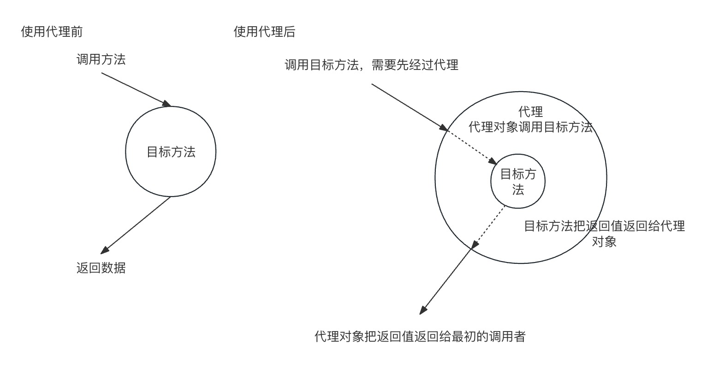
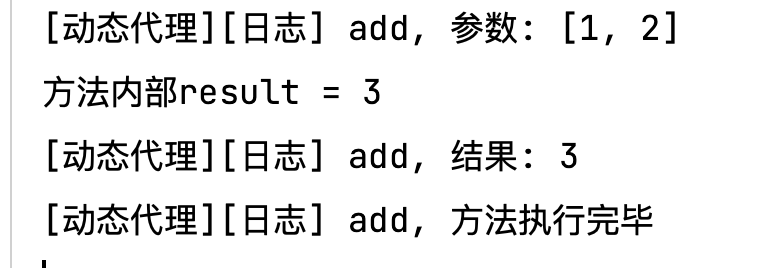
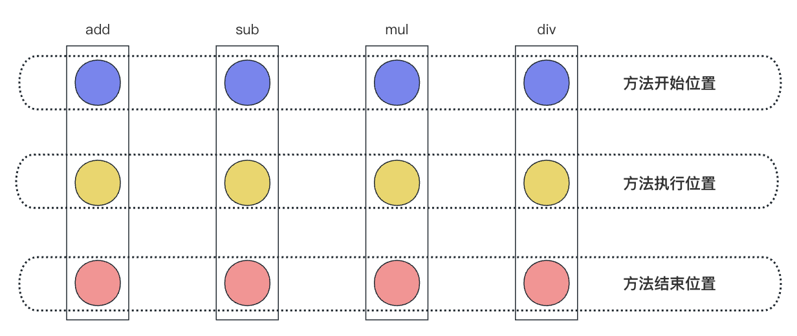
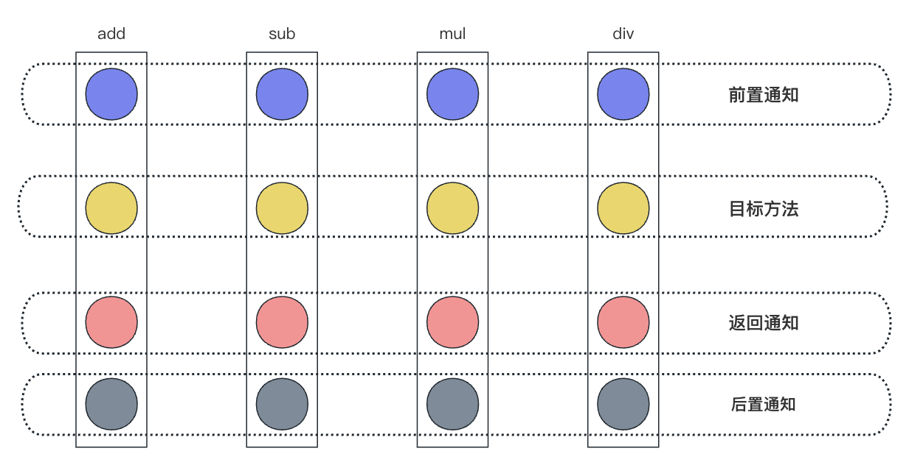
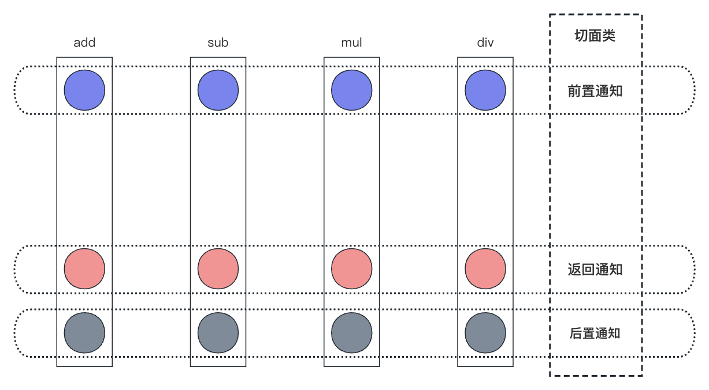
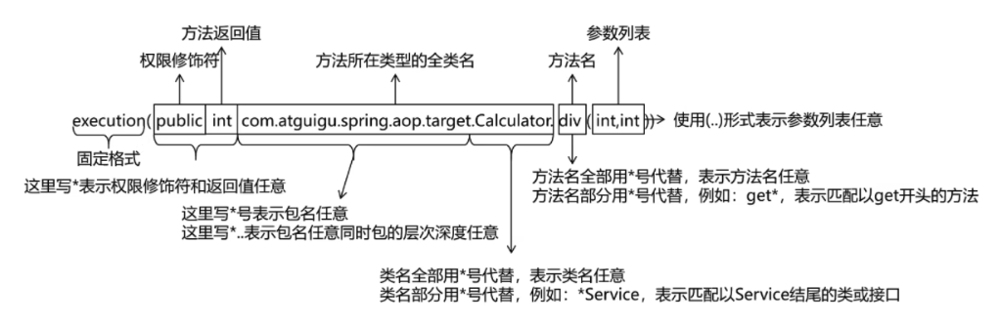
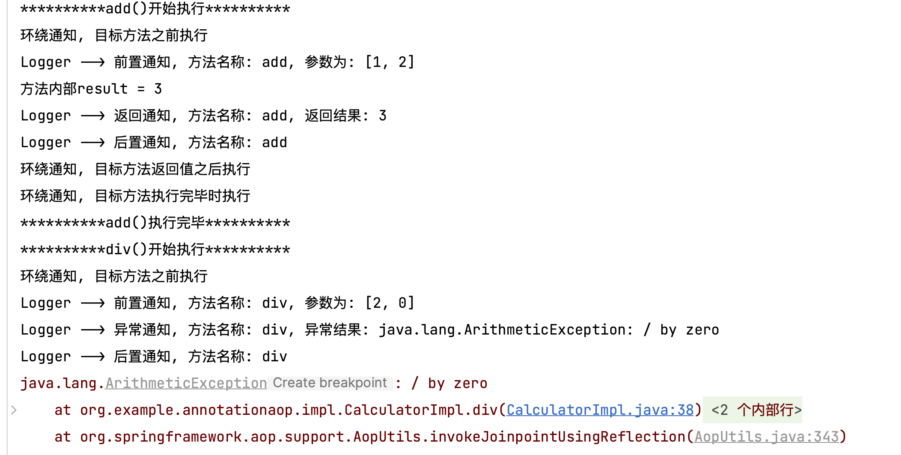
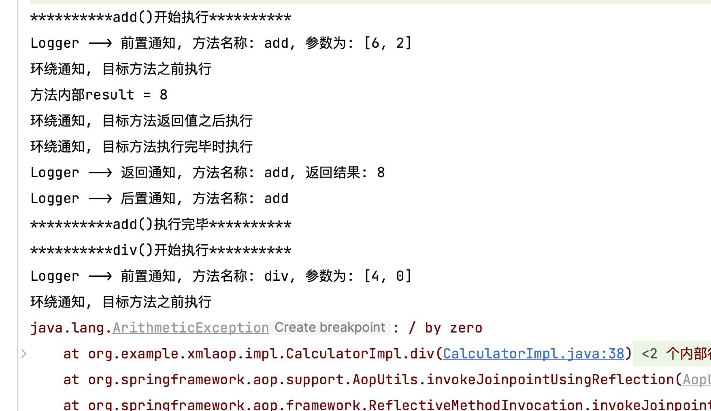

# 【study】Spring学习part05


## AOP面向切面编程

需求：制作一个计算器，包括加减乘除。还需要日志在核心业务前后做输出


代码实现

新建计算器类接口`Calculator`，定义四则运算

``` java
package org.example.demo;

public interface Calculator {
    int add(int a, int b);

    int sub(int a, int b);

    int mul(int a, int b);

    int div(int a, int b);
}

```


定义接口实现`CalculatorImpl`，实现四则运算的简单操作

``` java
package org.example.demo.impl;

import org.example.demo.Calculator;

/**
 * 
 * Date: 2024-02-09 13:12
 * Description: 基本的实现类, 实现四则运算
 */

public class CalculatorImpl implements Calculator {
    @Override
    public int add(int a, int b) {
        int result = a + b;
        System.out.println("方法内部result = " + result);
        return result;
    }

    @Override
    public int sub(int a, int b) {
        int result = a - b;
        System.out.println("方法内部result = " + result);
        return result;
    }

    @Override
    public int mul(int a, int b) {
        int result = a * b;
        System.out.println("方法内部result = " + result);
        return result;
    }

    @Override
    public int div(int a, int b) {
        int result = a / b;
        System.out.println("方法内部result = " + result);
        return result;
    }
}

```


定义接口实现`CalculatorLogImpl`，增加日志输出

``` java
package org.example.demo.impl;

import org.example.demo.Calculator;

/**
 * 
 * Date: 2024-02-09 13:20
 * Description: 含有日志的实现类, 包含四则运算
 */

public class CalculatorLogImpl implements Calculator {
    @Override
    public int add(int a, int b) {
        System.out.printf("[日志] add方法开始执行, 参数是:%d, %d", a, b);
        int result = a + b;
        System.out.println("方法内部result = " + result);
        System.out.printf("[日志] add方法执行结束, 结果是:%d", result);
        return result;
    }

    @Override
    public int sub(int a, int b) {
        System.out.printf("[日志] sub方法开始执行, 参数是:%d, %d", a, b);
        int result = a - b;
        System.out.println("方法内部result = " + result);
        System.out.printf("[日志] sub方法执行结束, 结果是:%d", result);
        return result;
    }

    @Override
    public int mul(int a, int b) {
        System.out.printf("[日志] mul方法开始执行, 参数是:%d, %d", a, b);
        int result = a * b;
        System.out.println("方法内部result = " + result);
        System.out.printf("[日志] mul方法执行结束, 结果是:%d", result);
        return result;
    }

    @Override
    public int div(int a, int b) {
        System.out.printf("[日志] div方法开始执行, 参数是:%d, %d", a, b);
        int result = a / b;
        System.out.println("方法内部result = " + result);
        System.out.printf("[日志] div方法执行结束, 结果是:%d", result);
        return result;
    }
}

```


**目前存在的问题**

1.   日志功能混合到一定，代码耦合度高，维护起来不方便

     >   日志功能和核心业务能否分离？
     >
     >   -   如果将日志功能抽象出工具类并不能做到，因为还是耦合在了业务中。


### 代理模式

设计模式中的一种，是**结构型模式**。作用是通过提供一个代理类，让我们在调用目标的方法时，不再是直接对目标方法进行调用，而是通过代理类**间接调用**，让不属于目标方法核心逻辑的代码从目标方法中剥离出来——**解耦**。调用目标方法时先调用代理对象的方法，减少对目标方法的调用和打扰，同时让附加功能能够集中在一起有利于统一维护。




-   代理：将非核心逻辑剥离出来以后，封装这些非核心逻辑的类、对象、方法。
-   目标：被代理“套用”了非核心逻辑代码的类、对象、方法。


#### 静态代理

新建静态代理类`proxy.CalculatorStaticProxy.java`

``` java
package org.example.demo.proxy;

import org.example.demo.Calculator;

import java.lang.ref.PhantomReference;

/**
 * 
 * Date: 2024-02-10 19:13
 * Description:
 */

public class CalculatorStaticProxy implements Calculator {
    
    // 被代理的目标对象传递过来
    private Calculator calculator;
    public CalculatorStaticProxy(Calculator calculator) {
        this.calculator = calculator;
    }
    

    @Override
    public int add(int a, int b) {
        // 输出日志
        System.out.printf("[日志] add方法开始执行, 参数是:%d, %d", a, b);
        
        // 调用目标对象的方法实现核心业务
        int result = calculator.add(a, b);
        
        // 输出日志
        System.out.printf("[日志] add方法执行结束, 结果是:%d", result);
        return result;
    }

    @Override
    public int sub(int a, int b) {
        // 输出日志
        System.out.printf("[日志] sub方法开始执行, 参数是:%d, %d", a, b);

        // 调用目标对象的方法实现核心业务
        int result = calculator.sub(a, b);

        // 输出日志
        System.out.printf("[日志] sub方法执行结束, 结果是:%d", result);
        return result;
    }

    @Override
    public int mul(int a, int b) {
        // 输出日志
        System.out.printf("[日志] mul方法开始执行, 参数是:%d, %d", a, b);

        // 调用目标对象的方法实现核心业务
        int result = calculator.mul(a, b);

        // 输出日志
        System.out.printf("[日志] mul方法执行结束, 结果是:%d", result);
        return result;
    }

    @Override
    public int div(int a, int b) {
        // 输出日志
        System.out.printf("[日志] div方法开始执行, 参数是:%d, %d", a, b);

        // 调用目标对象的方法实现核心业务
        int result = calculator.div(a, b);

        // 输出日志
        System.out.printf("[日志] div方法执行结束, 结果是:%d", result);
        return result;
    }
}

```

当前存在问题，日志功能并没有抽取出来，不具备灵活性。将来有任何日志需求都需要一个代理类来实现。


#### 动态代理

定义代理工厂`ProxyFactory`，

``` java
package org.example.demo.proxy;


import java.lang.reflect.InvocationHandler;
import java.lang.reflect.Method;
import java.lang.reflect.Proxy;
import java.util.Arrays;

/**
 * 
 * Date: 2024-02-10 19:29
 * Description:
 */

public class ProxyFactory {

    // 目标对象
    private final Object target;

    public ProxyFactory(Object target) {
        this.target = target;
    }

    // 创建一个方法, 返回代理对象(动态)
    public Object getProxy() {
        /*
         * @param ClassLoader: 加载动态生成代理类的类加载器
         * @param interfaces: 目标对象实现所有接口类型的class
         * @param InvocationHandler: 设置代理对象实现目标对象方法的过程
         * */
        ClassLoader classLoader = target.getClass().getClassLoader();
        Class<?>[] interfaces = target.getClass().getInterfaces();
        InvocationHandler invocationHandler = new InvocationHandler() {

            /**
             * @param proxy 代理对象
             * @param method 需要重写目标对象的方法
             * @param args method方法中所需要的参数
             * @return Object
             * */
            @Override
            public Object invoke(Object proxy, Method method, Object[] args) throws Throwable {
                // 调用目标方法
                Object result = null;
                try {
                    System.out.println("[动态代理][日志] " + method.getName() + ", 参数: " + Arrays.toString(args));
                    result = method.invoke(target, args);
                    System.out.println("[动态代理][日志] " + method.getName() + ", 结果: " + result);
                } catch (Exception e) {
                    e.printStackTrace();
                    System.out.println("[动态代理][日志] " + method.getName() + ", 异常: " + e.getMessage());
                } finally {
                    System.out.println("[动态代理][日志] " + method.getName() + ", 方法执行完毕");
                }
                return result;
            }
        };
        return Proxy.newProxyInstance(classLoader, interfaces, invocationHandler);
    }
}

```


测试单元

``` java
@Test
public void testCalculator() {
    // 1. 创建代理对象(动态)
    ProxyFactory proxyFactory = new ProxyFactory(new CalculatorImpl());
    Calculator proxy = (Calculator) proxyFactory.getProxy();
    proxy.add(1, 2);
}
```

输出结果




### AOP

AOP (Aspect Oriented Programming）是一种设计思想，是软件设计领域中的面向切面编程，它是面向对象编程的一种补充和完善，它以通过预编译方式和运行期动态代理方式实现，**在不修改源代码的情况下，给程序动态统一添加额外功能的一种技术**。利用AOP可以对业务逻辑的各个部分进行隔离，从而使得业务逻辑各部分之问的耦合降低，提高程序的可重用性，同时提高了开发的效率。

#### 1. 横切关注点

分散在每个、各个模块中解决同一样的问题，例如用户验证、日志管理、事务处理、数据缓存都属于**横切关注点**。

从每个方法中抽取出来的同一类非核心业务。在同一个项目中，我们可以使用多个横切关注点对相关方法进行多个不同方面的增强。




 

#### 2. 通知（增强）

增强，想要增强的功能，例如安全、事务、日志等。

每一个横切关注点上要做的事情都需要写一个方法来实现，这样的方法叫做通知方法。

-   前置通知：在被代理的目标方法前执行
-   返回通知：在被代理的目标方法**成功结束**后执行（寿终正寝）
-   异常通知：在被代理的目标方法**异常结束**后执行（死于非命）
-   后置通知：在被代理的目标方法**最终结束**后执行（盖棺定论）
-   环绕通知：使用`try...catch...finally`结构围绕着**整个**被代理的目标方法，包括上面四种通知对应的所有位置




#### 3. 切面

封装通知方法类




#### 4. 目标

被代理的目标对象


#### 5. 代理

向目标对象应用通知之后创建的代理对象。


#### 6. 连接点

这是一个纯逻辑的概念

把每个方法排成一排，每一个横切位置看成x轴方向，把方法从上到下执行顺序看成y轴，x轴和y轴交叉点就是连接点。**通俗说，就是Spring允许使用通知的地方**


#### 7. 切入点

定位连接点的方式。

每个类的方法中都包含多个连接点，所以连接点是类中客观存在的事物（从逻辑上来说），

如果把连接点看作数据库中的记录，那么切入点就是查询记录的SQL 语句。

**Spring 的 AOP 技术可以通过切入点定位到特定的连接点。通俗说，要实际去增强的方法**

切点通过 `org.springframework.aop.Pointcut` 接口进行描述，它使用类和方法作为连接点的查询条件。


### 基于注解的AOP

#### 1. 添加依赖

``` xml
<!--Spring AOP依赖-->
<dependency>
    <groupId>org.springframework</groupId>
    <artifactId>spring-aop</artifactId>
    <version>6.0.2</version>
</dependency>
<!--Spring aspects依赖-->
<dependency>
    <groupId>org.springframework</groupId>
    <artifactId>spring-aspects</artifactId>
    <version>6.0.2</version>
</dependency>
```

#### 2. 创建目标资源

1.   接口
2.   实现类

同计算器的例子`Calculator.java`，`CalculatorImpl.java`，放入新的包`annotationaop`当中

``` java
package org.example.annotationaop;


public interface Calculator {
    int add(int a, int b);

    int sub(int a, int b);

    int mul(int a, int b);

    int div(int a, int b);
}

```


``` java
package org.example.annotationaop.impl;


import org.example.annotationaop.Calculator;
import org.springframework.stereotype.Component;

/**
 * 
 * Date: 2024-02-09 13:12
 * Description: 基本的实现类, 实现四则运算
 */

@Component  // 添加注解注入
public class CalculatorImpl implements Calculator {
    @Override
    public int add(int a, int b) {
        int result = a + b;
        System.out.println("方法内部result = " + result);
        return result;
    }

    @Override
    public int sub(int a, int b) {
        int result = a - b;
        System.out.println("方法内部result = " + result);
        return result;
    }

    @Override
    public int mul(int a, int b) {
        int result = a * b;
        System.out.println("方法内部result = " + result);
        return result;
    }

    @Override
    public int div(int a, int b) {
        int result = a / b;
        System.out.println("方法内部result = " + result);
        return result;
    }
}

```


#### 3. 创建切面类

1.   切入点
2.   创建类型


##### 切入点表达式


五种通知类型注解，括号内参数为切入点表达式

- 前置 `@Before()`
- 返回 `@AfterReturning()`
- 异常` @AfterThrowing()`
- 后置 `@After()`
- 环绕` @Around()`




创建切面类`LogAspect.java`

``` java
package org.example.annotationaop;

import org.aspectj.lang.JoinPoint;
import org.aspectj.lang.ProceedingJoinPoint;
import org.aspectj.lang.annotation.*;
import org.springframework.stereotype.Component;

import java.util.Arrays;

/**
 * 
 * Date: 2024-02-10 23:14
 * Description:
 */

// 切面类
@Aspect  // 切面类注解
@Component  // 在Spring IoC容器中管理
public class LogAspect {
    // 设置切入点和通知类型
    // 括号内写 切入点表达式 execution(访问修饰符 增强方法返回类型 增强方法所在类的全类名.方法名称(参数))
    // * 可以省略一些
    // 通知类型:
    //      前置 @Before()
    //      返回 @AfterReturning()
    //      异常 @AfterThrowing()
    //          目标方法出现异常, 这个通知会执行, 也能获取到目标方法异常信息
    //      后置 @After()
    //      环绕 @Around()

    // 前置通知 @Before()
    @Before(value = "execution(public int org.example.annotationaop.impl.CalculatorImpl.*(..))")
    public void beforeMethod(JoinPoint joinPoint) {
        String methodName = joinPoint.getSignature().getName();
        Object[] args = joinPoint.getArgs();
        System.out.println("Logger --> 前置通知, 方法名称: " + methodName + ", 参数为: " + Arrays.toString(args));
    }

    // 后置通知 @After()
    @After(value = "execution (* org.example.annotationaop.impl.CalculatorImpl.*(..))")
    public void afterMethod(JoinPoint joinPoint) {
        String methodName = joinPoint.getSignature().getName();
        System.out.println("Logger --> 后置通知, 方法名称: " + methodName);
    }

    // 返回通知 @AfterReturning
    // 参数returning = "参数名", 下方函数参数中Object 命名也必须一致
    @AfterReturning(value = "execution(* org.example.annotationaop.impl.CalculatorImpl.*(..))", returning = "results")
    public void afterReturningMethod(JoinPoint joinPoint, Object results) {
        String methodName = joinPoint.getSignature().getName();
        System.out.println("Logger --> 返回通知, 方法名称: " + methodName + ", 返回结果: " + results);
    }

    // 异常通知 @AfterThrowing
    @AfterThrowing(value = "execution(* org.example.annotationaop.impl.CalculatorImpl.*(..))", throwing = "ex")
    public void afterThrowingMethod(JoinPoint joinPoint, Throwable ex) {
        String methodName = joinPoint.getSignature().getName();
        System.out.println("Logger --> 异常通知, 方法名称: " + methodName + ", 异常结果: " + ex);
    }

    // 环绕通知 @Around
    @Around(value = "execution(* org.example.annotationaop.impl.CalculatorImpl.*(..))")
    public Object aroundMethod(ProceedingJoinPoint joinPoint) {  // 使用ProceedingJoinPoint类型, 更强
        String methodName = joinPoint.getSignature().getName();
        Object[] args = joinPoint.getArgs();
        String argString = Arrays.toString(args);
        Object result = null;
        try {
            System.out.println("环绕通知, 目标方法之前执行");
            result = joinPoint.proceed();
            System.out.println("环绕通知, 目标方法返回值之后执行");
        } catch (Throwable throwable) {
            throwable.printStackTrace();
            System.out.println("环绕通知, 目标方法出现异常时执行");
        } finally {
            System.out.println("环绕通知, 目标方法执行完毕时执行");
        }
        return result;
    }
}


```


创建配置文件`bean.xml`

``` xml
<?xml version="1.0" encoding="UTF-8"?>
<beans xmlns="http://www.springframework.org/schema/beans"
       xmlns:xsi="http://www.w3.org/2001/XMLSchema-instance"
       xmlns:context="http://www.springframework.org/schema/context"
       xmlns:aop="http://www.springframework.org/schema/aop"
       xsi:schemaLocation="http://www.springframework.org/schema/beans 
       http://www.springframework.org/schema/beans/spring-beans.xsd
       http://www.springframework.org/schema/context
       http://www.springframework.org/schema/context.xsd
       http://www.springframework.org/schema/aop 
       http://www.springframework.org/schema/aop.xsd">
    <!--
        基于注解的AOP实现:
        1. 将目标对象和切面交给IoC容器管理(注解+扫描)
        2. 开启AspectJ的自动代理, 为目标对象自动生成代理
        3. 将切面类通过注解@Aspect标识
    -->
    <context:component-scan base-package="org.example.annotationaop"/>
	<aop:aspectj-autoproxy/>

</beans>
```


创建测试用例

``` java
@Test
public void testAOPAdd() {
    ApplicationContext context = new ClassPathXmlApplicationContext("bean.xml");
    org.example.annotationaop.Calculator calculator = context.getBean(org.example.annotationaop.Calculator.class);
    System.out.println("**********add()开始执行**********");
    calculator.add(1, 2);
    System.out.println("**********add()执行完毕**********");
    System.out.println("**********div()开始执行**********");
    calculator.div(2, 0);
    System.out.println("**********div()执行完毕**********");
}
```

>    测试用例中使用`2/0`来引发错误异常。





#### 切入点表达式的重用

定义方法`pointCut()`，在之前使用注解`@Pointcut()`，使用时候

``` java
// 重用切入点表达式
@Pointcut(value = "execution(* org.example.annotationaop.impl.CalculatorImpl.*(..))")
public void pointCut() {

}

@After(value = "pointCut()")  // 注解时的值直接写方法名（同一个包里面的切面），不同包就是全路径


@After(value = "org.example.annotationaop.LogAspect.pointCut()")

```


#### 切面优先级

使用`Order()`可以控制切面的优先级，越小级别越高


### 基于XML的AOP

 计算器接口、实现类、切面类同上，切面类去掉方法前的所有注解。

新建配置文件`bean-aop.xml`，写入配置

``` xml
<?xml version="1.0" encoding="UTF-8"?>
<beans xmlns="http://www.springframework.org/schema/beans"
       xmlns:xsi="http://www.w3.org/2001/XMLSchema-instance"
       xmlns:context="http://www.springframework.org/schema/context"
       xmlns:aop="http://www.springframework.org/schema/aop"
       xsi:schemaLocation="http://www.springframework.org/schema/beans
       http://www.springframework.org/schema/beans/spring-beans.xsd
       http://www.springframework.org/schema/context
       http://www.springframework.org/schema/context/spring-context.xsd
       http://www.springframework.org/schema/aop
       http://www.springframework.org/schema/aop/spring-aop.xsd">
    <!--开启组件扫描-->
    <context:component-scan base-package="org.example.xmlaop"/>
    <!--配置AOP五种通知类型-->
    <aop:config>
        <!--配置切面类-->
        <aop:aspect ref="logAspect">
            <!--配置切入点-->
            <aop:pointcut id="pointcut" expression="execution(* org.example.xmlaop.impl.CalculatorImpl.*(..))"/>
            <!--配置五种通知类型-->
            <!--1. 前置通知-->
            <aop:before method="beforeMethod" pointcut-ref="pointcut"/>

            <!--2. 后置通知-->
            <aop:after method="afterMethod" pointcut-ref="pointcut"/>

            <!--3. 返回通知-->
            <aop:after-returning method="afterReturningMethod" pointcut-ref="pointcut" returning="results"/>

            <!--4. 异常通知-->
            <aop:after-throwing method="afterThrowingMethod" pointcut-ref="pointcut" throwing="ex"/>

            <!--5. 环绕通知-->
            <aop:around method="aroundMethod" pointcut-ref="pointcut"/>
        </aop:aspect>
    </aop:config>
</beans>
```


新建测试用例

``` java
@Test
public void testXMLAOPAdd() {
    ApplicationContext context = new ClassPathXmlApplicationContext("bean-aop.xml");
    org.example.xmlaop.Calculator calculator = context.getBean(org.example.xmlaop.Calculator.class);
    System.out.println("**********add()开始执行**********");
    calculator.add(6, 2);
    System.out.println("**********add()执行完毕**********");
    System.out.println("**********div()开始执行**********");
    calculator.div(4, 0);
    System.out.println("**********div()执行完毕**********");
}
```


结果输出



