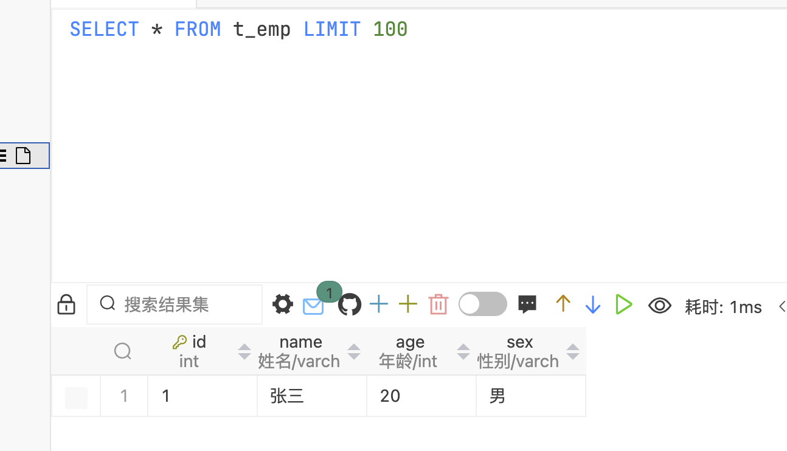
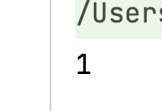
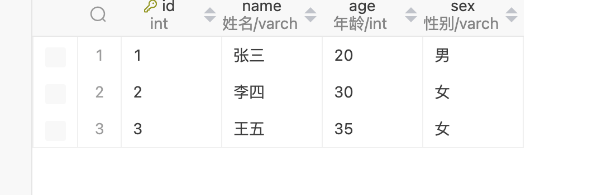
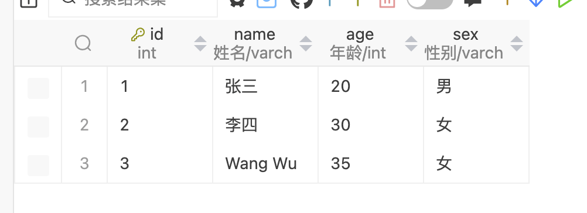
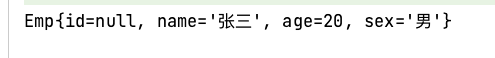
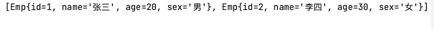
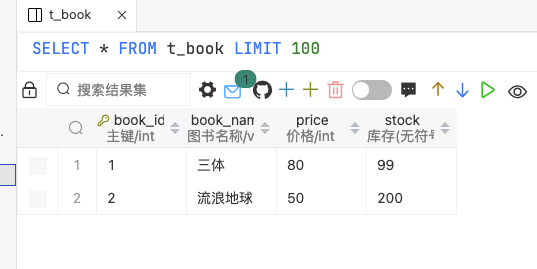
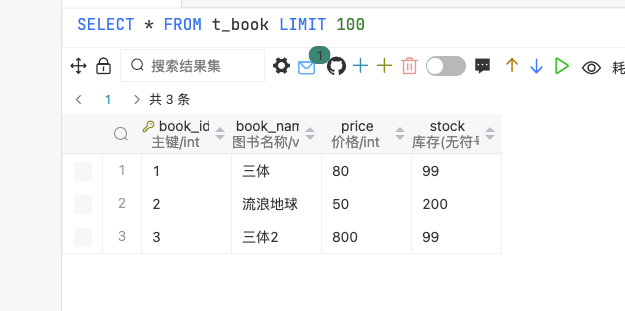

# Spring学习part06


macOS启动MySQL命令

`sudo /usr/local/mysql/support-files/mysql.server start`


## JdbcTemplate


引入相关依赖

``` xml
<dependency>
    <groupId>org.springframework</groupId>
    <artifactId>spring-jdbc</artifactId>
    <version>6.1.2</version>
</dependency>

<dependency>
    <groupId>org.springframework</groupId>
    <artifactId>spring-test</artifactId>
    <version>5.3.20</version>
</dependency>
<dependency>
    <groupId>mysql</groupId>
    <artifactId>mysql-connector-java</artifactId>
    <version>8.0.30</version>
</dependency>
<dependency>
    <groupId>com.alibaba</groupId>
    <artifactId>druid</artifactId>
    <version>1.0.31</version>
</dependency>
```


新建数据库`spring`

``` sql
CREATE TABLE `t_emp` (
    `id` INT(11) NOT NULL AUTO_INCREMENT,
    `name` VARCHAR(20) DEFAULT NULL COMMENT '姓名',
    `age` INT(11) DEFAULT NULL COMMENT '年龄',
    `sex` VARCHAR(2) DEFAULT NULL COMMENT '性别', 
    PRIMARY KEY (`id`)
) ENGINE=INNODB DEFAULT CHARSET=utf8mb4;
```


新建jdbc相关配置`jdbc.properties`

``` properties
jdbc.url=jdbc:mysql://localhost:3306/spring?characterEncoding=utf8&useSSL=false
jdbc.driver=com.mysql.cj.jdbc.Driver
jdbc.user=root
jdbc.password=11111111
```


新建bean，`beans.xml`，并配置

``` xml
<?xml version="1.0" encoding="UTF-8"?>
<beans xmlns="http://www.springframework.org/schema/beans"
       xmlns:xsi="http://www.w3.org/2001/XMLSchema-instance"
       xmlns:context="http://www.springframework.org/schema/context"
       xsi:schemaLocation="http://www.springframework.org/schema/beans
       http://www.springframework.org/schema/beans/spring-beans.xsd
       http://www.springframework.org/schema/context
       http://www.springframework.org/schema/context/spring-context.xsd">
    <!--引入外部属性文件, 创建数据源对象-->
    <context:property-placeholder location="classpath:jdbc.properties"/>
    <bean class="com.alibaba.druid.pool.DruidDataSource" id="druidDataSource">
        <property name="url" value="${jdbc.url}"/>
        <property name="driverClassName" value="${jdbc.driver}"/>
        <property name="username" value="${jdbc.user}"/>
        <property name="password" value="${jdbc.password}"/>
    </bean>

    <!--创建jdbcTemplate对象, 注入数据源-->
    <bean class="org.springframework.jdbc.core.JdbcTemplate" id="jdbcTemplate">
        <property name="dataSource" ref="druidDataSource"/>
    </bean>


</beans>
```


### 1. CRUD操作


#### 插入

新建测试类`jdbc.JdbcTemplateTest.java`

``` java
package org.example.jdbc;

import org.junit.jupiter.api.Test;
import org.springframework.beans.factory.annotation.Autowired;
import org.springframework.jdbc.core.JdbcTemplate;
import org.springframework.test.context.junit.jupiter.SpringJUnitConfig;

/**
 * Author: Promise
 * Date: 2024-02-19 18:50
 * Description:
 */

@SpringJUnitConfig(locations = "classpath:beans.xml")
public class JdbcTemplateTest {
    @Autowired
    private JdbcTemplate jdbcTemplate;

    @Test
    public void testUpdate1() {
        // 1. 添加
        // 1.1 编写SQL语句
        String sql = "INSERT INTO t_emp VALUES (NULL, ?, ?, ?)";
        // 1.2 调用jdbcTemplate方法, 传入相关参数
        // int rows = jdbcTemplate.update(sql, "张三", 20, "男");  // 影响行数
        // System.out.println(rows);

        // Object[] role = {"李四", 30, "女"};  // 等价于上面写法
        // System.out.println(jdbcTemplate.update(sql, role));

        Object[] role = {"王五", 35, "女"};
        System.out.println(jdbcTemplate.update(sql, role));
    }
}

```


新增一条查看MySQL结果




查看spring输出结果




多插入两条数据




#### 修改

继续添加测试方法

``` java
@Test
public void testUpdate2() {
    // 2. 修改
    String sql = "UPDATE t_emp SET name=? WHERE id=?";
    int rows = jdbcTemplate.update(sql, "Wang Wu", 3);
    System.out.println(rows);
}
```

MySQL结果如下




#### 删除

添加删除测试方法

``` java
@Test
public void testUpdate3() {
    // 3. 删除
    String sql = "DELETE from t_emp where id=?";
    int rows = jdbcTemplate.update(sql, 3);
    System.out.println(rows);
}
```


#### 查询

##### 查询：返回对象

新建员工类`Emp.java`，并且生成`getter`、`setter`、`toString()`

``` java
package org.example.jdbc;

import org.springframework.beans.factory.annotation.Autowired;
import org.springframework.jdbc.core.JdbcTemplate;

/**
 * Date: 2024-02-26 21:03
 * Description:
 */

public class Emp {
    private Integer id;
    private String name;
    private Integer age;
    private String sex;

    public Integer getId() {
        return id;
    }

    public void setId(Integer id) {
        this.id = id;
    }

    public String getName() {
        return name;
    }

    public void setName(String name) {
        this.name = name;
    }

    public Integer getAge() {
        return age;
    }

    public void setAge(Integer age) {
        this.age = age;
    }

    public String getSex() {
        return sex;
    }

    public void setSex(String sex) {
        this.sex = sex;
    }

    @Override
    public String toString() {
        return "Emp{" +
                "id=" + id +
                ", name='" + name + '\'' +
                ", age=" + age +
                ", sex='" + sex + '\'' +
                '}';
    }
}

```


###### 写法一：自行封装

测试方法，查看id为1的用户相关信息

``` java
@Test
public void testReturnObject() {
    // 4.1 查询: 返回对象   写法1
    String sql = "SELECT * FROM t_emp WHERE id=?";
    Object o = jdbcTemplate.queryForObject(sql, (rs, rowNum) -> {
        Emp emp = new Emp();
        emp.setName(rs.getString("name"));
        emp.setAge(rs.getInt("age"));
        emp.setSex(rs.getString("sex"));
        return emp;
    }, 1);
    System.out.println(o);
}
```

使用的是`public <T> T queryForObject(String sql, RowMapper<T> rowMapper, @Nullable Object... args) throws DataAccessException`，使用lambda表达式。

`RowMapper<T> rowMapper`接口实现源码如下

``` java
public interface RowMapper<T> {
    @Nullable
    T mapRow(ResultSet rs, int rowNum) throws SQLException;
}

```

-   `rs`是返回的结果
-   `rowNum`是返回的行数




若不对相关属性赋值返回为`null`


###### 写法二：使用BeanPropertyRowMapper

``` java
@Test
public void testReturnObject2() {
    // 4.1 查询: 返回对象  写法2
    String sql = "SELECT * FROM t_emp WHERE id=?";
    Object o = jdbcTemplate.queryForObject(sql, new BeanPropertyRowMapper<>(Emp.class), 1);
    System.out.println(o);
}
```

`BeanPropertyRowMapper`实现了相关方法，在参数中放入`Emp.class`可以直接映射到`Emp`实体类中。


##### 查询：返回list

查询所有表数据

``` java
@Test
public void testReturnList() {
    // 4.2 查询: 返回List
    String sql = "SELECT * FROM t_emp";
    List<Emp> result = jdbcTemplate.query(sql, new BeanPropertyRowMapper<>(Emp.class));
    System.out.println(result);
}
```




##### 查询：返回单个值

查询共多少条记录

```java
@Test
public void testReturnValue() {
    String sql = "SELECT COUNT(*) FROM t_emp";
    Integer count = jdbcTemplate.queryForObject(sql, Integer.class);
    System.out.println(count);
}
```


## 事务


### 编程式事务

相关伪代码

``` java
Connection conn = ...;
try {
	// 开启事务： 关闭事务的自动提交；
    conn.setAutoCommit(false);
    
    // 核心操作
    // TODO
    
    // 提交事务
    conn.commit();
    
} catch(Exception e) {
	// 回滚事务
    conn.rollBack();
} finally {
	// 释放数据库连接
    conn.close();
}
```

编程式实现事务的缺陷：

-   细节没有被屏蔽：具体操作过程中，所有细节都需要程序员自己完成，比较繁琐。
-   代码复用性不高：如果没有有效抽取出，每次实现功能都需要自己编写代码，代码并没有得到复用


---

不使用事务会产生的问题：demo


### 声明式事务

#### 基于注解的声明式事务


需求：用户购买图书的时候，数据库中对书的数量进行变动，用户表对余额进行变动。

创建两个表，`t_book`和`t_user`

``` sql
CREATE TABLE `t_book`(  
    `book_id` INT(11) NOT NULL AUTO_INCREMENT COMMENT '主键',
    `book_name` VARCHAR(20) DEFAULT NULL COMMENT '图书名称',
    `price` INT(11) DEFAULT NULL COMMENT '价格',
    `stock` INT(10) UNSIGNED DEFAULT NULL COMMENT '库存(无符号)',
    PRIMARY KEY (`book_id`)
)ENGINE=InnoDB DEFAULT CHARSET=utf8mb4 AUTO_INCREMENT=3;


CREATE TABLE `t_user` (
    `user_id` INT(11) NOT NULL AUTO_INCREMENT COMMENT '主键',
    `username` VARCHAR(20) DEFAULT NULL COMMENT '用户名',
    `balance` INT(10) UNSIGNED DEFAULT NULL COMMENT '余额(无符号)',
    PRIMARY KEY (`user_id`)
) ENGINE=InnoDB DEFAULT CHARSET=utf8mb4 AUTO_INCREMENT=2;

```


在图书表插入几条数据

``` sql
INSERT INTO `t_book` (`book_id`, `book_name`, `price`, `stock`)
VALUES (1, '三体', 80, 100);

INSERT INTO `t_book` (`book_id`, `book_name`, `price`, `stock`)
VALUES (2, '流浪地球', 50, 200);
```


在用户表插入一条数据

``` sql
INSERT INTO `t_user` (`user_id`, `username`, `balance`)
VALUES (1, 'admin', 50);
```


实现Controller层, Service层与DAO层

#### Controller层

``` java
package org.example.tx.controller;

import org.example.tx.service.BookService;
import org.springframework.beans.factory.annotation.Autowired;
import org.springframework.stereotype.Controller;

/**
 * Author: Promise
 * Date: 2024-02-29 14:51
 * Description:
 */

@Controller
public class BookController {
    @Autowired
    private BookService bookService;

    /**
     * 购买书的方法
     * @param bookId 图书id
     * @param userId 用户id
     * */
    public void buyBook(Integer bookId, Integer userId) {
        // 调用Service方法
        bookService.buyBook(bookId, userId);
    }
}

```


#### Service层与实现类

``` java
package org.example.tx.service;

public interface BookService {
    public void buyBook(Integer bookId, Integer userId);
}

```


``` java
package org.example.tx.service.impl;

import org.example.tx.dao.BookDao;
import org.example.tx.service.BookService;
import org.springframework.beans.factory.annotation.Autowired;
import org.springframework.stereotype.Service;

/**
 * Author: Promise
 * Date: 2024-02-29 14:53
 * Description:
 */

@Service
public class BookServiceImpl implements BookService {
    @Autowired
    private BookDao bookDao;

    @Override
    public void buyBook(Integer bookId, Integer userId) {
        // 1. 根据图书id查询图书价格
        Integer price = bookDao.getBookPriceByBookId(bookId);

        // 2. 更新图书表的库存量
        bookDao.updateStock(bookId);

        // 3. 更新用户表的用户余额
        bookDao.updateUserBalance(userId, price);
    }
}

```


#### DAO层与实现类

```java
package org.example.tx.dao;

/**
 * Author: Promise
 * Date: 2024-02-29 14:53
 * Description:
 */

public interface BookDao {
    Integer getBookPriceByBookId(Integer bookId);

    void updateStock(Integer bookId);

    void updateUserBalance(Integer userId, Integer price);
}
```


```java
package org.example.tx.dao.impl;

import org.example.tx.dao.BookDao;
import org.springframework.beans.factory.annotation.Autowired;
import org.springframework.jdbc.core.JdbcTemplate;
import org.springframework.stereotype.Repository;

/**
 * Author: Promise
 * Date: 2024-02-29 14:54
 * Description:
 */

@Repository
public class BookDaoImpl implements BookDao {
    @Autowired
    private JdbcTemplate jdbcTemplate;

    @Override
    public Integer getBookPriceByBookId(Integer bookId) {
        String sql = "SELECT price FROM t_book WHERE book_id=?";
        Integer price = jdbcTemplate.queryForObject(sql, Integer.class, bookId);
        return price;
    }

    @Override
    public void updateStock(Integer bookId) {
        String sql = "UPDATE t_book SET stock=stock-1 WHERE book_id=?";
        jdbcTemplate.update(sql, bookId);
    }

    @Override
    public void updateUserBalance(Integer userId, Integer price) {
        String sql = "UPDATE t_user set balance=balance-? WHERE user_id=?";
        jdbcTemplate.update(sql, price, userId);
    }
}
```


#### 创建测试类

``` java
import org.example.tx.controller.BookController;
import org.junit.jupiter.api.Test;
import org.springframework.beans.factory.annotation.Autowired;
import org.springframework.test.context.junit.jupiter.SpringJUnitConfig;

/**
 * Author: Promise
 * Date: 2024-02-29 15:13
 * Description:
 */

@SpringJUnitConfig(locations = "classpath:beans.xml")
public class TestBookTx {
    @Autowired
    private BookController bookController;

    @Test
    public void testBuyBook() {
        bookController.buyBook(1, 1);
    }
}

```


图书表更新后结果




用户表更新后结果


#### 当前存在问题

新增一本书《三体2》，售价800元。

``` sql
INSERT INTO `t_book` (`book_id`, `book_name`, `price`, `stock`)
VALUES (3, '三体2', 800, 100);
```

用户想购买《三体2》但是余额不足会发生什么

``` java
@Test
public void testBuyBook() {
    bookController.buyBook(3, 1);
}
```


报错信息如下：

```
org.springframework.dao.DataIntegrityViolationException: PreparedStatementCallback; SQL [UPDATE t_user set balance=balance-? WHERE user_id=?]; Data truncation: BIGINT UNSIGNED value is out of range in '(`spring`.`t_user`.`balance` - 800)'

```

因为余额使用的是无符号数，此时余额还有420元不足以支付800元的书籍。在数据库中报错。


但是图书表数量发生了变化




**所以在此需要添加事务进行操作**

#### 添加事务

配置bean，在`bean.xml`文件中，

``` xml
<?xml version="1.0" encoding="UTF-8"?>
<beans xmlns="http://www.springframework.org/schema/beans"
       xmlns:xsi="http://www.w3.org/2001/XMLSchema-instance"
       xmlns:context="http://www.springframework.org/schema/context"
       xmlns:tx="http://www.springframework.org/schema/tx"
       xsi:schemaLocation="http://www.springframework.org/schema/beans
       http://www.springframework.org/schema/beans/spring-beans.xsd
       http://www.springframework.org/schema/context
       http://www.springframework.org/schema/context/spring-context.xsd
       http://www.springframework.org/schema/tx
       http://www.springframework.org/schema/tx/spring-tx.xsd">

    <!--引入外部属性文件, 创建数据源对象-->
    <context:property-placeholder location="classpath:jdbc.properties"/>
    <bean class="com.alibaba.druid.pool.DruidDataSource" id="druidDataSource">
        <property name="url" value="${jdbc.url}"/>
        <property name="driverClassName" value="${jdbc.driver}"/>
        <property name="username" value="${jdbc.user}"/>
        <property name="password" value="${jdbc.password}"/>
    </bean>

    <!--创建jdbcTemplate对象, 注入数据源-->
    <bean class="org.springframework.jdbc.core.JdbcTemplate" id="jdbcTemplate">
        <property name="dataSource" ref="druidDataSource"/>
    </bean>


    <context:component-scan base-package="org.example.tx"/>

    <bean class="org.springframework.jdbc.datasource.DataSourceTransactionManager" id="transactionManager">
        <property name="dataSource" ref="druidDataSource"/>
    </bean>
    <!--
        开启事务的注解驱动
        通过注解@Transactional所标识的方法或标识的类中所有的方法, 都会被事务管理器管理事务
    -->
    <!--transaction-manager属性值是transactionManager, 如果事务管理器bean的id正好是默认值, 可以省略这个属性-->
    <tx:annotation-driven transaction-manager="transactionManager"/>
</beans>
```


在实现类前加注解

```java
@Transactional
@Override
public void buyBook(Integer bookId, Integer userId) {
    // 1. 根据图书id查询图书价格
    Integer price = bookDao.getBookPriceByBookId(bookId);

    // 2. 更新图书表的库存量
    bookDao.updateStock(bookId);

    // 3. 更新用户表的用户余额
    bookDao.updateUserBalance(userId, price);

}
```


`@Transactional`注解标识的位置

-   `@Transactional`标识在方法上，则只会影响该方法
-   `@Transactional`标识在类上，则会影响类中的所有方法

  

#### @Transactional属性

-   `readOnly`是否只读：如果设置为只读属性，只能进行查询操作，不能进行修改、添加、删除操作

-   `timeout`超时（单位是秒）：在设置超时时间之内没有完成，抛出异常回滚。默认值`-1`（不超时）

-   回滚策略：设置哪些异常不回滚，哪些异常进行回滚。

    -   `rollbackFor`：需要设置一个Class类型对象
    -   `rollbackForClassName`：需要设置一个字符串类型的全类名
    -   `noRollbackFor`：需要设置一个Class类型对象
    -   `noRollbackForClassName`：需要设置一个字符串类型的全类名

-   `isolation`隔离级别：读问题（脏读、幻读、重复读等）

    数据库系统必须具有隔离并发运行各个事务的能力，使它们不会相互影响，避免各种并发问题。一个事务与其他事务隔离的程度称为隔离级别。SQL标准中规定了多种事务隔离级别，不同隔离级别对应不同的干扰程度，隔离级别越高，数据一致性就越好，但并发性越弱。

    -   READ UNCOMMITTED：读未提交，允许Transaction01读取Transaction02未提交的修改
    -   READ COMMITTED：读已提交，要求Transaction01只能读取Transaction02已提交的修改
    -   REPEATABLE READ：可重复读，确保Transaction01可以多次从一个字段中读取到相同的值，即Transaction01执行期间禁止其它事务对这个字段进行更新
    -   SERIALIZABLE：串行化，确保Transaction01可以多次从一个字段中读取到相同的值，即Transaction01执行期间，禁止其它事务对这个表进行添加、更新、删除操作。可以避免任何并发问题，但性能十分低下

    | 隔离级别         | 脏读 | 不可重复读 | 幻读 |
    | ---------------- | ---- | ---------- | ---- |
    | READ UNCOMMITTED | 有   | 有         | 有   |
    | READ COMMITTED   | 无   | 有         | 有   |
    | REPEATABLE READ  | 无   | 无         | 有   |
    | SERIALIZABLE     | 无   | 无         | 无   |

    

    各种数据库产品对事务隔离级别支持程度

    |     隔离级别     |  Oracle   |   MySQL   |
    | :--------------: | :-------: | :-------: |
    | READ UNCOMMITTED |     ❌     |     ✅     |
    |  READ COMMITTED  | ✅（默认） |     ✅     |
    | REPEATABLE READ  |     ❌     | ✅（默认） |
    |   SERIALIZABLE   |     ✅     |     ✅     |

    使用方式：`@Transactional(isolation = Isolation.READ_UNCOMMITTED)`

-   `propagation`传播行为：事务方法之间的调用，事务该如何进行使用

    什么是事务的传播行为？

    在service类中有a()方法和b()方法，a()方法上有事务，b()方法上也有事务，当a()方法执行过程中调用了b()方法，

    事务是如何传递的？合并到一个事务里？还是开启一个新的事务？这就是事务传播行为。

    一共有七种传播行为：

    -   REQUIRED：支持当前事务，如果不存在就新建一个（默认）【没有就新建，有就加入】

    -   SUPPORTS：支持当前事务，如果当前没有事务，就以非事务方式执行【有就加入，没有就不管了】

    -   MANDATORY：必须运行在一个事务中，如果当前没有事务正在发生，将抛出一个异常【有就加入，没有就抛异常】

    -   REQUIRES_NEW：开启一个新的事务，如果一个事务已经存任，则特这个存在的事务挂起 【不管有没有，直接开启一个新事务，开启的新事务和之前的事务不存在嵌套关系，之前事务被挂起】

    -   NOT_SUPPORTED：以非事务方式运行，如果有事务存在，挂起当前事务【不支持事务，存在就挂起】

    -   NEVER：以非事务方式运行，如果有事务存在，抛出异常【不支持事务，存在就抛异常】
    -   NESTED：如果当前正有一个事务在进行中，则该方法应当运行在一个嵌套式事务中。被嵌套的事务可以独立于外层事务进行提交或回滚。如果外层事务不存在，行为就像REQUIRED一样。【有事务的话，就在这个事务里再嵌套一个完全独立的事务，嵌套的事务可以独立的提交和回滚。没有事务就和REQUIRED一样】。


## 使用全注解配置事务

创建配置类，同时需要注释掉`bean.xml`内所有`bean`标签内容，否则会引起冲突

``` java
package org.example.tx.config;

import com.alibaba.druid.pool.DruidDataSource;
import org.springframework.context.annotation.Bean;
import org.springframework.context.annotation.ComponentScan;
import org.springframework.context.annotation.Configuration;
import org.springframework.jdbc.core.JdbcTemplate;
import org.springframework.jdbc.datasource.DataSourceTransactionManager;
import org.springframework.transaction.annotation.EnableTransactionManagement;

import javax.sql.DataSource;

/**
 * Author: Promise
 * Date: 2024-02-29 20:49
 * Description:
 */

@Configuration
@ComponentScan("org.example.tx")
@EnableTransactionManagement
public class SpringConfig {
    @Bean
    public DataSource getDataSource() {
        DruidDataSource druidDataSource = new DruidDataSource();
        druidDataSource.setDriverClassName("com.mysql.cj.jdbc.Driver");
        druidDataSource.setUsername("root");
        druidDataSource.setPassword("11111111");
        druidDataSource.setUrl("jdbc:mysql://localhost:3306/spring?characterEncoding=utf8&useSSL=false");
        return druidDataSource;
    }

    @Bean(name = "jdbcTemplate")
    public JdbcTemplate getJdbcTemplate(DataSource dataSource) {
        JdbcTemplate jdbcTemplate = new JdbcTemplate();
        jdbcTemplate.setDataSource(dataSource);
        return jdbcTemplate;
    }

    @Bean
    public DataSourceTransactionManager getDataSourceTransactionManager(DataSource dataSource) {
        DataSourceTransactionManager dataSourceTransactionManager = new DataSourceTransactionManager();
        dataSourceTransactionManager.setDataSource(dataSource);
        return dataSourceTransactionManager;
    }

}

```

