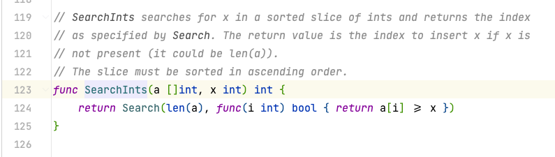
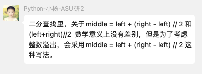

# 代码随想录算法训练营第一天| 704. 二分查找、27. 移除元素。


## 704. 二分查找

>   题目链接：[leetcode链接](https://leetcode.cn/problems/binary-search/)
>
>   文章讲解：[代码随想录(programmercarl.com)](https://programmercarl.com/0704.二分查找.html)
>
>   视频讲解：[手把手带你撕出正确的二分法 | 二分查找法 | 二分搜索法 | LeetCode：704. 二分查找](https://www.bilibili.com/video/BV1fA4y1o715)
>
>   状态：AC

### 思路

看了卡哥的文档，才注意到二分查找也有两种写法。”要**熟悉 根据 左闭右开，左闭右闭 两种区间规则 写出来的二分法**“。回头看自己的代码是左闭右闭的写法，再改写成左闭右开也不难，只需要更改边界条件即可。

### 代码

``` go
func search(nums []int, target int) int {
	// 左闭右闭写法
	left := 0
	right := len(nums) - 1
	var mid int
	for left <= right {
		mid = (left + right) / 2
		if nums[mid] < target {
			left = mid + 1
		} else if nums[mid] > target {
			right = mid - 1
		} else {
			return mid
		}
	}
	return -1
}

```


``` go
func search1(nums []int, target int) int {
	// 左闭右开写法
	left := 0
	right := len(nums)
	var mid int
	for left < right {
		mid = (left + right) / 2
		if nums[mid] < target {
			left = mid + 1
		} else if nums[mid] > target {
			right = mid
		} else {
			return mid
		}
	}
	return -1
}
```

## 27. 移除元素

>   题目链接：[leetcode链接](https://leetcode.cn/problems/remove-element/ )
>
>   文章讲解：[代码随想录(programmercarl.com)](https://programmercarl.com/0027.移除元素.html)
>
>   视频讲解：[数组中移除元素并不容易！ | LeetCode：27. 移除元素](https://www.bilibili.com/video/BV12A4y1Z7LP )
>
>   状态：AC

### 思路

第一眼看到时，题目要求”不要使用额外的数组空间，你必须仅使用 `O(1)` 额外空间并 **原地修改输入数组**“。能想到的就是将待删除的后面的元素向前移动达到删除效果，但是时间复杂度为`O(n^2)`。再向下看到了示例：

**示例 1：**


> 输入：nums = [3,2,2,3], val = 3
> 输出：2, nums = [2,2]
> 解释：函数应该返回新的长度 2, 并且 nums 中的前两个元素均为 2。你不需要考虑数组中超出新长度后面的元素。例如，函数返回的新长度为 2 ，而 nums = [2,2,3,3] 或 nums = [2,2,0,0]，也会被视作正确答案。


**示例 2：**


> 输入：nums = [0,1,2,2,3,0,4,2], val = 2
> 输出：5, nums = [0,1,4,0,3]
> 解释：函数应该返回新的长度 5, 并且 nums 中的前五个元素为 0, 1, 3, 0, 4。注意这五个元素可为任意顺序。你不需要考虑数组中超出新长度后面的元素。

看到这里大概理解了，想到的解法是双指针，方法也有两种。

#### 方法一：

1.   左右指针均从头开始，右指针每次向前一步
2.   若右指针的值为`val`，那么跳过；否则将右指针的值给左指针，左指针++
3.   返回左指针所在的索引

#### 方法二：

1.   左指针从前开始，右指针从后开始，左指针找`val`，右指针找非`val`
2.   右指针的值给左指针
3.   返回左指针所在的索引

### 代码

``` go
// 方法一
func removeElement(nums []int, val int) int {
	n := len(nums)
	left := 0
	for right := 0; right < n; right++ {
		if nums[right] != val {
			nums[left] = nums[right]
			left++
		}
	}
	return left
}
```

``` go
// 方法二
func removeElement(nums []int, val int) int {
	left := 0
	right := len(nums) - 1
	for left <= right {
		for left <= right {
			if nums[left] == val {
				break
			} else {
				left++
			}
		}
		for left <= right {
			if nums[right] != val {
				break
			} else {
				right--
			}
		}
		if left < right {
			nums[left] = nums[right]
			left++
			right--
		}
	}
	return left
}
```

方法二还是的边界条件有点绕的，自己把自己绕进去了


## 附加题 35. 搜索插入位置

>   题目链接：[35. 搜索插入位置](https://leetcode.cn/problems/search-insert-position/)
>
>   状态：AC

### 思路

查找，而且是有序，不难想到二分查找。这不过这里不是匹配的情况，而是有可能不匹配。无论是否匹配，只需返回左边界即可。

### 代码

``` go
func searchInsert(nums []int, target int) int {
	left := 0
	right := len(nums) - 1
	var mid int
	for left <= right {
		mid = (left + right) / 2
		if nums[mid] == target {
			return mid
		} else if nums[mid] < target {
			left = mid + 1
		} else {
			right = mid - 1
		}
	}
	return left
}
```

## 附加题34.在排序数组中查找元素的第一个和最后一个位置

>   题目链接：[34.在排序数组中查找元素的第一个和最后一个位置](https://leetcode.cn/problems/find-first-and-last-position-of-element-in-sorted-array/description/)
>
>   状态：AC

### 思路

通过两次二分查找找到`target`在数组中的起始和结束位置，实现了函数`binary`可以两次调用。但是判断起始位置和结束位置需要额外的判断条件：

-   起始：需要判断`num[mid-1]<target`，或者`mid==0`（第0个元素就是起始位置），为了保证不越界，需要先判断`mid==0`的情况
-   结束：需要判断`mid == len(nums)-1`（最后一个元素是结束位置），或者`nums[mid+1] > target`

如果没有找到该元素，则返回`-1`。由于起始和介绍条件判断有些不同，`binary`函数中使用了`flag`来区分是进行起始元素查找还是结束元素查找的条件。若是`true`则为查找起始元素

### 代码

``` go
func searchRange(nums []int, target int) []int {
	result := []int{}
    var temp int
    temp = binary(nums, target, true)
    if temp == -1 {  // 如果查找开始元素为-1，说明该数不存在，第二次二分不需要进行
        return []int{-1, -1}
    } else {
		result = append(result, temp)
        result = append(result, binary(nums, target, false))
        return result
    }
}
func binary(nums []int, target int, flag bool) int {
	left := 0
	right := len(nums) - 1
	for left <= right {
		mid := left + (right-left)/2
		if flag {
			if nums[mid] == target && (mid == 0 || nums[mid-1] < target) {
				return mid
			} else if nums[mid] < target {
				left = mid + 1
			} else {
				right = mid - 1
			}
		} else {
			if nums[mid] == target && (mid == len(nums)-1 || nums[mid+1] > target) {
				return mid
			} else if nums[mid] <= target {
				left = mid + 1
			} else {
				right = mid - 1
			}
		}
	}
	return -1
}
```


### 官方解法

#### Go语言版本

``` go
func searchRange(nums []int, target int) []int {
    leftmost := sort.SearchInts(nums, target)
    if leftmost == len(nums) || nums[leftmost] != target {
        return []int{-1, -1}
    }
    rightmost := sort.SearchInts(nums, target + 1) - 1
    return []int{leftmost, rightmost}
}

作者：力扣官方题解
链接：https://leetcode.cn/problems/find-first-and-last-position-of-element-in-sorted-array/
来源：力扣（LeetCode）
著作权归作者所有。商业转载请联系作者获得授权，非商业转载请注明出处。
```

`sort.SearchInts()`函数没有接触过，看看源码



>   SearchInts在整型数组的有序切片中搜索x，并返回由Search指定的索引。如果x不存在，返回值是插入x的索引(可以是len(a))。
>   切片必须按升序排序。

#### C++版本

``` c++
class Solution { 
public:
    int binarySearch(vector<int>& nums, int target, bool lower) {
        int left = 0, right = (int)nums.size() - 1, ans = (int)nums.size();
        while (left <= right) {
            int mid = (left + right) / 2;
            if (nums[mid] > target || (lower && nums[mid] >= target)) {
                right = mid - 1;
                ans = mid;
            } else {
                left = mid + 1;
            }
        }
        return ans;
    }

    vector<int> searchRange(vector<int>& nums, int target) {
        int leftIdx = binarySearch(nums, target, true);
        int rightIdx = binarySearch(nums, target, false) - 1;
        if (leftIdx <= rightIdx && rightIdx < nums.size() && nums[leftIdx] == target && nums[rightIdx] == target) {
            return vector<int>{leftIdx, rightIdx};
        } 
        return vector<int>{-1, -1};
    }
};

作者：力扣官方题解
链接：https://leetcode.cn/problems/find-first-and-last-position-of-element-in-sorted-array/
来源：力扣（LeetCode）
著作权归作者所有。商业转载请联系作者获得授权，非商业转载请注明出处。
```

官方题解在找结束元素是找到了下一位，可以通过减一操作得到正确答案。但是他们实现的二分函数的`true`和`false`对条件控制的很巧妙。

## 小结

-   在二分查找时又学到了一种思路，”左闭右开“

-   群里面有位同学说到了这个事情，之前从未注意过：

    

    看别人的二分确实发现了第一种写法，但是并不是很理解，也没有很在意。

今天总用时三个小时多一些，做了四道题，感觉良好。第一天结束！！

