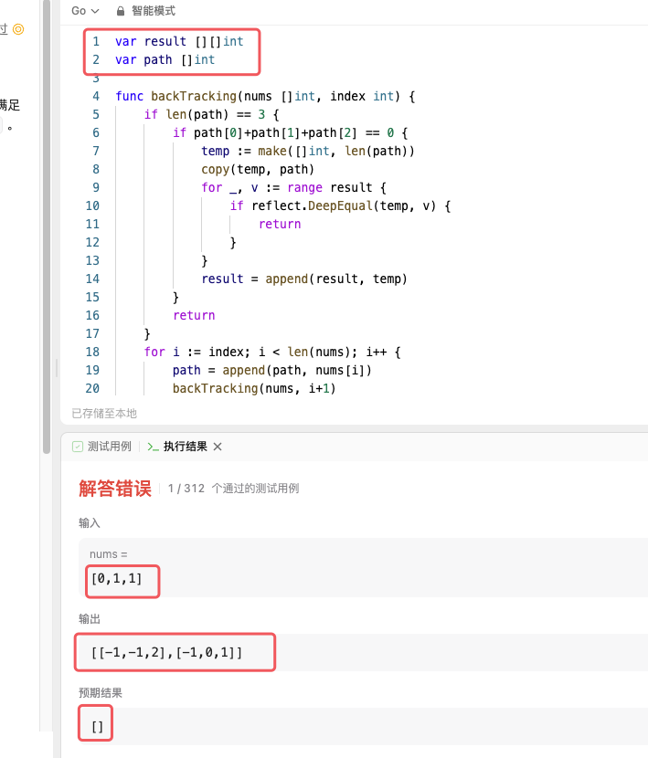

# 代码随想录算法训练营第七天| 454.四数相加II、383. 赎金信、15. 三数之和、18. 四数之和。

## 454. 两数相加

>   题目链接：[力扣题目链接](https://leetcode.cn/problems/4sum-ii/)
>
>   文章讲解：[代码随想录(programmercarl.com)](https://programmercarl.com/0454.%E5%9B%9B%E6%95%B0%E7%9B%B8%E5%8A%A0II.html#%E7%AE%97%E6%B3%95%E5%85%AC%E5%BC%80%E8%AF%BE)
>
>   视频讲解：[学透哈希表，map使用有技巧！LeetCode：454.四数相加II](https://www.bilibili.com/video/BV1Md4y1Q7Yh)
>
>   状态：TLE

### 思路

#### 思路一：暴力算法

暴力算法就不用解释了，每个元素都遍历下。定义`count`记录满足条件情况的个数。满足条件`count++`就好。不出意外的也肯定会超时。

#### 思路二：使用map

将`num4`的值存入到`map4`中的`key`，值出现的次数存为`value`。三层循环后接一个判断，判断第四个数是否在`map4`中，如果存在则总数加`value`

```go
func fourSumCount(nums1 []int, nums2 []int, nums3 []int, nums4 []int) int {
	count := 0
	map4 := map[int]int{}
	for _, v := range nums4 {
		map4[v]++
	}
	for _, i := range nums1 {
		for _, j := range nums2 {
			for _, k := range nums3 {
				if v, ok := map4[0-i-j-k]; ok {
					count += v
				}
			}
		}
	}
	return count
}
```

结果你猜超时没有，肯定还是超时了。

#### 思路三：使用四个map

每个map中都存放`nums`中出现的数以及出现的次数。第一个map定义为`map1`，键是`k1`，值是`v1`，以此类推。

三层循环后判断`map4[0-k1-k2-k3]`是否存在，如果存在那么`count += v1 * v2 * v3 * v4`

``` go
count := 0
map1 := map[int]int{}
map2 := map[int]int{}
map3 := map[int]int{}
map4 := map[int]int{}
for i := 0; i < len(nums1); i++ {
    map1[nums1[i]]++
    map2[nums2[i]]++
    map3[nums3[i]]++
    map4[nums4[i]]++
}
for k1, v1 := range map1 {
    for k2, v2 := range map2 {
        for k3, v3 := range map3 {
            if v4, ok := map4[0-k1-k2-k3]; ok {
                count += v1 * v2 * v3 * v4
            }
        }
    }
}
return count
```

结果你猜超时没有，肯定还是超时了。

原因如下：如果数组中重复的数不多，或者没有，就会退化成思路二。

想了许久，想不出优化的方法了，看了卡哥的题解，我就用我的理解描述一下。

#### 卡哥题解

先计算`nums1`与`nums2`和，将两数组所有和的情况保存到`mapAB`中。key保存的是和，value保存的是和的个数。

再计算`nums3`与`nums4`和，判断`mapAB[0-k3-k4]`是否存在，若存在`count+=mapAB[0-k3-k4]`

``` go
func fourSumCount(nums1 []int, nums2 []int, nums3 []int, nums4 []int) int {
	count := 0
	mapAB := map[int]int{}
	for _, v1 := range nums1 {
		for _, v2 := range nums2 {
			mapAB[v1+v2]++
		}
	}
	for _, v3 := range nums3 {
		for _, v4 := range nums4 {
			if v, ok := mapAB[0-v3-v4]; ok {
				count += v
			}
		}
	}
	return count
}
```

## 383. 赎金信

### 思路

要判断`ransomNote`是否含于`magazine`，先构建一个数组，存放`magazine`的情况，索引代表字母：0代表`'a'`，1代表`'b'`等等；值代表字母出现的次数。构建好后再遍历`ransomNote`串，将对应的字母数量减少一，如果不存在直接`return false`

### 代码

``` go
func canConstruct(ransomNote string, magazine string) bool {
	if len(ransomNote) > len(magazine) {
		return false
	}
	arr := make([]int, 26)
	for _, v := range magazine {
		arr[v-'a']++
	}
	for _, v := range ransomNote {
		arr[v-'a']--
		if arr[v-'a'] < 0 {
			return false
		}
	}
	return true
}
```


## 15. 三数之和

>   题目链接：[力扣题目链接](https://leetcode.cn/problems/3sum/)
>
>   文章讲解：[代码随想录(programmercarl.com)](https://programmercarl.com/0015.%E4%B8%89%E6%95%B0%E4%B9%8B%E5%92%8C.html#%E7%AE%97%E6%B3%95%E5%85%AC%E5%BC%80%E8%AF%BE)
>
>   视频讲解：[梦破碎的地方！| LeetCode：15.三数之和](https://www.bilibili.com/video/BV1GW4y127qo)
>
>   状态：TLE

### 思路

我投降了这道题，Go的底层现在有一个新的理解！

#### 方法一：回溯算法

首先先将`nums`排序，利用回溯算法得到所有的组合，选择排序的原因是因为这样得到的组合，即使是重复的也可以保证顺序一致，方便判断这个组合是否出现过。最终结果保存到变量`result`，得到的可能得组合保存到变量`path`

#### 代码

``` go
func backTracking(nums []int, index int, result *[][]int, path *[]int) {
	if len(*path) == 3 {
		if (*path)[0]+(*path)[1]+(*path)[2] == 0 {
			// 后面的append()操作是深拷贝，所以这里使用temp保存path的值
            temp := make([]int, len(*path))  
			copy(temp, *path)
			for _, v := range *result {
				if reflect.DeepEqual(temp, v) {  // 使用反射判断temp是否在result中
					return
				}
			}
			*result = append(*result, temp)
		}
		return
	}
	for i := index; i < len(nums); i++ {
		*path = append(*path, nums[i])
		backTracking(nums, i+1, result, path)
		*path = (*path)[:len(*path)-1]

	}
}

func threeSum(nums []int) [][]int {
	var result [][]int
	var path []int
	sort.Ints(nums)
	backTracking(nums, 0, &result, &path)
	return result
}
```

结果你猜超时没有，肯定还是超时了。

这里我遇到了好多问题，首先是发现了`result = append(result, temp)`，这里`append`方法实际上是浅拷贝！也就是说以后`temp`的值，`result`也会变化。这也是我为什么用一个临时变量`temp`来保存`path`，而且使用的是`copy()`。

要判断`temp`是否存在于`result`中，那么则需要使用反射，进行深度判断`reflect.DeepEqual(temp, v)`。

##### 遇到最头大的问题！！！！！！

以前用别的语言写回溯，很自然的使用了全局变量，结果在Go语言中发生了奇妙的事情。请看截图



明明输入的只有0和1，怎么会输出了2。而且这个测试用例这么眼熟呢，没错这就是给出的测试用例Case1的答案。放到Goland里面明明是正确答案！到这里就变了，说明全局变量出现了问题。解决这个问题有两个想法：

-   查找有没有类似C++中的`delete`，使用完变量之后释放掉。发现并没有。而且使用完变量应该在`threeSum()`之外了，函数内释放就没有结果了。
-   `threeSum()`定义变量，使用指针传值。

当然，第二种才是正解。改完之后就是上面放出来的代码了，超时。

#### 方法二：使用哈希

将`nums`进行排序，并哈希处理，定义变量`map1`用作哈希表，`nums`中的每个元素做key，value则是每个元素出现的次数。

使用两层for循环之后，判断`0-nums[i]-nums[j]`是否存在。若存在还需要判断每个数字出现的次数是否合法（例如`nums = [-1,0,1,2,-1,-4]`，如果找到一个组合是`[2, -4, 2]`则需要舍弃。之所以会出现这样，是因为两层for会找到`2`和`-4`，而`0-nums[i]-nums[j]`会找到重复的2）

找到组合之后，对组合再排序，判断`path`是否在`result`中。

``` go
func threeSum(nums []int) [][]int {
	sort.Ints(nums)
	map1 := map[int]int{}
	for _, v := range nums {
		map1[v]++
	}
	var result [][]int
	for i := 0; i < len(nums); i++ {
		for j := i + 1; j < len(nums); j++ {
			if v, ok := map1[-nums[i]-nums[j]]; ok {
				temp := []int{nums[i], nums[j], -nums[i] - nums[j]}
				sort.Ints(temp)
				count := 0
				if nums[i] == nums[j] || nums[j] == -nums[i]-nums[j] || nums[i] == -nums[i]-nums[j] {
					count = 2
				}
				if nums[i] == nums[j] && nums[j] == -nums[i]-nums[j] {
					count = 3
				}
				if v >= count {
					flag := true
					for _, value := range result {
						if reflect.DeepEqual(value, temp) {
							flag = false
						}
					}
					if flag {
						result = append(result, temp)
					}

				}
			}
		}
	}
	return result
}
```

结果你猜超时没有，肯定还是超时了。

好了，我投降了，想不到好方法了。去看卡哥视频了。


### 卡哥解法

<font color="red">这道题不适合用哈希表做</font>。双指针我想了一下也没有太想明白，主要还是去重操作。看了视频讲解很清楚了

1.   数组排序，方便后序操作
2.   先找第一个数，使用一层`for`，指针为`i`
3.   找第二个、第三个数。分别用指针`left = i + 1`，`right = len(nums) - 1`
4.   剪枝：如果`i>0`，那么直接`return`，说明后续不可能再有等于0的三元组了
5.   判断`nums[i] + nums[left] + nums[right]`和0的情况
     -   `nums[i] + nums[left] + nums[right] > 0    right--`
     -   `nums[i] + nums[left] + nums[right] < 0    left++`
     -   `nums[i] + nums[left] + nums[right] == 0` 
         -   这个三元组放入到结果中，但是仍然要相向前进。对于`left`，如果如果一致前进得到的`nums[left]==nums[left+1]`，说明该三元组已经存在过了（`0, -1, -1, 1 ,1`）。`right`同理，`nums[right] == nums[right - 1]`
         -   找到各自不同的数`nums[left+1]`和`nums[right-1]`，再前进一个（`0, -1, -1, -2, 2, 1, 1`）

6.   `return result`


### 代码

``` go
func threeSum(nums []int) [][]int {
	sort.Ints(nums)
	result := [][]int{}
	for i := 0; i < len(nums); i++ {
		if nums[i] > 0 {
			return result
		}
		if i > 0 && nums[i] == nums[i-1] {
			continue
		}
		left := i + 1
		right := len(nums) - 1
		for left < right {
			if nums[i]+nums[left]+nums[right] > 0 {
				right--
			} else if nums[i]+nums[left]+nums[right] < 0 {
				left++
			} else {
				result = append(result, []int{nums[i], nums[left], nums[right]})
				for left < right && nums[left] == nums[left+1] {
					left++
				}
				for left < right && nums[right] == nums[right-1] {
					right--
				}
				left++
				right--
			}
		}
	}
	return result
}
```

虽然这个代码AC了，但是毫无成就感。现在是9月27日凌晨2:53，还有一道题。继续


## 18. 四数之和

>   题目链接：[力扣题目链接](https://leetcode.cn/problems/4sum/)
>
>   文章讲解：[代码随想录(programmercarl.com)](https://programmercarl.com/0018.%E5%9B%9B%E6%95%B0%E4%B9%8B%E5%92%8C.html)
>
>   视频讲解：[难在去重和剪枝！| LeetCode：18. 四数之和](https://www.bilibili.com/video/BV1DS4y147US)
>
>   状态：AC

### 算法

算法同上题，只不过这次要先确定两个数，然后用`left`和`right`指针找第三个第四个数。有几点不同：

-   这里不是与0作比较，而是`target`，不可以`nums[i] > target`之后就`break`，因为如果有一堆负数相加一定出现越加越小，使得等于`target`
-   数组长度可能小于4，需要额外判断
-   剪枝`i>0`开始，`j>i+1`开始，`j`永远在`i`后一位

领悟了上一道题，这一题不难了

### 代码

``` go
func fourSum(nums []int, target int) [][]int {
	var result [][]int
	if len(nums) < 4 {
		return result
	}
	sort.Ints(nums)
	for i := 0; i < len(nums)-3; i++ {
		if i > 0 && nums[i] == nums[i-1] {
			continue
		}
		for j := i + 1; j < len(nums)-2; j++ {
			if j > i+1 && nums[j] == nums[j-1] {
				continue
			}
			left := j + 1
			right := len(nums) - 1
			for left < right {
				if nums[i]+nums[j]+nums[left]+nums[right] < target {
					left++
				} else if nums[i]+nums[j]+nums[left]+nums[right] > target {
					right--
				} else {
					result = append(result, []int{nums[i], nums[j], nums[left], nums[right]})
					for left < right && nums[left] == nums[left+1] {
						left++
					}
					for left < right && nums[right] == nums[right-1] {
						right--
					}
					left++
					right--
				}
			}
		}
	}
	return result
}
```

## 小结

-   Go的底层有了很多认识，是以前做题或者写项目时候意识不到的。尤其是浅拷贝与深拷贝，大概找到规律了，几乎都是浅拷贝，如果想要深拷贝一定要用`copy()`
-   由于Go的特性，Go的全局变量不可以在leetcode使用，需要指针传值
-   晚安，准备睡觉了，3:20了，一觉起来是新的题，字符串要学KMP算法什么的了。
