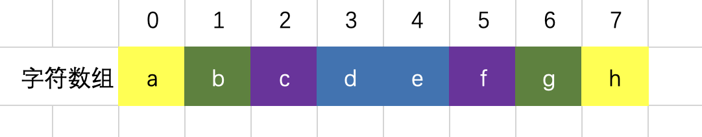
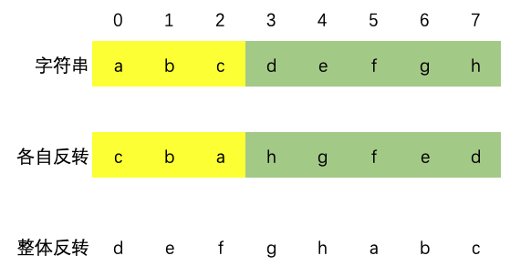

# 代码随想录算法训练营第八天| 344. 反转字符串、541. 反转字符串II、剑指Offer 05.替换空格、151.翻转字符串里的单词、剑指Offer58-II.左旋转字符串。

## 344. 反转字符串

>   题目链接：[力扣题目链接](https://leetcode.cn/problems/reverse-string/)
>
>   文章讲解：[代码随想录(programmercarl.com)](https://programmercarl.com/0344.%E5%8F%8D%E8%BD%AC%E5%AD%97%E7%AC%A6%E4%B8%B2.html)
>
>   视频讲解：[字符串基础操作！ | LeetCode：344.反转字符串](https://www.bilibili.com/video/BV1fV4y17748)
>
>   状态：AC

### 思路



相同颜色的互换位置即可，即`i`与`len(s) - 1 - i`交换。`i`的范围到`len(s)/2`

### 代码

``` go
func reverseString(s []byte) {
	for i := 0; i < len(s)/2; i++ {
		temp := s[i]
		s[i] = s[len(s)-i-1]
		s[len(s)-i-1] = temp
	}
}
```

## 541. 反转字符串II

>   题目链接：[力扣题目链接]([力扣题目链接](https://leetcode.cn/problems/reverse-string-ii/))
>
>   文章讲解：[代码随想录(programmercarl.com)](https://programmercarl.com/0541.%E5%8F%8D%E8%BD%AC%E5%AD%97%E7%AC%A6%E4%B8%B2II.html)
>
>   视频讲解：[字符串操作进阶！ | LeetCode：541. 反转字符串II](https://www.bilibili.com/video/BV1dT411j7NN)
>
>   状态：AC

### 思路

.png)

1.   如图，图中相同颜色的部分代表一个`2k`段，循环条件：`for i := 0; i < len(s); i += 2 * k`。
2.   相同颜色下，分为两段，前`k`段和后`k`段。前`k`段进行反转，后`k`段直接拼接。如果某一段到达了字符串`s`尾部，需要停止。
3.   由于Go语言的字符串不可变，所以新建一个变量，一点点“组装”成最终结果。前`k`段翻转直接进行反向遍历。

### 代码

``` go
func min(a, b int) int {
    if a < b {
        return a
    } else {
        return b
    }
}

func reverseStr(s string, k int) string {
	newString := ""
	for i := 0; i < len(s); i += 2 * k {
		for j := min(len(s), i+k) - 1; j >= i; j-- { // 前k段
			newString += string(s[j])
		}
		for j := i + k; j < min(len(s), i+2*k); j++ {  // 后k段
			newString += string(s[j])
		}
	}
	return newString
}
```

## 剑指Offer 05.替换空格、LCR22.路径加密

>   题目链接：[力扣题目链接](https://leetcode.cn/problems/ti-huan-kong-ge-lcof/)
>
>   文章讲解：[代码随想录(programmercarl.com)](https://programmercarl.com/%E5%89%91%E6%8C%87Offer05.%E6%9B%BF%E6%8D%A2%E7%A9%BA%E6%A0%BC.html)
>
>   状态：AC

### 思路

直接投机取巧，新建一个字符串`newString`，遍历字符串`s`，如果`s[i] == '.'`，在`newString += ' '`，否则`newString += s[i]`

### 代码

``` go
func pathEncryption(path string) string {
	newString := ""
	for _, v:= range path{
		if v == '.' {
			newString += " "
		} else {
			newString += string(v)
		}
	}
    return newString
}
```

## 151.翻转字符串里的单词

>   题目链接：[力扣题目链接](https://leetcode.cn/problems/reverse-words-in-a-string/)
>
>   文章讲解：[代码随想录(programmercarl.com)](https://programmercarl.com/0151.%E7%BF%BB%E8%BD%AC%E5%AD%97%E7%AC%A6%E4%B8%B2%E9%87%8C%E7%9A%84%E5%8D%95%E8%AF%8D.html)
>
>   视频链接：[字符串复杂操作拿捏了！ | LeetCode:151.翻转字符串里的单词](https://www.bilibili.com/video/BV1uT41177fX)
>
>   状态：AC

### 思路

1.   使用双指针，`left`指针指向的是单词的起始位置，遍历字符串用的`i`找到单词末尾。
2.   新建一个字符串数组`words`，将每个单词加入到其中
3.   定义新字符串`newString`，将`words`中每个单词拼接到`newString`中（反向遍历`words`），并且如果不是最后一个单词则再加一个空格。

### 代码

``` go
func reverseWords(s string) string {
	words := []string{}
	left := 0
	for i := 0; i < len(s); i++ {
		if s[i] == ' ' {
			if s[left:i] != "" {
				words = append(words, s[left:i])
			}
			left = i + 1
		} else if i == len(s)-1 {
			words = append(words, s[left:])
		}
	}
	newString := ""
	for i := len(words) - 1; i >= 0; i-- {
		newString += words[i]
		if i > 0 {
			newString += " "
		}
	}
	return newString
}
```

## Offer58-II.左旋转字符串

>   题目链接：[力扣题目链接](https://leetcode.cn/problems/zuo-xuan-zhuan-zi-fu-chuan-lcof/)
>
>   文章讲解：[代码随想录(programmercarl.com)](https://programmercarl.com/%E5%89%91%E6%8C%87Offer58-II.%E5%B7%A6%E6%97%8B%E8%BD%AC%E5%AD%97%E7%AC%A6%E4%B8%B2.html)
>
>   状态：AC

### 思路

#### 方法一

直接拼接

#### 方法二



### 代码

``` go
// 方法一
func dynamicPassword(password string, target int) string {
	return password[target:] + password[:target]
}
```

``` go
// 方法二
func reverse(chars []byte, left, right int) {
    for left < right {
        temp := chars[left]
        chars[left] = chars[right]
        chars[right] = temp
        left++
        right--
    }
}
func dynamicPassword(password string, target int) string {
    chars := []byte(s)
    reverse(chars, 0, target - 1)
    reverse(chars, target, len(chars) - 1)
    reverse(chars, 0, len(chars) - 1)
    return string(chars)
}
```

